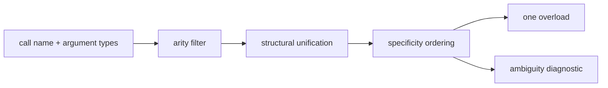

# Functions

## Definition

```jog
fn affine(x: f32, scale: f32, bias: f32) -> f32 {
  let scaled = x * scale
  return scaled + bias
}
```

Parameters and results are typed. A body contains ordinary statements and must
return values matching the declared result list.

## Declaration without a body

```jog
fn vendor_gemm(a: tensor<f32, [M, K]>, b: tensor<f32, [K, N]>)
  -> tensor<f32, [M, N]>;
```

A body-less declaration describes a semantic or native boundary. Another
package may supply a compatible body, or a native mod may bind it. It is not an
automatic external call until a selected workflow gives it that role.

## No result and multiple results

```jog
fn notify() -> () {
  return
}

fn quotient_remainder(x: i64, y: i64) -> (i64, i64) {
  return x / y, x % y
}

fn rebuild(x: i64, y: i64) -> i64 {
  let q, r = quotient_remainder(x, y)
  return q * y + r
}
```

## Generics

```jog
fn identity<T: Ty>(x: T) -> T {
  return x
}
```

Generic parameters are compile-time values with types such as `Ty`, `int`, or
`str`. They are inferred by structural unification unless passed explicitly.

## Overloads

```jog
fn +<T: Ty>(a: T, b: T) -> T;
fn +<W: int>(a: sat<W>, b: sat<W>) -> sat<W>;
```

Resolution filters by arity and structural unification, then chooses the most
specific signature. Return types do not distinguish overloads. Equally
specific matches are an error instead of depending on load order.

## Compile-time functions are ordinary functions

```jog
fn count(m: Mod) -> int { return len(ir.ops(m)) }
```

`Mod` in a signature does not introduce new syntax. The CLI decides whether a
named function is invoked as `query`, `run`, or `emit`. Continue with
[Types](types.md).

## Names and qualification

Inside a mod, an unqualified name first participates in normal resolution
across the current mod and declared dependencies. A qualified name identifies
the owning mod explicitly:

```jog
mod image.policy
use base
use tensor

fn elements<S: list<int>>() -> int {
  return tensor.numel<S>()
}
```

Qualification is useful at subsystem boundaries; it is not a substitute for
`use`. Dependencies remain explicit so loading and packaging are reproducible.

## Generic values are structural

Generic parameters can describe types, shapes, names, and other compile-time
data:

```jog
fn zero<T: Ty>() -> T { return T(0) }

fn flat_size<S: list<int>>() -> int {
  var size = 1
  for extent in S { size *= extent }
  return size
}

fn copy<T: Ty, S: list<int>>(
  x: tensor<T, S>
) -> tensor<T, S> {
  var out = tensor<T, S>(T(0))
  for i in 0..flat_size<S>() { out[i] = x[i] }
  return out
}
```

For `tensor<f32, [2, 4]>`, unification binds `T = f32` and `S = [2, 4]`.
Those bindings are available to the body and to implementation selection.

## Overload resolution, step by step



Suppose a call has two `relu` candidates: one accepts any `tensor<T, S>` and
one accepts only `tensor<i8, S>`. An `i8` input selects the latter because it
is more specific. Load order never breaks a tie. This matters for external
implementation mods: adding a package must not make resolution accidental.

## Function values and callbacks

Reflection produces typed `Fn` handles, allowing policy to be passed as data:

```jog
fn weight(m: Mod, op: Op, config: dict) -> int {
  if ir.kind(op) == "call" { return int(config["call"]) }
  return int(config["other"])
}

fn total(m: Mod) -> int {
  var config: dict = {call: 4, other: 1}
  return stat.sum(m, ir.find("project.weight"), config)
}
```

The callback signature is part of the API contract. The callee invokes it
through the evaluator with the same type and diagnostic rules as a direct
call.

## Public API stability

| Change | Effect on callers |
| --- | --- |
| add a new uniquely named function | normally additive |
| add an overload | may expose a new ambiguity; check dependents |
| change parameter/result type | breaking |
| change `local fn` body | private if behavior contract is preserved |
| rename/remove public function | breaking |
| change metadata interpreted by policy | behavioral API change |

`joggle mod upgrade` validates the package and reverse dependency graph, but
semantic compatibility still needs focused tests and release notes.

## Failure guide

| Diagnostic | Meaning | Correction |
| --- | --- | --- |
| unresolved function | no visible signature unifies | add `use`, search root, or correct types |
| ambiguous overload | multiple equally specific signatures | make types/signature more specific |
| result mismatch | returned values do not match declaration | correct count/order/types |
| callback invocation failed | supplied `Fn` has wrong contract or body failed | inspect callback signature/diagnostics |
| public dependency unavailable | package graph is incomplete | declare `use` and pass its root |
