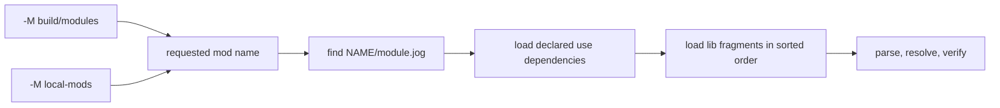

# Packages

## Smallest layout

```text
math_policy/
  module.jog
```

```jog
mod math_policy
use base
```

The directory name and declaration identify one mod. The parent directory is a
search root:

```sh
joggle mod check math_policy -M local-mods
```

## Dependencies

`use` is explicit and transitive loading follows the declared graph:

```jog
mod app.policy
use ir
use opt
```

A sibling directory is not an implicit dependency. Add its parent with another
`-M` and declare it with `use`.

## Split a large mod

```text
app.policy/
  module.jog
  lib/
    analysis.jog
    rewrite.jog
```

`module.jog` is read first; `lib/*.jog` follows in sorted order. Every fragment
belongs to the same lexical mod and must not repeat `mod` or `use`.

```jog
// lib/analysis.jog
local fn score(x: i32) -> i32 {
  return x * 2
}
```

## Public and local functions

```jog
fn apply(m: Mod) -> bool { return helper(m) }
local fn helper(m: Mod) -> bool { return false }
```

`apply` appears in `joggle mod info`; `helper` is visible only inside the mod.

## Lifecycle

```sh
joggle mod list -M local-mods
joggle mod info math_policy -M local-mods
joggle mod install local-mods/math_policy installed-mods -M local-mods
joggle mod upgrade local-mods/math_policy installed-mods -M local-mods
joggle mod uninstall math_policy installed-mods
```

Install validates a staged copy. Upgrade also checks installed reverse
dependencies. Continue with [Functions](functions.md).

## Resolution from disk to dependency graph



Search roots answer where a mod may be found. `use` answers which mods are part
of the program. Keeping these separate prevents a directory full of installed
packages from silently changing visible overloads.

## A complete split package

```text
local-mods/
└── project.analysis/
    ├── module.jog
    └── lib/
        ├── collect.jog
        └── report.jog
```

`module.jog`:

```jog
mod project.analysis
use base
use ir
```

`lib/collect.jog`:

```jog
local fn call_count(m: Mod) -> int {
  return len(ir.ops(m, ["call"]))
}
```

`lib/report.jog`:

```jog
fn summary(m: Mod) -> dict {
  var out: dict = {}
  out["calls"] = call_count(m)
  out["revision"] = ir.revision(m)
  return out
}
```

Invocation:

```sh
./build/joggle mod check project.analysis \
  -M build/modules -M local-mods
./build/joggle query project.analysis.summary model.jog \
  -M build/modules -M local-mods
```

Possible output for a model with one call:

```text
{"calls": 1, "revision": 0}
```

## Why fragments are not subpackages

All files under one package share its dependency list and private namespace.
Use fragments to keep one coherent API readable. Create another mod when the
code needs independent versioning, installation, dependencies, or ownership.

| Need | Fragment | Separate mod |
| --- | ---: | ---: |
| private implementation split | ✓ | — |
| distinct public namespace | — | ✓ |
| optional dependency | — | ✓ |
| independent install/upgrade | — | ✓ |
| avoid a very long `module.jog` | ✓ | — |

## Install and upgrade semantics

Lifecycle commands operate on explicit source and destination directories.
They stage and validate before publishing the package directory. They do not
fetch a registry, alter global configuration, or rewrite a model.

```sh
mkdir -p build/installed
./build/joggle mod install local-mods/project.analysis build/installed \
  -M build/modules -M local-mods
./build/joggle mod info project.analysis \
  -M build/modules -M build/installed
```

Keep source-controlled mods separate from generated build output. For CI,
construct the same ordered roots on every platform.

## Failure guide

| Diagnostic | Cause | Correction |
| --- | --- | --- |
| mod not found | no root contains `NAME/module.jog` | add the parent directory with `-M` |
| declaration/name mismatch | directory identity and `mod` differ | make them identical |
| missing dependency | `use` target is absent from roots | install/add root; do not copy functions |
| duplicate public signature | fragments export conflicting functions | make helper local or reconcile overloads |
| upgrade rejected | reverse dependency no longer checks | preserve API or upgrade dependents together |

Continue with [Functions](functions.md).
