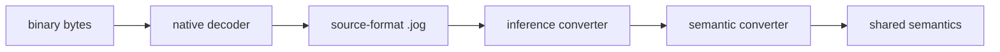
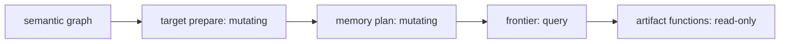

# Converters and emitters

Converters and emitters use the same language and graph reflection as analyses
and transforms, but their contracts differ:

- a converter mutates the graph from one explicit representation to another;
- an emitter reads a prepared graph and returns `str` or `bytes`.

## Small text emitter

```jog
fn manifest(m: Mod) -> str {
  return "functions=" + text(len(ir.fns(m))) +
         ",calls=" + text(len(ir.ops(m, ["call"]))) + "\n"
}
```

Input:

```jog
fn main(x: tensor<f32, [4]>) -> tensor<f32, [4]> {
  let y = nn.relu(x)
  return y
}
```

Command and output:

```console
$ joggle emit meta_demo.manifest meta_model.jog \
    -M build/modules -M tutorial-mods
functions=1,calls=1
```

This is an emitter even though it is only three lines. Role comes from the
contract and CLI mode, not special syntax.

## Structured report versus text artifact

Prefer `dict`/list from a query when another program consumes fields:

```jog
fn manifest_data(m: Mod) -> dict {
  var out: dict = {}
  out["functions"] = len(ir.fns(m))
  out["calls"] = len(ir.ops(m, ["call"]))
  return out
}
```

Prefer `str`/`bytes` emission for a target artifact whose formatting is part of
its contract. Do not make downstream tools parse human prose when structured
data is available.

## Converter skeleton

```jog
fn convert(m: Mod, rules: list<Fn>) -> bool {
  var changed = false
  for op in ir.ops(m, ["call"]) {
    if !ir.live(op) { continue }
    let candidates = compatible_rules(op, rules)
    if len(candidates) == 0 { continue }
    let rule = ir.match(op, candidates)
    changed = ir.invoke<bool>(m, op, rule) || changed
  }
  return changed
}
```

This schematic separates rule discovery, typed matching, invocation, and the
changed flag. Real converters must document callback signatures and source
attribute/version contracts.

## Frontend boundary

Binary readers return deterministic `.jog` source:

```jog
[role: "read"]
fn read(data: bytes) -> str;
```



Decoding and conversion are distinct. Unknown source operations remain visible
rather than being guessed.

## Representation conversion

For ONNX:

```console
$ joggle run onnx.nn.infer decoded.jog -M build/modules > inferred.jog
$ joggle run onnx.nn.convert inferred.jog -M build/modules > semantic.jog
```

Input call:

```jog
let y: tensor<f32, [1, 4]> = onnx.Relu(x)
```

Output call:

```jog
let y = nn.relu(x)
```

The converter changes representation ownership while preserving semantics and
type/shape information.

## Capability before emission

An emitter with partial coverage should expose `accepts` and/or `frontier`:

```jog
fn accepts(m: Mod, op: Op) -> bool;
fn frontier(m: Mod) -> list<str>;
fn source(m: Mod) -> str;
```

The consumer can require an empty frontier before producing an artifact.

```console
$ joggle query c.frontier planned.jog -M build/modules
[]
$ joggle emit c.source planned.jog -M build/modules > model.c
```

## C artifact family

The `c` mod illustrates meta-emission at several granularities:

| Function | Output |
| --- | --- |
| `c.api` | structured ABI descriptors |
| `c.header` | public C header |
| `c.source` | complete translation unit |
| `c.data` | constant payload bytes |
| `c.preamble` | includes and shared declarations |
| `c.declaration` | one public declaration |
| `c.definition` | one complete function definition |
| chunk/partition functions | function/nested structural pieces |

All are ordinary functions implemented largely in `.jog` fragments. The core
does not contain a C operator switch.

## VM artifact family

```console
$ joggle run vm.prepare model.jog -M build/modules > prepared.jog
$ joggle emit vm.image prepared.jog -M build/modules > model.vm
```

`vm.image` creates a deterministic text image. Native `vm.run` accepts image,
entry, and input bytes and returns output bytes plus a deterministic step count.

## Byte artifacts and external data

Use `bytes` for payloads that should not be represented as source strings.
`c.data` can separate large constants from generated source. The same blob name
must be supplied consistently to API/header/source calls when an overload
requires external data.

## Read-only emission

Preparation may mutate; emission should not. This gives a clean boundary:



If an emitter discovers it needs lowering, expose that lowering as a named
preparation function rather than hiding graph edits during output.

## Incremental artifacts

Function-granular emitters can support downstream incremental regeneration. A
changed body may require only one definition, but signature, call graph, header,
payload, or ABI changes require broader invalidation. Use observed dependencies
and artifact contracts; do not assume “one changed function” always means “one
changed object file.”

## Failure guide

| Failure | Meaning | Correction |
| --- | --- | --- |
| converter leaves source calls | unsupported exact mapping | report/add narrow rule |
| converter ambiguity | overlapping rules | specialize rule signatures |
| nonempty frontier | graph not representable | prepare/expand/add implementation |
| emitter mutates graph | hidden stage boundary | move edit into preparation |
| artifact ABI mismatch | different graph/config used | derive all artifacts together |
| byte payload mismatch | offset/layout/blob policy disagreement | inspect `c.api` and data config |

## End-to-end examples

- [Import ONNX](../guides/import-onnx.md)
- [Emit C](../guides/emit-c.md)
- [Quantized inference in C](../guides/quantized-c.md)
- [External C kernels](../examples/edge.md)
