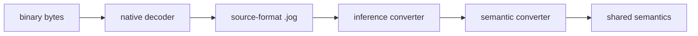
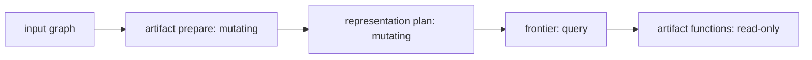

# Converters and emitters

Converters and emitters use the same language and graph reflection as analyses
and transforms, but their contracts differ:

- a converter mutates the graph from one explicit representation to another;
- an emitter reads a prepared graph and returns `str` or `bytes`.

## Small text emitter

```jog
fn manifest(m: Mod) -> str {
  return "functions=" + text(len(ir.fns(m))) +
         ",calls=" + text(len(ir.ops(m, ["call"]))) + "\n"
}
```

Input:

```jog
fn main(x: tensor<f32, [4]>) -> tensor<f32, [4]> {
  let y = nn.relu(x)
  return y
}
```

Command and output:

```console
$ joggle emit meta_demo.manifest meta_model.jog \
    -M build/modules -M tutorial-mods
functions=1,calls=1
```

This is an emitter even though it is only three lines. Role comes from the
contract and CLI mode, not special syntax.

## Structured report versus text artifact

Prefer `dict`/list from a query when another program consumes fields:

```jog
fn manifest_data(m: Mod) -> dict {
  var out: dict = {}
  out["functions"] = len(ir.fns(m))
  out["calls"] = len(ir.ops(m, ["call"]))
  return out
}
```

Prefer `str`/`bytes` emission for a target artifact whose formatting is part of
its contract. Do not make downstream tools parse human prose when structured
data is available.

## Converter skeleton

```jog
fn convert(m: Mod, rules: list<Fn>) -> bool {
  var changed = false
  for op in ir.ops(m, ["call"]) {
    if !ir.live(op) { continue }
    let candidates = compatible_rules(op, rules)
    if len(candidates) == 0 { continue }
    let rule = ir.match(op, candidates)
    changed = ir.invoke<bool>(m, op, rule) || changed
  }
  return changed
}
```

This schematic separates rule discovery, typed matching, invocation, and the
changed flag. Real converters must document callback signatures and source
attribute/version contracts.

## Frontend boundary

Binary readers return deterministic `.jog` source:

```jog
[role: "read"]
fn read(data: bytes) -> str;
```



Decoding and conversion are distinct. Unknown source operations remain visible
rather than being guessed.

## Representation conversion

A project converter can replace a source-owned operation with a shared semantic
operation while preserving its type:

```jog
mod project_convert
use ir

fn apply(m: Mod) -> bool {
  var changed = false
  for op in ir.ops(m, ["call"]) {
    if ir.callee(op) == "source.absolute" {
      changed = ir.rename(m, op, "semantic.absolute") || changed
    }
  }
  return changed
}
```

Input:

```jog
let y: i32 = source.absolute(x)
```

Output:

```jog
let y: i32 = semantic.absolute(x)
```

The converter changes representation ownership explicitly. A complete rule
also checks source attributes and the destination signature before retargeting.

## Capability before emission

An emitter with partial coverage should expose `accepts` and/or `frontier`:

```jog
fn accepts(m: Mod, op: Op) -> bool;
fn frontier(m: Mod) -> list<str>;
fn source(m: Mod) -> str;
```

The consumer can require an empty frontier before producing an artifact.

```console
$ joggle query project_artifact.frontier prepared.jog \
    -M build/modules -M project-mods
[]
$ joggle emit project_artifact.source prepared.jog \
    -M build/modules -M project-mods > artifact.txt
```

## Design an artifact family

Expose structured and textual views at useful granularities:

| Function | Output |
| --- | --- |
| `project_artifact.api` | structured interface descriptors |
| `project_artifact.source` | complete text artifact |
| `project_artifact.data` | constant payload bytes |
| `project_artifact.preamble` | shared declarations |
| `project_artifact.declaration` | one public declaration |
| `project_artifact.definition` | one complete function definition |
| chunk/partition functions | function/nested structural pieces |

All are ordinary functions. The core does not contain branches for a particular
artifact name or format.

## Byte artifacts and external data

Use `bytes` for payloads that should not be represented as source strings.
`project_artifact.data` can separate large constants from generated text. The
same blob identifier must be supplied consistently to interface/source calls
when an overload uses external data.

## Read-only emission

Preparation may mutate; emission should not. This gives a clean boundary:



If an emitter discovers it needs lowering, expose that lowering as a named
preparation function rather than hiding graph edits during output.

## Incremental artifacts

Function-granular emitters can support downstream incremental regeneration. A
changed body may require only one definition, but signature, call graph, header,
payload, or ABI changes require broader invalidation. Use observed dependencies
and artifact contracts; do not assume “one changed function” always means “one
changed object file.”

## Failure guide

| Failure | Meaning | Correction |
| --- | --- | --- |
| converter leaves source calls | unsupported exact mapping | report/add narrow rule |
| converter ambiguity | overlapping rules | specialize rule signatures |
| nonempty frontier | graph not representable | prepare/expand/add implementation |
| emitter mutates graph | hidden stage boundary | move edit into preparation |
| artifact ABI mismatch | different graph/config used | derive all artifacts together |
| byte payload mismatch | offset/layout/blob policy disagreement | inspect structured API and data config |

## Bundled mod case studies

Concrete format and artifact implementations live in the
[built-in mod catalogue](../api/mods/index.md). They demonstrate this protocol;
they do not add special artifact behavior to the core.
