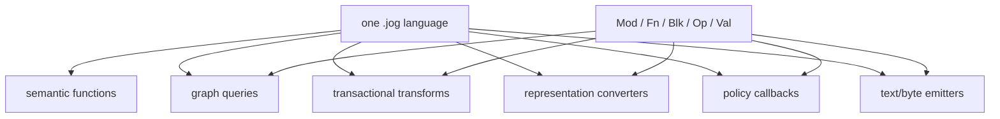

# Unified metaprogramming

Joggle's central design is not merely “models are text.” Operator semantics,
analyses, transforms, converters, implementation policies, and emitters are all
written as typed functions over the same graph and value system.

## The unification



There is no separate pass DSL, rewrite registry, emitter language, or operator
class hierarchy. Different roles arise from typed signatures and contracts.

| Role | Example signature | Observable result |
| --- | --- | --- |
| semantic definition | `fn relu(x: tensor<E,S>) -> tensor<E,S>` | graph call/body meaning |
| reflection query | `fn inventory(m: Mod) -> dict` | `Attr` report |
| transform | `fn mark(m: Mod, callee: str) -> bool` | revised graph |
| conversion | `fn convert(m: Mod) -> bool` | changed representation |
| policy callback | `fn score(op: Op, config: Attr) -> int` | decision evidence |
| emitter | `fn manifest(m: Mod) -> str` | text artifact |
| binary reader | `fn read(data: bytes) -> str` | source-format `.jog` |

## One running example

The next pages use this source model:

```jog
mod meta_model
use nn

fn main(x: tensor<f32, [4]>) -> tensor<f32, [4]> {
  let y = nn.relu(x)
  return y
}
```

and one external mod:

```jog
mod meta_demo
use base
use ir

fn inventory(m: Mod) -> dict {
  let functions = len(ir.fns(m))
  let operations = len(ir.ops(m))
  let calls = len(ir.ops(m, ["call"]))
  var out: dict = {}
  out["functions"] = functions
  out["operations"] = operations
  out["calls"] = calls
  return out
}

fn mark(m: Mod, callee: str) -> bool {
  var changed = false
  for op in ir.ops(m, ["call"]) {
    if ir.callee(op) == callee {
      changed = ir.set(m, op, "meta_demo.selected", true) || changed
    }
  }
  return changed
}

fn manifest(m: Mod) -> str {
  return "functions=" + text(len(ir.fns(m))) +
         ",calls=" + text(len(ir.ops(m, ["call"]))) + "\n"
}
```

This small package demonstrates three roles without switching languages:

```console
$ joggle query meta_demo.inventory meta_model.jog \
    -M build/modules -M tutorial-mods
{"calls": 1, "functions": 1, "operations": 2}

$ joggle run meta_demo.mark meta_model.jog --arg '"nn.relu"' \
    -M build/modules -M tutorial-mods > marked.jog

$ joggle emit meta_demo.manifest meta_model.jog \
    -M build/modules -M tutorial-mods
functions=1,calls=1
```

The same typed function system returns a report, edits a graph, and produces an
artifact.

## Why this matters to extension authors

### Shared abstractions

A new type or operator becomes visible to analyses, transforms, policies, and
emitters through normal types and calls. The core does not need one new class or
registry entry per role.

### Composable stages

Functions can call other functions, receive `Fn` callbacks, enumerate graph
objects, clone bodies, set metadata, and invoke shared algorithms. A project can
replace policy while retaining legality and mutation mechanisms.

### Inspectable state

Every committed intermediate graph prints as `.jog`. Converters and transforms
do not hide state in an opaque pass manager.

### Unified safety

The same ownership, liveness, type resolution, verification, transaction, and
dependency-tracking mechanisms protect all compiler roles.

## The metaprogramming ladder

Read in this order:

1. [Reflection](reflection.md): enumerate and inspect graph objects without
   mutation.
2. [Graph generation](generation.md): construct constants, calls, control flow,
   clones, and specialized functions.
3. [Transactional rewrites](rewrites.md): replace, retarget, erase, annotate,
   and verify safely.
4. [Policies and implementations](policies.md): pass typed functions as
   callbacks and separate legality from profitability.
5. [Converters and emitters](artifacts.md): change representation and produce
   structured, text, or byte artifacts.

## Mental model

Treat `.jog` as a typed meta-language with two categories of values:

- ordinary compile-time data such as `int`, `str`, list, dict, `Ty`, and `Attr`;
- graph handles such as `Mod`, `Fn`, `Blk`, `Op`, and `Val`.

Compiler functions calculate ordinary data, traverse handles, or request edits
through `ir`. They never manipulate untracked internal pointers.

## Boundary with ordinary model code

Model/semantic functions operate on domain values:

```jog
fn twice(x: f32) -> f32 { return x + x }
```

Meta-functions explicitly receive handles:

```jog
fn count(m: Mod) -> int { return len(ir.ops(m)) }
```

The syntax is shared, but the signature makes the layer explicit. A model call
does not gain graph mutation access merely because it is written in `.jog`.

## What unified does not mean

- Query and policy callbacks are not allowed to publish mutations.
- Semantic functions and target emitters still own different contracts.
- A converter must preserve semantics; it is not arbitrary textual replacement.
- Native decoders remain optional ABI components when byte libraries are needed.
- Generated artifacts are not automatically executed or linked by the core.

Unification removes redundant extension mechanisms; it does not erase
responsibility boundaries.
