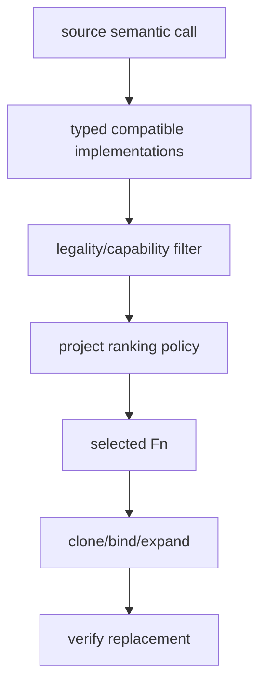

# Policies and implementation selection

Metaprogramming becomes reusable when an algorithm receives policy as a typed
`Fn` instead of importing one device/project decision. Joggle uses this pattern
for measurement, loop scheduling, capability, and implementation selection.

## Functions are values

```jog
let measure = ir.find("project.cost.weight")
let total = stat.sum(m, measure, config)
```

`ir.find` returns a `Fn` handle. The receiving function validates its signature
and invokes it through the normal evaluator.

## Callback invocation

```jog
fn apply_score(m: Mod, op: Op, scorer: Fn, config: Attr) -> int {
  return ir.invoke<int>(m, op, scorer, config)
}
```

The generic result type states what the caller expects. Subject and additional
arguments are typed normally. Invocation records observations and respects
read-only/mutation contracts of the containing algorithm.

## Measurement policy

```jog
fn weight(op: Op, config: Attr) -> int {
  if ir.callee(op) == "tensor.matmul" {
    return int(config["matmul"])
  }
  return int(config["default"])
}

fn total(m: Mod, config: dict) -> int {
  return stat.sum(m, ir.find("project.weight"), config)
}
```

Input:

```text
config = {matmul: 16, default: 1}
graph = two MatMul calls and three other operations
```

Output:

```text
35
```

The unit is defined by the policy. `stat` only traverses and sums.

## Scheduling policy

```jog
fn order(m: Mod, loop: Op) -> list<int> {
  let state = tile.state_axes(m, loop)
  let reduction = tile.reduction_axes(m, loop)
  if len(state) == 0 || len(reduction) == 0 { return [] }
  return reduction + state
}

fn apply(m: Mod) -> bool {
  return tile.reorder(m, ir.find("project.order"))
}
```

The policy proposes an order. `tile.reorder` still owns legality and refuses a
proposal that changes dependence or reduction semantics.

## Capability policy

```jog
fn accepts(m: Mod, op: Op, config: Attr) -> bool {
  if ir.kind(op) != "call" { return true }
  if ir.callee(op) == "nn.relu" { return true }
  return false
}

fn frontier(m: Mod, config: dict) -> list<str> {
  return opt.frontier(m, ir.find("project.accepts"), config)
}
```

Input graph calls `nn.relu` and `tensor.matmul`. Output:

```text
["tensor.matmul"]
```

The frontier is explicit evidence for the next legalization/implementation
step.

## Implementation candidates

An implementation mod exposes body-bearing typed functions and marks their
role in metadata:

```jog
[role: "implementation", target: "portable"]
fn relu<T: Ty, S: list<int>>(
  x: tensor<T, S>
) -> tensor<T, S> {
  var out = tensor<T, S>(T(0))
  for i in 0..tensor.numel<S>() {
    if x[i] > T(0) { out[i] = x[i] }
  }
  return out
}
```

Collect candidates:

```jog
let impls = ir.where(
  ir.fns("project.impl"), "role", "implementation"
)
```

`opt.candidates` filters candidates compatible with one call. `opt.apply` or
`opt.instantiate` selects and exposes implementations across a graph.

## Ranking policy

A ranking policy sees only type-compatible candidates:

```jog
fn choose(op: Op, candidates: list<Fn>, config: Attr) -> Fn {
  let wanted = str(config["target"])
  for candidate in candidates {
    if str(ir.meta(candidate, "target")) == wanted { return candidate }
  }
  return candidates[0]
}
```

The exact callback signature must match the chosen `opt.apply` overload. The
policy must return a member of `candidates`; it cannot bypass compatibility.

## Selection pipeline



Each layer has a distinct failure:

| Empty/failure point | Meaning |
| --- | --- |
| compatible candidates empty | no implementation matches types |
| legality filter empty | representations exist but none are legal |
| policy rejects/ambiguous | project choice incomplete |
| expansion fails | body/closure cannot be materialized |
| verification fails | replacement violates graph contract |

## Why policy lives outside official mechanisms

Different projects/devices may prefer different tile sizes, kernel libraries,
memory tradeoffs, or costs. Encoding one choice in `tile`, `opt`, or `c` makes
the correctness mechanism hard to reuse and compare.

Keep policy in an external mod when it is:

- device-specific;
- calibrated from measurements;
- research/experiment configuration;
- application-specific;
- expected to change independently from legality.

## Policy purity

Analysis/ranking callbacks are normally read-only. Mutation during candidate
enumeration can invalidate handles, bias ordering, and violate reuse records.
Return data/handles; let the outer transform commit the selected change.

## Configuration

Pass configuration explicitly as `Attr`/`dict`:

```console
$ joggle run project.schedule model.jog \
    --arg '{tile: 8, scalar_budget: 16, target: "mcu"}' \
    -M build/modules -M project-mods > scheduled.jog
```

Explicit arguments appear in commands, reports, experiment manifests, and
reactive invalidation. Hidden environment variables do not.

## Review checklist

- Callback signature is documented and checked.
- Callback is read-only unless mutation is explicitly required.
- Legality remains in the reusable mechanism.
- Candidate list contains only type-compatible functions.
- Ranking returns one candidate from that list.
- Configuration and units are explicit.
- Unsupported/empty cases have deterministic behavior.
- Output graph is reverified and compared with an oracle.
