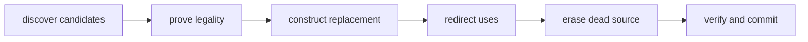

# Transactional rewrites

A rewrite changes the existing graph. Joggle provides primitive edits through
`ir`; higher-level mods such as `opt`, `tile`, `mem`, and frontend bridges
compose those primitives into reusable algorithms.

## Complete metadata rewrite

```jog
fn mark(m: Mod, callee: str) -> bool {
  var changed = false
  for op in ir.ops(m, ["call"]) {
    if ir.callee(op) == callee {
      changed = ir.set(m, op, "meta_demo.selected", true) || changed
    }
  }
  return changed
}
```

Input:

```jog
fn main(x: tensor<f32, [4]>) -> tensor<f32, [4]> {
  let y = nn.relu(x)
  return y
}
```

Command:

```console
$ joggle run meta_demo.mark meta_model.jog --arg '"nn.relu"' \
    -M build/modules -M tutorial-mods > marked.jog
```

Output:

```jog
fn main(x: tensor<f32, [4]>) -> tensor<f32, [4]> {
  [meta_demo.selected]
  let y = nn.relu(x)
  return y
}
```

The dotted Boolean attribute is canonical shorthand for the nested open
metadata path set by the transform.

## Why the function returns `bool`

`ir.set` returns false when the same value is already present. Aggregating with
`|| changed` makes the transform idempotent:

| Run | Graph change | Function result |
| --- | --- | --- |
| first | adds metadata | `true` |
| second | value already equal | `false` |

Changed flags support fixed-point drivers and reactive reports without parsing
printed graphs.

## Structural replacement pattern

The safe order is:



Example skeleton:

```jog
fn replace_unary(m: Mod, source: Op, target: str) -> bool {
  let inputs = ir.args(source)
  let outputs = ir.outs(source)
  assert(len(inputs) == 1 && len(outputs) == 1,
         "expected unary single-result call")

  let next = ir.call(
    m, source, target, [inputs[0]], ir.type(outputs[0])
  )
  ir.replace(m, outputs[0], next)
  return ir.erase(m, source)
}
```

Build first so failure leaves the source connected. Redirect all intended users
before erasing the definition.

## Target-preserving retarget

When only callee/arguments change and result structure stays valid, use
`ir.retarget`:

```jog
let implementation = ir.find("project.fast_relu", [ir.type(input)])
return ir.retarget(m, call, implementation)
```

The typed function form avoids a second string-based resolution decision.

## Batch replacement and erasure

```jog
ir.replace(m, old_values, new_values)
ir.erase(m, dead_ops)
```

Batch forms validate ownership and arity for the set and avoid repeated scans.
Use them when a rewrite is semantically one edit rather than a sequence of
independent commits.

## Clone-and-expand

`ir.expand` replaces a call with a compatible body-bearing function. `opt.apply`
and `opt.instantiate` add candidate discovery, policy, worklists, and limits.

```jog
fn expose_relu(m: Mod) -> bool {
  let accepts = ir.find("project.accepts_low_level")
  return opt.expose(m, accepts, len(ir.ops(m)) + 1)
}
```

An explicit limit prevents mutually expanding representations from oscillating
forever.

## Metadata edits are real edits

`set` and `unset` update revisions and reactive observations. They are not
side tables invisible to caching. This allows policy annotations to drive later
stages safely.

## Transaction boundary

Several functions in one CLI `run` execute left-to-right inside one transaction:

```console
$ joggle run source.infer source.convert opt.basic mem.plan model.jog \
    -M build/modules > planned.jog
```

If `mem.plan` fails or final verification rejects the graph, earlier conversion
and cleanup edits roll back too. Use separate commands only when separate
commits/intermediate artifacts are intentional.

## Legality before profitability

A transform should expose a reason or predicate when legality is complex:

```jog
let issue = tile.reorder_issue(m, loop, order)
if issue != "" { return false }
let reordered = tile.reorder(m, loop, order)
return ir.live(reordered)
```

Project policy selects among legal candidates. It must not reproduce or bypass
the transform's correctness proof.

## Failure modes

| Failure | Meaning | Correction |
| --- | --- | --- |
| foreign handle | item belongs to another `Mod` | keep graph ownership explicit |
| stale handle | source was erased/rebuilt | rediscover or use validated path |
| dominance error | replacement not available at use | choose insertion point/remap values |
| type mismatch | replacement result incompatible | construct with exact result type |
| live users on erase | redirect was incomplete | replace users before erase |
| final verifier failure | combined edits break graph | inspect transaction diagnostics |

## Rewrite review checklist

- Candidate discovery does not mutate.
- Every handle is live and owned.
- Legality is separate from profitability.
- Replacement is constructed before disconnection.
- All result uses are accounted for.
- Effecting operations are not erased as dead.
- Batch operations are used for atomic sets.
- Failure returns without partial state.
- `true` means the committed graph changed.
- Input, output, and unsupported cases are documented.
