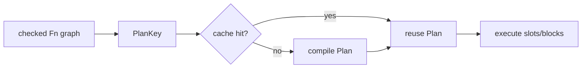

# Evaluator fast path

Compiler functions written in `.jog` execute in the evaluator. The fast path
does not reinterpret source tokens. Parsing already produced a checked graph;
the evaluator derives and caches a compact execution plan for each function
version.

## From function graph to plan

The cache key contains store identity, function id, slot generation, and
function revision. A body edit therefore cannot reuse an old plan.



A plan records:

- generic and local slot counts;
- one `PlanBlock` per structured block;
- predecoded operation kind and operand/result slot indices;
- parsed call or intrinsic identity;
- direct operator code when available;
- cached dispatch entries for observed type combinations;
- move opportunities for values whose storage can be transferred.

The plan is an internal execution form. It is not printable user IR and does
not become another optimization level.

## Runtime values

The evaluator needs values beyond serializable `Attr`: graph handles, mods,
types, functions, lists of runtime items, and control-flow results. These are
private runtime variants. At the public boundary:

- CLI arguments enter as `Attr` and are materialized;
- graph handles arise only while evaluating against an owning `Mod`;
- query/emitter results must project back to supported result types;
- native calls cross the fixed `joggle_value` ABI.

Keeping runtime items private prevents evaluator representation from becoming
a public extension contract.

## Frames and register windows

Parameters, generics, block arguments, and operation results map to plan slot
indices. The evaluator reuses register windows from a shared pool instead of
allocating a fresh associative environment for each call.

Counters distinguish:

| Counter family | Interpretation |
| --- | --- |
| frame lookups/probes/writes | pressure in lexical value lookup |
| pool hits/misses/growths | reuse versus allocation of register windows |
| peak capacity | largest slot window required |
| argument/result materializations | avoidable vector/value construction |

Small-arity calls have dedicated counters because most compiler helpers take
zero, one, or two non-`Mod` arguments. Optimizing the common arity avoids
penalizing source-level modularity.

## Dispatch

For a call, resolution depends on the symbol, explicit generic arguments,
runtime argument types, source context, environment epoch, and target
revision. A dispatch cache stores the resolved function and generic bindings
only while those inputs remain current.

Direct links cover built-in operators and intrinsics where the plan can prove
the exact implementation. Other calls use normal overload resolution and then
cache the result at the call site.

```text
call site
→ derive argument types
→ probe valid dispatch entries
→ on miss: resolve + bind generics
→ execute body/native/intrinsic
→ cache only with current environment and revisions
```

## Control flow

Branches and loops execute predecoded child-block indices. A `YieldTarget`
describes whether a nested block yields to control flow, an item list, or plan
slots. Direct-yield and direct-block-entry paths avoid rebuilding intermediate
containers where the plan shape is known.

The executor still enforces language semantics: early return, short circuit,
loop-carried values, and failure propagation are not optimized away.

## Memoization

`[memo]` functions use argument hashing plus observed store versions. Entries
are scoped to a top-level evaluation, preventing an unbounded process-global
cache and limiting stale capability references.

```jog
[memo]
local fn product(shape: list<int>) -> int {
  var out = 1
  for extent in shape { out *= extent }
  return out
}
```

Use `[memo]` only when the function is pure. A graph handle in the arguments
adds store/version dependencies; it does not make mutation safe.

## Where time can remain

| Symptom | Evidence | Candidate action |
| --- | --- | --- |
| many plan compiles | low plan-hit ratio | inspect revisions/environment churn |
| many dispatch misses | polymorphic call sites or cache invalidation | specialize stable sites carefully |
| frame pool misses/growths | large or changing slot windows | reserve/reuse based on plan capacity |
| argument vector materializations | high-call helper workload | add safe small-arity path |
| high loop iterations | source policy algorithm dominates | improve `.jog` algorithm/data access |
| evaluation low, verify high | graph checking dominates | optimize incremental verification, not evaluator |

## Native JIT boundary

A future native JIT would need a much narrower supported subset than “compile
all `.jog`”: pure hot functions, stable types, explicit guards, dependency
versions, fallback, and deoptimization. Without those contracts, machine code
would merely make stale or impure behavior faster.

Evaluation-plan caching is therefore the correct current description. Native
JIT remains a candidate, not an implemented feature.
