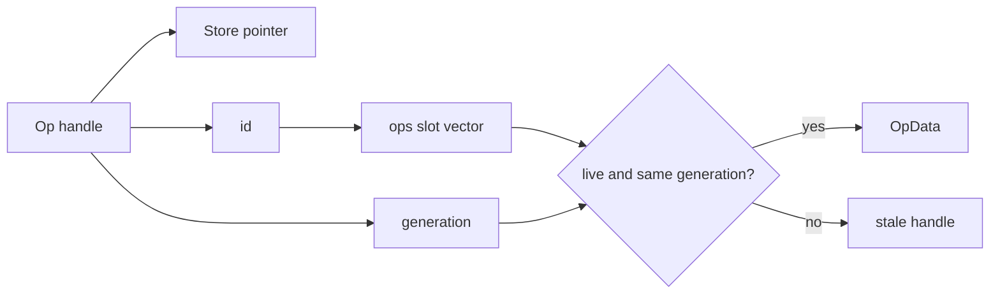

# Graph storage and edit costs

## Store layout

One `Mod` owns one internal store. Functions, blocks, operations, and values
live in separate slot vectors:

```text
Store
├── fns  : vector<Slot<FnData>>
├── blks : vector<Slot<BlkData>>
├── ops  : vector<Slot<OpData>>
├── vals : vector<Slot<ValData>>
├── symbols : name → function ids
└── queries : hash → cached dependency records
```

Each slot has data, a generation, and a live bit. Public `Fn`, `Blk`, `Op`, and
`Val` are small handles containing store identity, slot id, and generation.



This design deliberately differs from `Attr`: graph handles are identity- and
lifetime-bearing references, while `Attr` is owned serializable data. Folding
handles into `Attr` would erase ownership checks and make stale references
harder to reject.

## Node payloads

| Payload | Hot fields | Variable-size fields |
| --- | --- | --- |
| `FnData` | revision/local/external | name, generics, params, blocks, returns, metadata |
| `BlkData` | owning function/parent op | arguments, operation order |
| `OpData` | kind/block/form/carried count | callee, operands, results, child blocks, metadata, location |
| `ValData` | kind/function/def/index | name, type, users, metadata |

The structure-of-vectors split by node family keeps handle lookup direct and
avoids a polymorphic allocation for every graph object. Individual payloads
still own vectors/strings where the graph is genuinely variable arity.

## Def-use maintenance

`ValData.users` records operation ids. Edits update this relation rather than
rescanning the whole graph for every `users()` request.

For replacing one value used `U` times, the desired cost is proportional to
the affected uses plus validation, not to all `N` operations. Batch
replacement validates ownership/arity once and avoids repeated setup.

```text
discover replacement
→ validate stores/types/dominance
→ redirect recorded users
→ update old/new use lists
→ touch owning functions/revisions
→ erase dead producer when legal
```

`rebuild_uses` exists as a repair/reconstruction boundary for structural work;
it should not become the default cost of a small edit.

## Revision granularity

The store maintains:

- a whole revision for any observable edit;
- a structure revision for membership/order/topology changes;
- a function revision for function-local content changes;
- slot generations for erase/reuse safety.

Fine-grained observers can therefore survive unrelated edits. Consumers must
not interpret revision numbers as semantic versions; they are freshness
tokens.

## Affected-cone walks

`Mod::affected(roots)` follows users from changed values. Scratch marks use an
epoch counter, avoiding an `O(N)` bitmap clear for every call:

```text
affected_marks[id] == current_epoch  → already visited
affected_marks[id] != current_epoch  → visit and stamp
```

When the epoch wraps, the implementation can clear safely. This is a useful
pattern for repeated sparse traversals over a large stable slot space.

## Transaction cost

Metadata-only edits journal the old leaf and can roll back narrowly.
Structural edits request a structural snapshot before publishing mutations.
The snapshot is paid lazily: a read-only run or metadata-only run should not
deep-copy the graph.

| Edit | Typical rollback material |
| --- | --- |
| set/unset metadata | target, id, previous dictionary/value |
| rename/type/retarget | structural store state as required |
| insert/clone/erase/move | structural snapshot |
| failed final verify | restore store plus revision state |

The timing profile records whether a structural snapshot occurred and its
duration. That evidence is necessary before optimizing transaction code.

## Memory growth and handle stability

Slot vectors may grow, but handles do not contain addresses of vector
elements. They resolve through the store and id each time. Erasure invalidates
the generation; a later object using the same id cannot be mistaken for the
old node.

This trades one bounds/live/generation check for robust public handles. Hot
internal loops may work with ids or predecoded plan slots after validating the
boundary once.

## Optimization checklist

- Prefer a batch edit when ownership/type checks can be shared.
- Traverse `users` or an affected cone instead of all operations.
- Do not call `ops()` repeatedly inside an inner loop if one snapshot suffices.
- Avoid materializing metadata dictionaries when only one key is required.
- Keep read-only analyses free of mutation APIs so their dependencies remain
  precise.
- Inspect structural-snapshot and verification time before changing the
  evaluator.
- Never bypass `touch`, use-list maintenance, generation checks, or transaction
  hooks for a local speedup.

## Unsafe shortcuts

| Shortcut | Why it fails |
| --- | --- |
| retain `Loc&` across edits | it is borrowed from movable store data |
| cache raw slot payload pointers | vector growth and rollback invalidate them |
| mutate payloads directly | revisions, use lists, and rollback are skipped |
| identify nodes by id alone | erased slots can be reused with new generation |
| rebuild all uses after every edit | turns sparse changes into whole-graph work |
