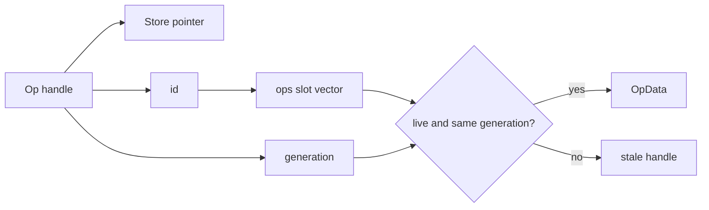

# Graph storage and edit costs

## Store layout

One `Mod` owns one internal store. Functions, blocks, operations, and values
live in separate slot vectors:

```text
Store
├── fns  : vector<Slot<FnData>>
├── blks : vector<Slot<BlkData>>
├── ops  : vector<Slot<OpData>>
├── vals : vector<Slot<ValData>>
├── symbols : name → function ids
└── queries : hash → cached dependency records
```

Each slot has data, a generation, and a live bit. Public `Fn`, `Blk`, `Op`, and
`Val` are small handles containing store identity, slot id, and generation.


```mermaid
flowchart LR
    H[Op handle] --> S[Store pointer]
    H --> I[id]
    H --> G[generation]
    I --> X[ops slot vector]
    X --> L{live and same generation?}
    G --> L
    L -->|yes| D[OpData]
    L -->|no| Z[stale handle]
```

This design deliberately differs from `Attr`: graph handles are identity- and
lifetime-bearing references, while `Attr` is owned serializable data. Folding
handles into `Attr` would erase ownership checks and make stale references
harder to reject.

## Node payloads

| Payload | Hot fields | Variable-size fields |
| --- | --- | --- |
| `FnData` | revision/local/external | name, generics, params, blocks, returns, metadata |
| `BlkData` | owning function/parent op | arguments, operation order |
| `OpData` | kind/block/form/carried count | callee, operands, results, child blocks, metadata, location |
| `ValData` | kind/function/def/index | name, type, users, metadata |

The structure-of-vectors split by node family keeps handle lookup direct and
avoids a polymorphic allocation for every graph object. Individual payloads
still own vectors/strings where the graph is genuinely variable arity.

## Def-use maintenance

`ValData.users` records operation ids. Edits update this relation rather than
rescanning the whole graph for every `users()` request.

Batch replacement validates ownership, types, replacement chains, and
dominance before changing operands. It snapshots the recorded users, sorts
and deduplicates their operation ids, then visits only those operations.
Repeated operands still contribute separate entries to the use lists.

For `U` recorded uses and `A` operands across the selected operations, user
selection costs `O(U log U)` and operand rewriting costs `O(A)`, in addition
to validation and use-list maintenance. The rewrite no longer scans all `N`
operations. Dominance checks and updates to a high-fanout value's use list
remain separate costs.

```text
discover replacement
→ validate stores/types/dominance
→ redirect recorded users
→ update old/new use lists
→ touch owning functions/revisions
→ erase dead producer when legal
```

`rebuild_uses` exists as a repair/reconstruction boundary for structural work;
it should not become the default cost of a small edit.

Erasure collects the removed subtree and rejects values with surviving
external users before mutation. Each operation's parent-block id identifies
the block orders to update; unrelated blocks are not scanned. Removing one
operation still traverses its containing block's order vector, so block size
also matters. Nested blocks and their slot generations are invalidated as
part of the same edit.

### Cloning and binding names

Cloning appends nodes and attaches their operand edges to existing use lists.
It preserves nested lexical bindings and chooses fresh names for declarations
copied into the destination scope. Two paths keep that work separate:

| Clone contents | Name handling |
| --- | --- |
| No root `let` or `var` binding | No name-index lookup |
| Named root declarations | Extend the index with newly appended values, then check candidates |

The store owns a name-to-value-id index and a cursor recording the indexed
prefix of the value arena. The first named clone indexes existing live values;
later clones inspect only values appended since that cursor. Candidate names
keep the same global collision rule and smallest available numeric suffix.

Index entries contain ids, not views into movable strings. Lookup drops erased
values lazily and checks the current name of each candidate slot. Renaming an
already indexed value removes its old entry and adds its new entry. New values
are picked up by the next index extension. Parsing resets the store; structural
rollback restores the index together with its arena.

This removes a full-arena scan from each repeated clone. Name indexing is
linear in the values appended across those clones, while choosing a suffix
still costs one lookup per occupied candidate. The remaining clone cost
includes subtree traversal, operand validation, and node allocation.

## Revision granularity

The store maintains:

- a whole revision for any observable edit;
- a structure revision for membership/order/topology changes;
- a function revision for function-local content changes;
- slot generations for erase/reuse safety.

Fine-grained observers can therefore survive unrelated edits. Consumers must
not interpret revision numbers as semantic versions; they are freshness
tokens.

## Affected-cone walks

`Mod::affected(roots)` follows users from changed values. Scratch marks use an
epoch counter, avoiding an `O(N)` bitmap clear for every call:

```text
affected_marks[id] == current_epoch  → already visited
affected_marks[id] != current_epoch  → visit and stamp
```

When the epoch wraps, the implementation can clear safely. This is a useful
pattern for repeated sparse traversals over a large stable slot space.

## Transaction cost

Metadata-only edits journal the old leaf and can roll back narrowly.
Structural edits request a structural snapshot before publishing mutations.
The snapshot is paid lazily: a read-only run or metadata-only run should not
deep-copy the graph.

| Edit | Typical rollback material |
| --- | --- |
| set/unset metadata | target, id, previous dictionary/value |
| retarget to a visible function | validate first, then commit; no per-call store copy |
| retarget that adds a package dependency | snapshot before adding the dependency |
| rename/type | structural store state as required |
| insert/clone/erase/move | structural snapshot |
| failed final verify | restore store plus revision state |

The timing profile records whether a structural snapshot occurred and its
duration. That evidence is necessary before optimizing transaction code.

### Call retargeting

`Mod::retarget(env, call, target)` first resolves the exact function, checks
argument dominance, and checks result compatibility. If the target is local
or already visible through `use`, this preflight does not mutate the graph.
Only a passing edit changes the callee and, when requested, its arguments.
Repeating the same edit leaves revisions unchanged.

An external target may require a new `use` edge. That path snapshots before
adding the edge: a later signature rejection restores both the dependency
list and the graph's revisions, while retaining the diagnostic. A surrounding
`run` transaction still provides its own rollback boundary. Avoiding a nested
snapshot for every already-visible target is particularly important when
expansion retargets many calls inside a large graph.

## Memory growth and handle stability

Slot vectors may grow, but handles do not contain addresses of vector
elements. They resolve through the store and id each time. Erasure invalidates
the generation; a later object using the same id cannot be mistaken for the
old node.

This trades one bounds/live/generation check for robust public handles. Hot
internal loops may work with ids or predecoded plan slots after validating the
boundary once.

## Optimization checklist

- Prefer a batch edit when ownership/type checks can be shared.
- Traverse `users` or an affected cone instead of all operations.
- Do not call `ops()` repeatedly inside an inner loop if one snapshot suffices.
- Avoid materializing metadata dictionaries when only one key is required.
- Keep read-only analyses free of mutation APIs so their dependencies remain
  precise.
- Inspect structural-snapshot and verification time before changing the
  evaluator.
- Never bypass `touch`, use-list maintenance, generation checks, or transaction
  hooks for a local speedup.

## Unsafe shortcuts

| Shortcut | Why it fails |
| --- | --- |
| retain `Loc&` across edits | it is borrowed from movable store data |
| cache raw slot payload pointers | vector growth and rollback invalidate them |
| mutate payloads directly | revisions, use lists, and rollback are skipped |
| identify nodes by id alone | erased slots can be reused with new generation |
| rebuild all uses after every edit | turns sparse changes into whole-graph work |
