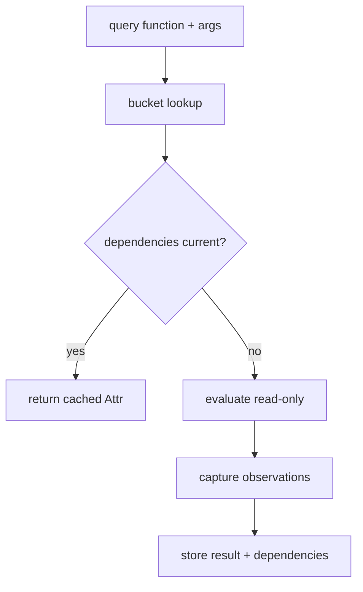
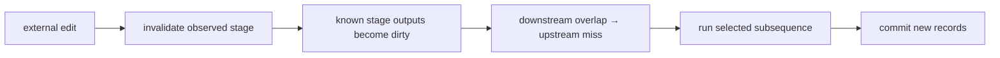

# Incremental invalidation

Joggle tracks what a compiler function reads while it executes. Reuse is based
on those observations, not only on the input mod's whole revision.

## Observation classes

| Observation | Captured identity/state | Invalidated by |
| --- | --- | --- |
| function content | id, generation, revision | erase/reuse or body/signature/metadata edit |
| function handle only | id, generation | erase/reuse |
| function operation/value collection | member ids and generations | membership/shape change |
| operation | id, generation, payload snapshot | erase/reuse or payload edit |
| value | id, generation, payload snapshot | erase/reuse or type/metadata/def-use edit |
| packages | declared `use` list | dependency change |
| intrinsics | intrinsic names used | environment capability change |
| structure | structure revision | topology/order change |
| whole mod | whole revision | any observable edit |

The evaluator records the narrowest observation supported by the API call.
Calling a broad convenience such as `ir.ops(m)` naturally observes more than
querying one already-known operation.

`ir.ops(block, start, count)` records the structural revision and the payloads
of only the returned operations. A content edit outside that range therefore
remains reusable, while insertion, removal, or reordering invalidates the
structural contract. `ir.blks(fn)` likewise records the function handle and
structural revision rather than treating every body edit as a function-content
observation.

## Read-only query cache



The cache also includes environment identity/epoch and query arguments. A
query that observes an operation in one function can survive an unrelated
function edit; a query that asks for every operation cannot.

Read-only mode rejects mutation. This is both a correctness boundary and a
cache-contract boundary.

## Miss taxonomy

Miss reasons name the first invalid contract:

```text
cold | environment | whole_revision | structure_revision
| package_dependencies | function_generation | function_revision
| function_shape | operation_generation | operation_revision
| value_generation | value_revision
```

The reason is diagnostic evidence, not a stable performance ranking. After
fixing one broad dependency, another may become the next miss.

## Reactive stages

A reactive schedule stores input dependencies and output effects for each
stage. On a later call it:

1. checks environment, store identity, and arguments;
2. validates each stage's recorded observations;
3. marks directly invalid stages;
4. propagates earlier dirty outputs to downstream observers;
5. executes the selected subsequence transactionally;
6. publishes fresh dependency records only after success.



`upstream` means a stage's own prior inputs may still match the store snapshot,
but an earlier selected stage can change something it observes during this
run.

## Precision versus capture cost

Very fine dependency capture stores and validates more records. Very coarse
capture reruns more work. The right granularity depends on the stage:

| Stage behavior | Useful dependency shape |
| --- | --- |
| inspect one marked call | operation/value snapshots |
| summarize one function | function revision or collection membership |
| discover all candidate functions | function collection/package dependencies |
| whole-program canonicalization | structure or whole revision |

A metaprogramming API should expose narrow lookup operations so authors can
express precise observation. Core developers should not silently make a broad
API appear narrow by failing to record what it read.

## Mutation outputs

For each stage, Joggle captures changed function ids and whether structure or
packages changed. Those effects are enough to propagate most downstream
invalidations without rerunning all earlier stages.

Current limitations are explicit:

- effects are function/structure/package oriented, not arbitrary semantic
  regions;
- external state is not tracked unless represented as arguments/environment;
- native callbacks must not hide relevant mutable dependencies;
- whole-graph APIs intentionally reduce reuse precision.

## Authoring for reuse

- Pass configuration as typed `Attr` arguments instead of reading ambient
  files or time.
- Query the smallest stable handle/collection that answers the question.
- Separate read-only analysis from mutation.
- Make transforms idempotent so a conservative rerun is cheap and safe.
- Avoid attaching `[memo]` to functions that observe untracked state.
- Use the report to confirm reuse; do not infer it from unchanged output.
