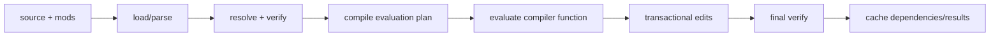

# Performance internals

This section explains the performance of Joggle itself: loading mods, storing
and editing graphs, resolving calls, evaluating compiler functions, verifying
results, caching read-only queries, and reusing reactive stages. It does not
measure generated-model speedups; artifact performance is a separate
measurement problem.



## Read in this order

| Chapter | Question answered |
| --- | --- |
| [Graph storage and edits](graph-storage.md) | how nodes, handles, revisions, use lists, and rollback are represented |
| [Evaluator fast path](evaluator.md) | how `.jog` compiler functions execute without reparsing their body each call |
| [Incremental invalidation](incremental.md) | how queries and stages record exactly what they observed |
| [Profiling and measurement](profiling.md) | how to separate lookup, verification, evaluation, mutation, and emission costs |
| [API shape and cost](api-design.md) | which types belong in the stable API and which records should remain private |

## Current mechanisms

The following mechanisms are implemented now:

- slot-backed graph storage with generation-checked handles;
- whole, structural, and function-level revisions;
- maintained def-use lists;
- transactional metadata journaling and structural rollback;
- cached verification keyed by environment and graph revision;
- predecoded evaluation plans keyed by function identity/generation/revision;
- cached call dispatch and direct operator/intrinsic links;
- reusable register windows and small-arity call paths;
- per-top-level-run memoization for explicitly pure `[memo]` functions;
- observation-based query caching;
- dependency-tracked reactive stage reuse;
- optional low-level evaluator counters.

> [!IMPORTANT]
> Evaluation plans are not native machine code. Joggle currently avoids repeated
> decoding and dispatch work. It is not an LLVM-style machine-code JIT.

## Cost model

For a workflow with `N` graph nodes and `K` selected compiler stages, total
latency is not one monolithic “pass time”:

```text
load + parse + initial verify
+ Σ(stage resolve + evaluate + edit bookkeeping + post-stage verify)
+ print/emit
```

Warm repeated work may replace some terms with dependency lookup and cache
validation. A useful optimization must identify which term dominates for the
actual workload.

| Workload | Likely dominant term | First evidence |
| --- | --- | --- |
| tiny one-shot CLI transform | process/load/parse overhead | wall time plus phase timing |
| large structural rewrite | cloning, use updates, verification | edit count, snapshot, verify time |
| loop-heavy source policy | evaluator loop/frame traffic | plan counters and per-function stats |
| repeated IDE/server update | invalidation breadth | reactive miss reasons/selected stages |
| large artifact generation | emitter traversal/string output | frontier size and emit-only timing |

## Optimization rule

Every core optimization should preserve three independent contracts:

1. identical verified graph or artifact semantics;
2. identical failure/rollback boundary;
3. measured improvement in the intended workload, not only a microbenchmark.

The project keeps deterministic structural reports separate from timing so a
faster wrong result cannot pass as an optimization.
