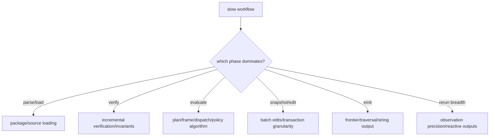

# Profiling and measurement

## Two evidence streams

Joggle separates deterministic execution reports from variable profiling:

```sh
./build/joggle run opt.basic model.jog \
  --report build/run.attr \
  --timing build/timing.attr \
  -M build/modules > build/optimized.jog
```

`run.attr` records functions, arguments, edits, changed status, and nested
compiler-function calls. `timing.attr` records durations and optional low-level
counters. Only the former is suitable for exact structural regression checks.

## Enable evaluator counters

```sh
cmake -S . -B build-profile \
  -DCMAKE_BUILD_TYPE=RelWithDebInfo \
  -DJOGGLE_EVAL_COUNTERS=ON
cmake --build build-profile -j
```

Counters add instrumentation. Use the same build configuration for compared
runs, and repeat final wall-clock measurements with counters both enabled and
disabled if overhead matters.

## Timing hierarchy

```text
run
├── snapshot_ns
├── initial_verification_ns
└── steps[]
    ├── resolve_ns
    ├── evaluation_ns
    ├── verification_ns
    ├── total_ns
    ├── graph revision before/after
    └── evaluator counters
```

Interpret `total_ns` as inclusive stage time. Do not sum overlapping or
inclusive fields without checking their definitions.

## Counter groups

| Group | Representative fields | Question |
| --- | --- | --- |
| plan | compiles, hits, fallbacks, persistent hits | are bodies repeatedly decoded? |
| frame | lookups, probes, writes, pool hits/misses | is value environment traffic dominant? |
| control | branches, loops, iterations, yields | is source policy algorithmic work dominant? |
| calls | arity counts, argument/result vectors | are call containers/materialization dominant? |
| dispatch | hits/misses, direct links | is overload dispatch repeated? |
| function | invocations, memo hits, evaluated ops | which compiler helper is hot? |

Counters are causal hints. A large count is not automatically expensive; pair
it with phase time and a controlled code change.

## Cold and warm protocol

For a reactive or embedded workload, report both:

1. cold environment/schedule construction;
2. warm no-change reuse;
3. one local metadata edit;
4. one local structural edit;
5. a whole-model change.

For every case capture:

| Field | Why |
| --- | --- |
| model and node/function counts | workload scale |
| build/compiler/CPU/OS | reproducibility |
| stage list and arguments | pipeline identity |
| executed/reused stage count | actual incremental work |
| miss reasons | explanation of reruns |
| median and tail latency | central and worst-case behavior |
| output hash/equivalence oracle | correctness |

## Repetition harness

A simple external harness should warm up, run many iterations, and write one
row per sample rather than averaging inside the compiler:

```text
case,iteration,wall_ns,executed_stages,reused_stages,output_hash
cold,0,...
warm,0,...
metadata_edit,0,...
```

Pinning CPU affinity or disabling frequency scaling may be appropriate for a
dedicated lab machine, but document it. Never mix debug, sanitizer, and release
numbers in one comparison.

## Optimization decision tree



## Invalid benchmarks

| Mistake | Why result is unusable |
| --- | --- |
| time only three toy nodes | fixed startup dominates |
| compare different optimization semantics | speed and work differ |
| omit output verification | faster result may be wrong |
| compare cold Joggle with warm competitor | cache states differ |
| report only best sample | noise is selected, not measured |
| enable counters on one side only | instrumentation differs |
| call plan cache a native JIT | mechanism is mischaracterized |

## Performance test placement

Correctness and invariant regression tests belong in the normal suite.
Wall-clock thresholds usually do not: shared CI noise makes them flaky. Keep a
repeatable benchmark driver and raw rows, then use statistically justified
guardrails on controlled hardware.
