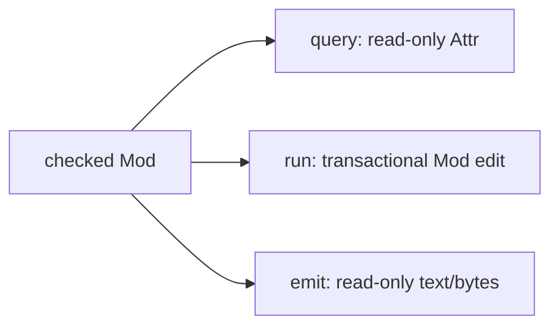

# Start here

This path builds Joggle, reads one complete `.jog` program, verifies it, and
runs one transformation. It requires CMake 3.20+ and a C++20 compiler.

## Build

```sh
cmake -S . -B build -DCMAKE_BUILD_TYPE=Release
cmake --build build
```

The default configuration downloads nothing. The CLI is `build/joggle`; built
mods are copied to `build/modules`.

### Build variants

| Goal | Configure option | Notes |
| --- | --- | --- |
| core, source mods, C target | default | offline, smallest dependency set |
| ONNX decoding | `-DJOGGLE_BUILD_ONNX=ON` | requires Protobuf |
| TFLite decoding | `-DJOGGLE_BUILD_TFLITE=ON` | requires FlatBuffers |
| evaluator counters | `-DJOGGLE_EVAL_COUNTERS=ON` | profiling build; adds instrumentation |
| developer checks | `-DBUILD_TESTING=ON` | default in a top-level checkout |

```sh
cmake -S . -B build \
  -DCMAKE_BUILD_TYPE=Release \
  -DJOGGLE_BUILD_ONNX=ON \
  -DJOGGLE_BUILD_TFLITE=ON
cmake --build build -j
```

Do not enable optional frontends merely to use their semantic counterparts.
The `tensor`, `nn`, `opt`, `mem`, `c`, and VM source APIs are independent of a
particular model file decoder.

## Read the program

`test/data/matmul.jog` starts with:

```jog
mod test.linear
use tensor

fn add_zero(x: i32) -> i32 {
  let y = x + 0
  return y
}
```

| Line | Meaning |
| --- | --- |
| `mod test.linear` | this file belongs to package `test.linear` |
| `use tensor` | the package depends on the bundled `tensor` mod |
| `fn ... -> i32` | a public function with one typed result |
| `let y` | immutable graph value |
| `x + 0` | typed call resolved through ordinary overloads |

The source is also the readable IR. The call, its result, and the return are
the objects a compiler function observes.

## Check it

```sh
./build/joggle check test/data/matmul.jog -M build/modules > checked.jog
```

`-M` adds a mod search root. `check` parses, resolves, verifies, and prints
canonical `.jog`. A failure reports a source location and publishes no output.

## Transform it

```sh
./build/joggle run opt.fold_add_zero checked.jog \
  -M build/modules > transformed.jog
```

The relevant result becomes:

```jog
fn add_zero(x: i32) -> i32 {
  return x
}
```

The transform redirected the return to `x` and removed the dead addition. It
did not rewrite unrelated functions.

## Inspect without editing

```sh
./build/joggle query opt.untyped transformed.jog -M build/modules
```

Expected output:

```text
[]
```

This means no call result retains the open `_` type. It does not claim
numerical correctness.

## Understand the three command roles



| Role | Entry signature | Observable result |
| --- | --- | --- |
| query | `fn(Mod, ...) -> Attr-compatible value` | printed structural data |
| run | `fn(Mod, ...) -> bool` | revised canonical `.jog` |
| emit | `fn(Mod, ...) -> str/bytes` | artifact stream |

The same `.jog` function language implements all three. The command chooses
the mutation/result contract; it does not select a different pass DSL.

## Work with files explicitly

Keep stage outputs while learning or debugging:

```sh
mkdir -p build/walkthrough
./build/joggle check test/data/matmul.jog -M build/modules \
  > build/walkthrough/checked.jog
./build/joggle run opt.fold_add_zero build/walkthrough/checked.jog \
  -M build/modules > build/walkthrough/folded.jog
./build/joggle query opt.untyped build/walkthrough/folded.jog \
  -M build/modules
```

This preserves the exact input to each stage. Shell pipelines are convenient
after the workflow is stable, but named intermediates make failure attribution
and bug reports much clearer.

## What success proves

| Check | Proves | Does not prove |
| --- | --- | --- |
| `check` succeeds | syntax, resolution, typing, graph invariants | target support or numerical accuracy |
| `opt.untyped == []` | no open result types reported | every semantic call is supported |
| target frontier is empty | selected target can represent the graph | generated result matches a reference |
| generated C compiles | derived ABI/source is accepted by that compiler | model output is correct |
| harness passes | covered inputs match its oracle | all shapes/values/platforms are covered |

> [!IMPORTANT]
> Treat every stage as a separate evidence boundary. Do not turn “the command
> returned zero” into a stronger claim than its contract supports.

## Common first-run problems

| Symptom | Cause | Fix |
| --- | --- | --- |
| `mod not found` | `-M` points at a package instead of its parent | pass `build/modules` or another mod root |
| unresolved function | provider is not loaded through `use` | add the dependency and root |
| command prints nothing useful | stdout was redirected or entry returns empty data | inspect diagnostics and command role |
| transformed graph is unchanged | transform was already stable or precondition did not match | inspect exact callee/types and report |
| optional frontend missing | build flag/dependency was absent | reconfigure with the appropriate option |

## Verify the documented path

```sh
ctest --test-dir build -L tutorial --output-on-failure
```

Continue with [Language](../language/index.md). Do not skip directly to compiler
internals if `mod`, structural types, or function syntax are still unfamiliar.
