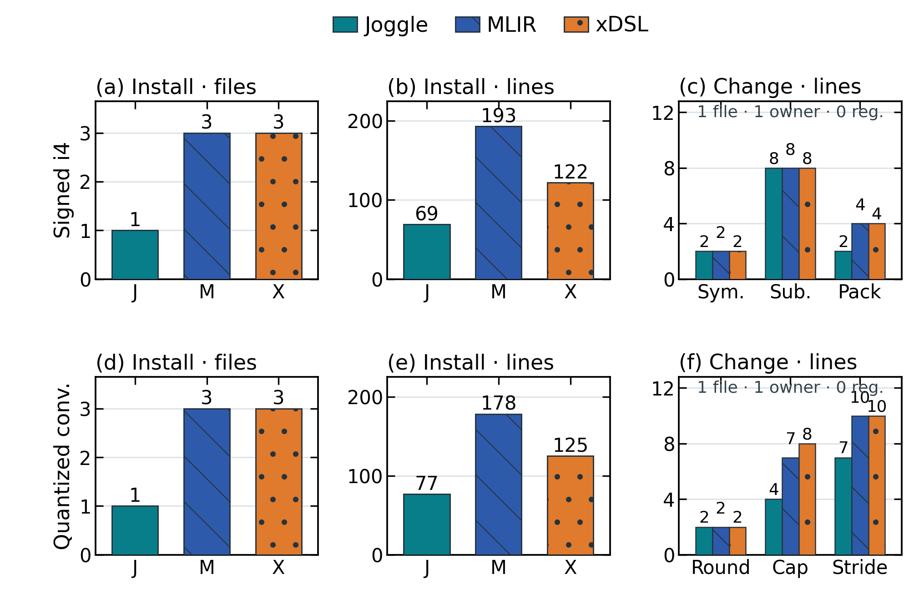

# Joggle: A Progressive IR for Malleable Compilation

## Abstract

Rapid advances in AI bring new operators, numeric formats, and hardware targets
that compilers must support. Yet cross-stage extensions span fragmented
interfaces and ownership boundaries, while local edits trigger broad
recompilation. We present Joggle, a compiler infrastructure built on a
progressive intermediate representation. To make extensions composable, typed
compiler functions unify semantics, analysis, transformation, conversion, and
emission through one language, call model, and value model. Graph-level mods
then give each cross-stage feature an explicit owner, while recorded
dependencies direct reactive execution toward affected work. Across three
models, prepared-body reuse accelerates executable-ready updates by
$1.49$--$2.48\times$ over complete rebuilds. The generated executables also
achieve a $2.10\times$ geometric-mean speedup over default TVM on eight models
compiled correctly by all compared systems. Together, these mechanisms make
compiler capabilities composable, independently organized, and reusable as
AI workloads evolve.

## 1. Introduction

The evolution of AI workloads makes compiler development a continuing part of
deployment. New operators, numeric formats, and accelerators require changes
from semantic definitions to generated code. Extensible IRs and tensor
programming systems provide the building blocks for these changes
[@lattner2021mlir; @feng2022tensorir]. The remaining challenge is to compose
those blocks into features that developers can extend, maintain, and evaluate
without repeatedly coordinating the entire compiler.

Consider adding a fused convolution. Its definition, legality analysis, graph
rewrite, and target implementation must agree on one semantic contract. Yet
these roles may use different interfaces and belong to separate registries,
build targets, and backend libraries. Even after a local modification, a
pipeline can repeat work unrelated to that change. The development cost thus
depends on three boundaries: how capabilities compose, where a feature is
owned, and what an edit invalidates.

Our central observation is that none of these boundaries is determined by
program containment alone. A feature can span several IR levels, and adjacent
passes can inspect disjoint graph regions. Consequently, organizing the
subject program does not by itself organize the compiler capabilities acting
on it. Ownership and execution dependencies need explicit representations
alongside the program graph.

We present Joggle, a compiler infrastructure that makes these relationships
explicit. Typed *compiler functions* express behavior, graph-level *mods* own
cross-stage features, and recorded observations and effects direct updates.
Functions progressively refine a typed graph while semantic operations and
lower-level helpers coexist. Each successful mutation publishes a verified
state over the same entity model. This *progressive intermediate
representation* preserves a feature's ownership as its subject program changes
form.

This organization also provides a concrete setting for agent-assisted compiler
development. Repository-editing benchmarks and agents emphasize executable
feedback [@jimenez2024swebench; @yang2024sweagent], while KernelBench measures
generated kernels [@ouyang2025kernelbench]. Here, an extension can involve
several compiler roles, making their composition part of the task itself.

Figure 1 summarizes the three mechanisms developed in this paper.

<!-- FIGURE 1 PROMPT — A dense two-column 3×3 systems-paper argument map. The
columns are PROGRAMMABILITY, ORGANIZATION, and UPDATE; the rows are CHALLENGE,
JOGGLE DESIGN, and OUTCOME. Each column reads top to bottom with no cross-column
arrows. Programmability: fragmented Semantics/Analysis/Transform/Convert/Emit
mechanisms → Unified metaprogramming using typed compiler functions, one language,
one call model, one value model, and `Ty Attr Mod Fn Op Val` → CONVENIENT with
`task success` and `tokens · tool calls`. Organization: one feature scattered across hierarchical
IR, pass registry, build target, conversion, and backend → Graph-level mod
boundary with `mod quant`, `use tensor`, own/publish/version/change tabs, and an
app→quant→tensor use graph → CONTROLLABLE with `files · lines` and `ownership
zones`; depict a feature patch as filename bars without invented source code.
Update: local edit at B causing suffix B→C→D rerun → Reactive re-execution over an
affected subgraph using revisions, dependency index `D/W`, and cached execution
plan → EFFICIENT with `p50 · p95`, `visited work`, and `edit-to-artifact`.
Use a changed→execute / unchanged→reuse ledger instead of synthetic curves.
The outcome row names measured endpoints without displaying invented results.
Use compact technical
glyphs, thin dark connectors, white background, restrained blue/teal/lavender,
and coral only for changed state. Use only the named Joggle constructs; omit
source snippets, line numbers, numbered circles, red numeric labels, gradients, shadows, and
decorative people. -->

*Figure 1: Joggle maps three extension challenges to system mechanisms and
measurable outcomes.*

**Unified compiler functions.** Five compiler roles share typed calls over
graph handles and owned values. Common resolution and composition rules let
one role invoke another, while effect contracts distinguish inspection,
mutation, and artifact return.

**Graph-level feature ownership.** A mod groups cross-stage functions and
native bindings behind one public interface and declared dependency closure.
Loading, visibility, and publication follow this boundary independently of
containment within the subject program.

**Reactive execution.** The evaluator validates recorded observations
and propagates overlapping effects to select affected stages. Entity generations
and revisions identify stale observations; transactional publication keeps
reusable records consistent with the verified graph.

The evaluation separates extension completion, package changes, and update
latency from generated-code performance. Native package integration touches
one file per extension, compared with three in the matched MLIR and xDSL
implementations. Prepared-body reuse accelerates executable-ready updates by
$1.49$--$2.48\times$ over complete rebuilds on three models. On eight models
compiled correctly by all four systems, the generated executables achieve a
$2.10\times$ geometric-mean speedup over default TVM. Together, these
experiments examine both the cost of changing a compiler and the artifacts
it produces.

## 2. Motivation

### 2.1 Cross-Stage Extensions

Figure 2 follows a model from structure to device. Operator definitions specify
semantics; graph passes change connectivity; system passes choose order and
storage; backends produce target implementations. These extension points
describe different responsibilities within one compilation workflow.

<!-- FIGURE 2 PLAN — Single-column figure. Preserve the supplied overview
artwork and its existing layout. It shows model structure and formats above
offline operator-, graph-, and system-level compilation; an online runtime and
target devices below; model, pass, operator/type, and hardware customization on
the left; and design, optimization, and deployment roles on the right. Do not
regenerate or alter the figure. -->

*Figure 2: A compiler extension can span semantic definition, optimization,
runtime support, and target deployment.*

For example, fusing convolution, bias addition, and activation requires more
than a replacement kernel. An analysis checks types, shapes, and intermediate
uses; a rewrite replaces the legal subgraph; conversion and emission realize
the fused operation. Changing its layout or numeric format can affect several
of these implementations while leaving unrelated features unchanged.

Existing systems expose substantial control over this workflow: MLIR supports
multi-level lowering [@lattner2021mlir], Halide separates algorithms and
schedules [@ragankelley2012halide], and Relax composes graph, tensor, and library
abstractions [@lai2025relax]. The issue is therefore not whether a compiler can
express an optimization, but how a complete feature crosses its interfaces.

### 2.2 Boundaries That Spread Change

*Fragmented mechanisms.* A fusion rule must invoke its legality check and pass
the matched graph to conversion. If these roles use different call and value
models, adapters become part of the feature. IRDL makes definitions declarative
[@fehr2022irdl], and the Transform dialect makes transformation control
programmable [@lucke2025transform]. Composing a complete extension also requires
agreement at the boundaries between such mechanisms.

*Scattered ownership.* Regions, blocks, and functions organize the program
being compiled. They do not determine who owns the fusion rule, its analysis,
or its emitter. When registration and deployment place these parts in separate
packages, one feature acquires several integration boundaries. A useful
ownership unit must follow the capability across stages.

*Coarse updates.* Pipeline order is similarly insufficient to identify affected
work. Editing one operator need not change analyses of a disjoint branch, yet
invalidating a stage suffix reruns both. Dynamic dependencies recover this
distinction in self-adjusting computation [@acar2009selfadjusting] and
interactive development pipelines [@konat2018pie]. For a mutable compiler graph,
the dependencies must also account for replaced entities and published edits.

### 2.3 A Composable Update Model

These observations lead to three design requirements. First, compiler roles
need a shared typed call interface so that analysis, transformation, and
emission compose directly. Second, a cross-stage feature needs an owner with
explicit visibility and dependencies, independent of subject-program
containment. Third, execution needs observed dependencies and effects so that
updates follow changed state rather than stage order.

The requirements meet at publication: a reusable result must refer to the
same graph state as its dependency records. Section 3 develops compiler
functions, mods, and transactional evaluation around that invariant.

## 3. Design

### 3.1 System Model

Programs and compiler extensions share one typed graph model.
A *subject mod* holds the program being inspected or transformed; an
*extension mod* supplies the compiler functions acting on it. These are roles
within an invocation. Both use the same entity model, type system, and loader.

The graph owned by a mod is

$$
G = (F, B, O, V, A),
$$

where $F$, $B$, $O$, and $V$ are functions, blocks, operations, and values, and
$A$ denotes attributes attached to these entities. Blocks order operations,
operations consume and produce values, and maintained def-use edges connect
each value to its users. Operator sets, input formats, and artifacts enter
through extension mods.

An environment $E$ loads the mods named by a program, resolves typed calls,
binds source or native implementations, and owns evaluator state. One
compiler-function call has the form

$$
E \vdash f(M, a) \Downarrow (r, D, W).
$$

Here, $M$ is the subject mod and $a$ contains explicit arguments. The call
returns $r$, records the observed graph state $D$, and publishes graph effects
$W$. Read-only calls have $W=\varnothing$. Mutating calls produce $W$ only
after the resulting graph passes verification.

This representation is progressive because each successful compiler
function publishes another verified mod over the same entity model. A stage may
retain semantic operations while introducing lower-level helpers, and a later
stage may replace definitions it owns. Typed refinements express progress
within one graph model, and every published state remains inspectable.

Figure 3 separates the two graphs that organize compilation. The mod graph
determines which compiler functions are available; the subject graph contains
the program those functions inspect and refine. Typed handles connect the
shared evaluator to the subject store. Execution plans cache function decoding,
whereas dependency records track the graph state observed by a call. These
caches serve different purposes and share a transactional publication boundary.

<!-- FIGURE 3 PROMPT — system-architecture.png. Original compact single-column
square compiler architecture, white background, fine charcoal rules, pale blue
and amber nodes, small serif mathematics and monospace field annotations.
Top left: tensor/fusion/target mod boundaries, use edges from dependents to
tensor; legal/fuse/lower/emit function nodes. Top right: nested M/f/b0 subject
graph x,w→Conv→Add→ReLU→y, b→Add, value circles and users(v) links.
Middle: f:(H,A)→R and parallel query(R), run(RW), emit(R) entrances to one
resolve/evaluate interface; a compact body/intrinsic/native bracket identifies
implementation forms. Bottom: evaluator plan table, register slots and
K/D/W records beside separate F/B/O/V entity-slot arrays, h=(S,i,g), revision
scopes and a separate o0→v0→o1 def-use relation. Plan key includes store,
function, generation and revision. Tiny annotations distinguish query (K,r,D)
from stage (K,D,W) records and decode the store/slot/generation handle fields.
Transaction: G→G′→verify ownership/types/uses, success publishes
graph and dependency records; failure restores G. No invented timing numbers,
large title bands, decorative icons, paragraphs, or sequential query/run/emit.
Use thin dependency arrows and tiny local annotations, not word-heavy cards. -->

*Figure 3: Two graph structures organize compilation. Mods delimit compiler capabilities;
typed calls operate on the subject graph. Decoded plans, dependency records,
and versioned entity stores support transactional publication. Entries are schematic.*

The rest of the design develops these relationships in order. Section 3.2
defines typed compiler functions; Section 3.3 gives them a mod-scoped
composition boundary. Sections 3.4 and 3.5 then explain how observed
dependencies and transactional graph storage support reuse.

### 3.2 Compiler Functions

Compiler functions provide the programmable interface to the shared graph.
Operator semantics, analyses, transformations, representation conversion, and
artifact generation use the same definition and invocation rules. Consequently,
an extension can compose these roles through calls rather than adapters between
role-specific interfaces.

A compiler function accepts graph handles and ordinary values:

$$
f : (H_1, \ldots, H_n, A_1, \ldots, A_m) \rightarrow R.
$$

Each $H_i$ is a `Mod`, `Fn`, `Blk`, `Op`, or `Val` handle. Each $A_i$ is a
configuration or structural value, such as an integer, type, list, dictionary,
or `Attr`. The result $R$ may itself be a handle, an ordinary value, structured
data, text, or bytes. Handles retain graph ownership and lifetime; ordinary
values remain independent of graph storage.

Figure 4 follows the operator extension introduced in Section 2. The graph
computes $y=\max(\operatorname{Conv}(x,w)+b,0)$. A legality function checks
types, shapes, and intermediate uses; fusion replaces the matched operations
with one semantic operation; conversion selects its target form. These graph
states, $G_0$, $G_1$, and $G_2$, retain the same input/output contract. An
emitter reads $G_2$ and returns the artifact. The extension's mod owns all five
roles, which exchange graph handles and owned values through the same call
interface.

<!-- FIGURE 4 PROMPT — Original compact single-column scientific diagram,
3.35 inches wide and approximately 2.6 inches high. Top: one conv_ext mod
containing Semantics/Analysis/Transform/Convert/Emit columns, with
define/legal/fuse/lower/emit and contract/read/write/write/read beneath them;
use tensor and a common typed-functions/graph-handles/owned-values rail.
Bottom: three aligned graph states. G0: x,w→Conv; b→BiasAdd; Conv→BiasAdd→ReLU→y,
with a single-use match boundary. G1: x,w,b→ConvBiasReLU→y. G2:
x,w,b→target.conv_relu→y. Left arrows: fuse·verify and lower·verify.
An emit(read) arrow connects the G2 graph to an artifact glyph. Semantic
contract: y=max(Conv(x,w)+b,0). These are schematic operator and role names.
Thin charcoal connectors, white background, pale teal/blue/lavender;
coral only for the match boundary. Compact readable labels, no numeric callouts,
fake source code, cache-hit counts, or isolated output-type edits. -->

*Figure 4: A schematic fused-operator extension. One mod owns five compiler
roles. Fusion and conversion publish verified graphs; emission reads the
prepared graph and returns an artifact without changing it.*

To invoke a compiler function, the environment resolves its qualified name, visible
mods, explicit generic arguments, parameter types, and result context. The
selected implementation may be a source body, an intrinsic, or a native
binding. In each case, the caller uses the same syntax and receives results
through the same evaluator boundary.

Effect contracts then determine how the resolved call accesses graph state.
A query evaluates against a read-only mod and returns an `Attr`; a run applies
mutating functions within a transaction. An artifact call reads a prepared
graph and returns text or bytes. Thus, `query`, `run`, and `emit` share
resolution and evaluation while enforcing their respective publication rules.
Read-only execution rejects mutation, and a run publishes a verified graph.

Compiler functions also compose through ordinary calls. A fusion function can
invoke the legality analysis in Figure 4, and a conversion can query the fused
operator's semantic contract. These calls remain visible to type checking,
diagnostics, and dependency capture. The typed call graph therefore defines
composition directly.

This function model unifies how compiler behavior is declared, resolved, and
invoked. Mods then supply the namespace, visibility, and dependency boundaries
that organize these functions.

### 3.3 Mods

Where compiler functions define behavior, mods define who owns and exposes it.
A mod groups the functions of a feature with their graph and dependencies. We
model this boundary as

$$
\mathcal{M} = (n, U, F_{pub}, F_{local}, G, N).
$$

Here, $n$ is the mod name and $U$ is its declared `use` set. $F_{pub}$ and
$F_{local}$ are its public and local functions, $G$ is its graph, and $N$
contains optional native bindings. The loaded object is the semantic boundary;
its on-disk package is the distribution form.

The `use` declarations form a directed mod graph. Search roots determine where
a named mod can be found, while `use` edges select the dependencies that
participate in loading and resolution. Separating location from dependency
keeps neighboring installations outside the visible function set.

Loading validates the declared dependency closure before evaluation. The
loader rejects missing mods, cycles, declaration-name mismatches, duplicate
public signatures, unreadable fragments, and unresolved native bindings. It
then loads source fragments in deterministic order. For a fixed mod graph and
search-root order, this process yields a stable public function set.

Within the validated dependency closure, visibility determines which
functions a dependent mod can call. Public functions cross this boundary,
whereas a `local fn` remains inside its owner. Source fragments can therefore
split a large implementation without creating new lifecycle boundaries.
A separate mod establishes an independent public interface, dependency set,
and installation lifecycle.

Native code follows the same boundary. A body-less declaration names the typed
contract, and a native library owned by that mod supplies its implementation.
The binding is scoped to the owning mod and becomes available through the
declared dependency graph.

The same dependency closure also governs installation and upgrade.
Installation stages a candidate, loads and verifies its dependencies, and
publishes it after validation succeeds. Upgrade additionally checks affected
reverse dependencies. If either operation fails, the installed graph remains
unchanged. The mod is therefore the unit of both composition and evolution.

The mod graph is orthogonal to the containment structure inside a subject
program. Blocks and operations describe program structure; `use` edges
describe compiler capability. The former may change during transformation
without rewriting the latter. This separation lets one project compose
analysis, transformation, and artifact mods without embedding those ownership
decisions into its program IR.

Static mod dependencies state what a compiler extension may call. During
execution, the evaluator records which
functions and graph entities a call actually observes. Section 3.4 uses this
second, dynamic dependency graph to avoid re-executing unaffected work.

### 3.4 Incremental Evaluation

Mods establish composition boundaries; recorded observations establish reuse
boundaries within them. A local graph edit need not invalidate every compiler
result. Instead, reuse depends on the state a call observed, rather than on the
subject mod's whole revision alone.
For a cached read-only call $c$, the evaluator stores

$$
C_c = (K_c, r_c, D_c),
$$

where $K_c$ identifies the environment, store, function, and arguments;
$r_c$ is the returned value; and $D_c$ contains the observations made while
computing it.

Observations follow the graph API used by the function. Reading one operation
records its identity, generation, and payload state. Reading one value also
records type, metadata, and def-use state. Traversing a function records the
relevant function revision or collection membership. Reading all operations,
the mod structure, or the `use` set records progressively broader state. The
evaluator therefore captures the narrowest observation that preserves the
semantics of each graph operation.

Range access records the structural revision together with only the returned
operations. A content edit outside the range therefore preserves the record,
whereas insertion, removal, or reordering invalidates its structural premise.

A cached query is reusable when its call key and every recorded observation
remain current:

$$
Reusable(c) = Same(K_c) \land
              \bigwedge_{d \in D_c} Current(d).
$$

On a hit, the evaluator returns $r_c$. On a miss, it evaluates the function in
read-only mode, captures a fresh $D_c$, and replaces the entry. The execution
report names the first invalid contract, such as an environment, structure,
function, operation, or value change. Generation checks distinguish an edited
entity from a new entity that later reuses the same slot.

Mutating pipelines require one further step. After a successful run, a reactive
schedule stores for each stage $s_i$ its call key $K_i$, observed inputs $D_i$,
and output scope $W_i$. The schedule is bound to the subject store; its key
names the environment and its epoch, the stage function, and the arguments.
The output scope contains changed function identities and flags for structural
or mod-dependency changes. On the next run, a stage is selected when its key or
inputs are stale, or when an earlier selected stage may change something it
observed:

$$
\begin{aligned}
Selected_i ={}& \neg Current(K_i,D_i) \\
              & \lor \exists j<i:\ Selected_j \land Overlap(W_j,D_i).
\end{aligned}
$$

The second term is an *upstream* miss. The inputs recorded for $s_i$ may still
match at the start of a run, yet an earlier stage selected in the same run can
change them. Propagating recorded output scopes restricts downstream selection
to stages with overlapping observations instead of forcing all later stages
to execute. A selected stage executes its complete function body. Thus, the
observations determine which stages run, while the compiler's stage boundaries
determine how much work each selection performs. Replacing the subject store
starts a cold schedule.

```text
Algorithm 1: Reactive stage selection and execution

dirty_outputs <- empty
selected      <- empty

for each stage s[i] in schedule order:
    miss <- validate(s[i].key, s[i].inputs)
    if miss is none and overlaps(dirty_outputs, s[i].inputs):
        miss <- upstream
    if miss is not none:
        selected.add(s[i])
        dirty_outputs.add(s[i].outputs)

begin transaction
for each stage s[i] in selected:
    execute s[i]
    capture fresh inputs D[i] and outputs W[i]
verify graph
commit transaction
replace records for selected stages
rebase retained observations to the committed graph
publish all records for the next run
```

Dependency records are published only after all selected stages execute and
the final graph verifies. Failure rolls back graph mutations and revision
state; it also discards the tentative records. Consequently, the next run
cannot reuse dependencies derived from an unpublished graph.

Figure 5 illustrates the distinction between a direct and an upstream miss.
An external edit changes the convolution's layout metadata. Stage $s_1$ read
that property, so its observation is stale. Stage $s_2$ read the ReLU operation:
that observation remains current at selection time, but $s_1$ previously wrote
to the containing function $f$. This output scope overlaps $s_2$'s input, so
$s_2$ is selected as an upstream miss. Stage $s_3$ observed a reduction in a
disjoint function $g$ and retains its result. Thus, stage selection follows
recorded reads and write scopes, not merely reachability from the edited node.

<!-- FIGURE 5 PROMPT — reactive-update.png. Dense square single-column
mechanism diagram, fine black rules, small math annotations, pale blue graph
nodes, amber selected stages and hatched retained records. Three tight bands:
(a) f contains x,w→Conv→Add→ReLU→y and b→Add; disjoint g contains u→Reduce→v.
External edit layout a→b at Conv; cached D1 records layout=a, D2 observes ReLU,
D3 observes Reduce. (b) Record table s1/Conv.layout/f/stale,
s2/ReLU/f/upstream, s3/Reduce/empty/reuse; selected_i=stale(Ki,Di) OR
overlap(dirty,Di). Scope intersections explain selection. (c) s1→s2 within a
transaction captures fresh D′/W′; verify G′ precedes joint publication;
failure restores G, including the already committed external edit layout=b.
Retained s3 records are rebased. No timings, large headings or prose boxes. -->

*Figure 5: Reactive stage selection. A stale observation selects $s_1$;
overlapping effects select $s_2$; disjoint observations retain $s_3$.
Verification gates joint publication; rollback preserves the committed external edit.*

Fine-grained observations reduce re-execution but add capture and validation
work. For $K$ stages, scheduled graph-evaluation latency is approximately

$$
\begin{aligned}
T_{select} &= \sum_{i=1}^{K} T_{validate}(K_i,D_i) + T_{propagate}, \\
T_{inc} &= T_{select}
        + \sum_{s_i \in Selected} T_{eval}(s_i) \\
        &\quad + T_{verify}(G') + T_{commit}.
\end{aligned}
$$

Reuse is beneficial when this cost is lower than executing the omitted stages.
Broad graph APIs remain correct but record broad dependencies; narrow APIs can
preserve results across unrelated edits. External mutable state must enter
through typed arguments or an environment change before reuse. Native bindings
exchange scalar or byte attributes and do not receive graph entities, so
graph-dependent work remains in tracked compiler functions. These rules define
the state over which the evaluator can validate reuse.

Incremental evaluation therefore depends on more than a result cache. It
requires stable entity identity, revisions that reflect every published edit,
and transactions that align graph state with dependency state. The graph
runtime provides these mechanisms.

### 3.5 Graph Runtime

Each mod owns a store with separate slot arrays for functions, blocks,
operations, and values. Public graph entities are small handles

$$
h = (S, i, g),
$$

where $S$ identifies the store, $i$ selects a slot, and $g$ is that slot's
generation. A lookup succeeds only when the store matches and the slot is live
at generation $g$. Erasing an entity advances its generation, so a stale handle
cannot refer to a later entity that reuses the same slot.

The store maintains whole-mod, structural, and function revisions. Any
observable edit advances the whole revision. Membership, order, and topology
changes also advance the structural revision, while function-local changes
advance the owning function's revision. These counters serve as freshness
tokens. Their granularity lets a function-level
observation survive an unrelated edit elsewhere in the mod.

Graph relations are updated with the store. In particular, each value records
its users. Replacing a value can therefore walk the affected uses, update both
def-use lists, and touch the owning functions without scanning every operation.
Repeated affected-cone walks use epoch marks, avoiding a graph-sized bitmap
clear before each sparse traversal.

Mutations execute inside a transaction. Metadata edits journal the previous
leaf value. Structural edits acquire a store snapshot lazily, when the first
such edit occurs. After evaluation, the verifier checks ownership, liveness,
dominance, calls, block arguments, return types, and structured control flow.
The publication rule is

$$
Publish(f,G) =
\begin{cases}
(G', \mathrm{ok}) & \text{if } f:G \Downarrow G' \land Verify(G'),\\
(G, \mathrm{fail}) & \text{otherwise.}
\end{cases}
$$

Verification therefore prevents a locally valid edit from exposing a globally
invalid graph. Success commits the graph and its revisions; failure restores
both.

The evaluator uses predecoded plans for checked compiler functions. A plan maps
parameters, block arguments, and operation results to dense slots;
it also records block targets, operation kinds, operand indices, and call-site
information. Its cache key is

$$
PlanKey = (S, id(fn), generation(fn), revision(fn)).
$$

Changing a function body invalidates its plan, while calls to the same version
reuse decoding and slot layout. Stable call sites additionally cache overload
resolution under the current environment epoch and argument types. Reusable
register windows reduce per-call allocation.

These plans are an internal interpreted execution form. They remove repeated
decoding and slot-allocation setup while preserving the language's control
flow, failure propagation, and dynamic calls. A native implementation may
accelerate a specific typed function through the same mod-scoped binding and
graph API.

At the extension boundary, typed handles represent live graph identity and
`Attr` represents owned, serializable values. Dependency records, execution
plans, transaction journals, and counters remain private. This boundary keeps
runtime machinery out of the extension API while allowing reports and profiles
to evolve as structured data.

The runtime gives each design mechanism an explicit contract.
Handles identify the entities compiler functions observe and change; mod
dependencies determine visible implementations; revisions and transactions
establish when recorded observations remain reusable.

## 4. Evaluation

### 4.1 Methodology

The evaluation follows a compiler feature from implementation to execution.
We first assess extension completion, then measure the change footprint of
implementations with the same behavior. Next, we measure the time from a model
edit to a replacement executable. Finally, we compare the execution latency
of generated code. Table 1 connects these four comparisons to the design goals.

| Property | Comparison | Primary evidence |
| --- | --- | --- |
| Convenient | 3 systems; 12 eval tasks | completion, tokens |
| Controllable | 3 systems; extension packages | files, lines, zones |
| Efficient | 3 systems; 9 edit sites | update time, reuse |
| End-to-end | 4 systems | correctness, latency |

*Table 1: Evaluation matrix. Every comparison fixes revisions, inputs, and its
correctness oracle before measurement.*

**Subjects and controls.** Extension and ownership comparisons use Joggle,
MLIR, and xDSL. Each extension follows its system's native API at a pinned
revision. The update comparison uses Joggle, TVM, and ONNX-MLIR on three models
from the 15-model end-to-end corpus. It measures the time to produce a bound
executable after an edit, using the same fixed inputs as the execution study.
End-to-end execution also includes ONNX Runtime.

**Correctness and measurement.** Compiler-extension tasks use build-and-test
oracles; transformations use verification and canonical graph digests;
executable artifacts use reference tensors with dtype-specific tolerances.
Failed cases remain in coverage but do not enter latency ratios. The repeated update
experiment covers three edit sites on each of DenseNet-121, SqueezeNet-1.1,
and TinyYOLOv3, with ten paired repetitions per site. The execution experiment uses ten warm-ups and
100 timed samples per artifact. We form ratios within an edit, model, or
operator before aggregation. The supplement gives per-case measurements,
input/output examples, and compiler configurations.

Figure 6 shows the paired design: shared feature specifications for extension
and ownership, the same edited graph for updates, and identical tensors for
execution. Each path checks correctness before aggregating measurements.

<!-- FIGURE 6 PROMPT — evaluation-workflow.png. Original dense square
single-column protocol schematic, fine black rules, white background, small
serif math labels and monospace annotations. Independent source glyphs for
specification, graph G, tensor X and revision/hash. Four compact rows:
(a) native function/type specification → Joggle/MLIR/xDSL → budgeted code/oracle
repair loop → pass/tokens; (b) feature patch hunks and package dependency
boundaries → (F,L,Z,R); (c) same edited G forks into update/full compilation,
replacement executables and output-tensor check → Tu and Tu/Tf;
(d) same X forks into Joggle/ORT/TVM/ONNX-MLIR, numerical comparison →
median/p95 and correct/total. Label extension and ownership rows
Joggle/MLIR/xDSL; label update row Joggle/TVM/ONNX-MLIR. Success/failure branches
both retain CSV records. This is a protocol, not numerical results. No
fabricated bar charts, percentages, prose boxes, large headers or gradients. -->

*Figure 6: Four paired comparisons. Shared specifications, edited graphs,
and tensors align inputs; correctness gates measurements while failures
remain in coverage. Update shading denotes executed work.*

### 4.2 Agent Extension Completion

To assess unified extension programming, the agent study measures completion
across six compiler roles rather than operator definition alone. The extension
suite specifies 24 tasks, four in each of six families: type or
operation definition, analysis, rewrite, conversion, artifact generation, and
a vertical feature combining these roles. Each task has one semantic
specification and fixed positive and negative fixtures. Before collecting
agent outcomes, we select two tasks per family for a 12-task execution set.
Admission requires a system-specific harness and an idiomatic reference patch
that passes the shared oracle.

The agent protocol uses two frozen small instruction models with the same
coding-agent harness. Each request combines a natural-language semantic
contract, public positive and negative examples, a native API card, and starter
code. The agent can inspect or replace its source, invoke the public
build-and-test oracle, and submit the result. Candidate programs execute in
isolated workspaces. The output consists of the final source patch and complete
tool trajectory; final scoring also checks fixtures withheld from tool feedback.
Each trajectory may take at
most 30 actions and emit at most 32k tokens. Each model--system--task condition
runs once with deterministic decoding and no demonstrations. The paired design
contains 72 trajectories: 12 tasks, three systems, and two models.

The primary endpoint is executable success within budget: the final workspace
must build and pass the semantic oracle without manual repair. We macro-average
success over tasks and resample tasks within each family. Successful
trajectories also report completion tokens, tool calls, edit attempts, and wall
time. Stopping conditions and candidate outcomes distinguish budget exhaustion
from incorrect code. The supplement pairs natural-language contracts with
input graphs and expected outputs.

<!-- AGENT-RESULTS FIGURE PLAN — Compact 2×3 grouped vertical bars. Rows are the
two frozen models; columns show task-macro executable success, completion
tokens for successful tasks, and successful tool calls. Each panel uses the
same six family positions and fixed Joggle/MLIR/xDSL colors. Stopping conditions
and final candidate outcomes belong in the supplement. CSV:
figure-04-extension.csv. Raw columns: model,
model_revision,system,system_revision,task,family,run,seed,
budget_actions,budget_tokens,wall_ms,prompt_tokens,completion_tokens,tool_calls,
edit_attempts,files_touched,parsed,typed,built,passed,stop_reason,
task_spec_sha256,api_card_sha256,trajectory_sha256,patch_sha256,reference_nll,
reference_tokens,reference_bytes,reference_bpb. -->

### 4.3 Change Footprint and Ownership

Completion measures whether an extension works; ownership concerns how a
feature is integrated and maintained. The comparison unit is therefore a
complete extension package, including its implementation, public entry points,
and build or registration declarations. Signed low-bit arithmetic and quantized
convolution fusion connect analysis, transformation, and emission in each system.
Initial integration and subsequent behavior changes are measured separately,
so one-time package setup does not count as recurring maintenance.

Each feature contributes an integration task and three independent maintenance
tasks. The low-bit package changes its saturation interval, arithmetic
operation, or nibble order. The convolution package changes requantization
rounding, the activation bound, or spatial stride. Every maintenance task starts
from the admitted original package. Its oracle checks both the changed behavior
and preserved behavior, including packed-byte padding or shared graph users.
Running the parent under the same oracle establishes that the task requires a
semantic change.

For patch $p$, the footprint is

$$
Footprint(p)=(F_p,L_p,Z_p,R_p),
$$

where $F_p$ counts touched package source files, $L_p$ counts added plus
deleted source lines, $Z_p$ counts ownership zones, and $R_p$ counts
changed entry-point and publication source lines under a frozen policy.
Publication declarations contribute to $F_p$ and $L_p$; $R_p$ identifies that
subset separately. Shared fixtures are excluded from source counts. A zone is a source package or build
target with one public responsibility.

All files implementing one native package form one ownership zone, including
baseline plugins. Counts exclude tests and shared measurement infrastructure.

**Integration and maintenance.** Figure 7 separates initial package setup from
subsequent edits. Native installation uses one source file per Joggle feature
and three per baseline, including publication declarations. The low-bit package
contains 69 lines, compared with 193 in MLIR and 122 in xDSL; the convolution
package contains 77, 178, and 125 lines, respectively. Thus, direct mod publication
reduces the source needed to connect these features to the compiler.

Once installed, all six maintenance changes touch one file and one ownership
zone per system, without registration edits. Saturation, subtraction, and
rounding have equal line counts; nibble order, activation bounds, and stride
require fewer changed lines in the mod implementations. Counts describe the
observed source patches, including formatting. All changed packages pass their
oracles, and each maintenance parent fails the changed contract. Appendix E
provides the complete footprints, package files, and worked input/output pairs.



*Figure 7: Native package footprints. Rows: signed i4 and quantized convolution.
Columns: integration files, integration source lines, and maintenance source
lines. Lines count additions plus deletions. Each bar is one observed package
patch, not a repeated timing estimate. J/M/X denote Joggle/MLIR/xDSL. Source:
`data/package-footprint.csv`.*

### 4.4 Reactive Update Cost

We next examine the compilation work triggered by a model edit. The measured
endpoint is a bound replacement executable, covering the full path from the
edited graph to runnable code.

**Update protocol.** Update-to-ready time starts immediately before applying
the edit and includes import, specialization, lowering, emission, native
compilation, and binding. Numerical validation follows this interval and gates
the result:

$$
T_{validated}=T_{ready}+T_{validation}.
$$

Reference outputs are generated outside both intervals; environment setup and
the validated initial build are recorded separately. For system $s$ and edit
$e$, we pair an update with a complete rebuild of the same edited model:

$$
S_{s,e}=\frac{T_{ready,full,s,e}}{T_{ready,update,s,e}}.
$$

Both paths use the same optimization policy, node replacement, input tensors,
and tolerance. The update starts from a validated original model; the rebuild
starts in a fresh worker. Native caches remain enabled. TVM retains its runtime
and process caches; ONNX-MLIR invokes a fresh compiler process from a resident
host.

Joggle retains its environment, evaluator plans, and prepared function bodies.
After import, it matches specialization signatures and materializes referenced
cached bodies. Scalarization, model-wide storage planning, emission, native
compilation, and binding remain inside the measured interval. Its matched
rebuild uses the same pipeline with an empty body cache.

**Turnaround and reuse.** Figure 8 reports absolute update latency and paired
rebuild/update speedup, separating cross-system turnaround from reuse within
each system. Across nine edit sites, Joggle reduces executable-ready time on
all three subjects. Median paired speedups are 2.48× for DenseNet-121, 1.49× for
SqueezeNet-1.1, and 1.88× for TinyYOLOv3. Each model contributes three edits
with ten paired repetitions; every successful update matches its rebuild's
output digest.

Absolute median update times are 19.991 s, 1.704 s, and 9.763 s for Joggle.
TVM completes DenseNet and SqueezeNet updates in 10.636 s and 1.092 s;
ONNX-MLIR takes 10.950 s, 2.032 s, and 2.796 s on the three models. Their paired
rebuild/update speedups remain between 0.99× and 1.00×. TVM's TinyYOLOv3 path
fails before producing an executable. Reuse therefore shortens the measured
rebuild path, while external turnaround still depends on the cost of the
complete compiler pipeline.

**Cost breakdown.** Prepared-body reuse accounts for most of the update gain.
DenseNet's median Prepare time falls from 29.854 s to 1.298 s, reducing total
lowering from 37.692 s to 8.411 s. Emission remains near 6.5 s and native
compilation near 2.7 s. SqueezeNet and TinyYOLOv3 show the same pattern:
preparation contracts, while emission and native compilation remain stable.
The supplement reports all 27 edit/system combinations and phase medians.

*Figure 8: Repeated model edits: ready time (top, log scale) and paired
rebuild/update speedup (bottom). Columns: DenseNet-121, SqueezeNet-1.1, TinyYOLOv3.
Ticks identify edited nodes and operators. Ten repetitions per edit; bars
show medians, whiskers IQR, and × failed compilation.*

<!-- UPDATE-RESULTS FIGURE — Single-column vertical bars, two rows by three columns,
3.33×2.25 inches with 5.5 pt labels. Columns: DenseNet-121, SqueezeNet-1.1, TinyYOLOv3. Top:
absolute ready time for three edit sites, grouped by system and policy; log
axis, hatched rebuild and full-color update. Bottom: paired rebuild/update speedup
at the same edit sites; linear axis and parity at one. Teal Joggle, amber TVM,
blue ONNX-MLIR, with the same system hatches as Figures 8–9. Use lighter
hatched rebuild bars and full-color update bars. Tight axis-label padding,
horizontal multiline edit labels, and compact row spacing enlarge the plot
areas without changing the canvas. Four-sided inward ticks, IQR whiskers, explicit × for
unsupported cases. Ten paired repetitions per edit. CSV and provenance:
paper/data/figure-06-update.*; script: paper/render_update.py. -->

### 4.5 End-to-End Performance

The preceding experiments concern compiler development and update cost.
We now evaluate the resulting executables on 24 operator graphs and 15 models.
The operator suite contains four cases in each of six families: elementwise
chains, reductions, matrix multiplication, convolution, quantization, and
fusion. External baselines are ONNX Runtime's single-thread CPU provider,
TVM Relax's default LLVM CPU pipeline without tuning, and ONNX-MLIR at
`-O3` with parallelism and fast math disabled. Joggle uses input-fixed
entry signatures and the same byte-identical tensors. The operator comparison
also includes Joggle without its optimization pack.

We report median steady-state execution latency from 100 measurements after
ten warm-ups. The performance figure groups all 24 operators into six panels
with shared logarithmic axes. Each latency is divided by the same-case ORT
median: a ratio below one means faster execution, and a ratio above one means
slower execution. Bars extend from parity to the median ratio; whiskers reach
p95 using the same denominator. Thus, whiskers show timing spread, not
confidence intervals. The model figure uses the same encoding. Cases that
fail compilation or numerical validation remain in the coverage denominator
but contribute no latency ratio.

<!-- PERFORMANCE FIGURE PROMPT — Render from measured CSV using
artifact/figures/figure_07_performance.py. Compact single-column figure with
3.33×2.25-inch canvas and 5.5 pt DejaVu Sans Condensed labels. Use compact
horizontal multiline case labels and axis-attached y labels rather than
distant figure-level text.
Six panels, two rows by three columns: elementwise, reduction, matmul,
convolution, quantization, fusion.
Every panel contains four operators and grouped base/optimized/TVM/ONNX-MLIR bars. Shared
logarithmic y axis, one legend, ORT=1 dashed line, median-to-p95 whiskers,
hatched base bars, solid optimized bars, and dotted amber TVM bars. Mark unsupported
TVM cases with ×, not zero-height bars. Report correct coverage in the
caption. Bars start at parity; use compact wrapped labels and shared axes at
the final column width. Enclose every panel in four thin spines with inward
ticks on all sides; share colors, hatching, and the compact legend with Figure 10.
Source CSV: paper/data/figure-07-operators.csv.
Model measurements have a separate companion display. Preserve every case and failed outcome.
No generated pixels or illustrative numbers for data. -->

*Figure 9: Operator latency / ORT (log scale). Bars span parity to median;
whiskers reach p95 over 100 samples. Correct: Joggle/ORT 24/24;
TVM/ONNX-MLIR 22/24. × marks invalid candidates. DW/PW: depthwise/pointwise;
MM: matmul; B/R: bias/ReLU.*

On the 22 operators correct in every configuration, optimized Joggle achieves
$1.27\times$ lower geometric mean latency than default TVM. It has lower
median latency on ten cases, including rectangular and square matrix products.
ONNX-MLIR is $1.64\times$ faster than Joggle in aggregate; ORT is faster than
all three compiler configurations. The family panels locate these differences
rather than reducing every operator to one suite-wide ratio.

Joggle and ORT pass all 24 operators; TVM and ONNX-MLIR each pass 22.
TVM cannot import QLinearConv or QLinearMatMul. ONNX-MLIR cannot lower
QLinearConv, and its QLinearMatMul output fails the integer oracle.
Appendix A gives every operator's latency and distinguishes the full and
jointly correct populations in the aggregate rows.

The optimization pack reduces geometric mean operator latency by
$1.78\times$ across all 24 cases. Rectangular and $256\times256$ matrix
products improve by $21.67\times$ and $12.90\times$, respectively; strided
convolution slows by $1.11\times$. The largest execution gains therefore come
from matrix-product lowering, whereas the update gains arise from preparation
reuse.

Figure 10 extends the external comparison to all 15 models. Joggle passes the
numerical oracle on 14 models, including both EfficientNet quantization
variants and both TinyYOLO models; SSD-MobileNet stops during preparation.
ORT passes on 13 models, and TVM and ONNX-MLIR on 11 each. Correctness is checked
against the unoptimized ONNX graph. ORT's optimized executions of MobileNetV2 and
EfficientNet QDQ exceed the tolerance, so these two models have no ORT-normalized
ratio even where another system produces a correct executable.

Eight models pass in all four systems. On this common set, geometric mean
latency relative to ORT is 24.83× for Joggle, 52.11× for TVM, and 23.84× for
ONNX-MLIR. Thus Joggle runs 2.10× faster than default TVM, while ONNX-MLIR runs
1.04× faster than Joggle; ORT has the lowest aggregate latency. The per-family
panels separate this execution comparison from coverage: a failed candidate
is marked ×, and a correct candidate without a valid ORT reference is marked
with a dash. Absolute medians and p95 values for every correct candidate remain
in the accompanying CSV.

<!-- FIGURE 10 DATA — Single-column 3.33×2.25-inch paired bar plot, 5.5 pt labels, two rows by
three columns. Five panels contain all 15 models grouped as dense CNNs,
mobile CNNs, detectors, quantized models, and other models; the sixth gives
the four-system common-set geometric means. Shared logarithmic latency/ORT
axis, parity at one; teal Joggle, dotted amber TVM, and hatched blue ONNX-MLIR
bars start at parity. ORT is the dashed reference line.
Whiskers extend from median to p95; the aggregate has no timing whisker.
Four thin spines, inward major/minor ticks, compact labels, and one legend.
Explicit × for failed candidates and a dash for correct candidates without a
valid ORT denominator, never zero-valued bars. Aggregate only the eight models
correct in all four systems. All panels share Figure 9's width and height.
CSV: paper/data/figure-07-models.csv; per-model summaries:
paper/data/figure-07-models-summary.csv; script:
artifact/figures/figure_07_models.py. -->

*Figure 10: Model latency / ORT; medians and p95 over 100 samples.
×: invalid candidate; dash: invalid reference. Panel (f): eight jointly correct
models. Coverage: Joggle 14/15, ORT 13/15, TVM/ONNX-MLIR 11/15.*

<!-- PERFORMANCE DATA — Separate operator and model displays form one
end-to-end experiment. Each display has a source CSV and plotting script.
Model CSV: paper/data/figure-07-models.csv. Columns:
subject_kind,subject,subject_hash,family,system,system_revision,variant,
supported,reason,iteration,calls_per_sample,latency_ns,max_abs_error,
max_rel_error,input_digest,output_digest,correct,seed. -->

Together, these comparisons distinguish extension cost from generated-code
quality. Prepared-body reuse reduces update turnaround, whereas matrix-product
lowering produces the largest operator gains. The model results extend the
execution comparison to complete networks, with coverage and latency reported
separately.

## 5. Related Work

Table 2 compares compiler and incremental systems by their programmable
units, composition boundaries, and dependency mechanisms.

| Dimension | MLIR [@lattner2021mlir; @mlirpass] | xDSL [@fehr2025xdsl] | TVM [@chen2018tvm; @feng2022tensorir] | Exo 2 [@ikarashi2025exo2] | **Joggle** |
| --- | --- | --- | --- | --- | --- |
| Programming | C++ / ODS | Python | Python / C++ | Python | **Typed jog calls** |
| Composition | Dialects, passes | Dialects, passes | Tensor programs, schedules | Scheduling libraries | **Cross-stage mods** |
| References | Operations, values | Operations, values | Tensor blocks | Cursors | **Typed graph handles** |
| Dependency mechanism | Analysis preservation | SSA use-def links | Dataflow, schedules | Cursor forwarding | **Reads, effects, revisions** |

| Dimension | Transform [@lucke2025transform] | egg [@willsey2021egg] | rustc [@rustcincremental] | Adapton [@hammer2014adapton] | Build systems [@mokhov2018build] |
| --- | --- | --- | --- | --- | --- |
| Programming | Transform IR | Rust rules | Rust queries | Host-language API | Task rules |
| Composition | Transform operations | Rewrite rules | Query calls | Thunk calls | Build rules |
| References | Payload handles | E-classes | Query keys | Thunks | Task keys |
| Dependency mechanism | Handle effects | E-class rebuilding | Red-green query DAG | Demanded computation graph | Task dependency graph |

*Table 2: Programmable units and dependency mechanisms. The two bands share
comparison dimensions; entries name mechanisms rather than capability scores.*

### 5.1 Compiler Construction and Composition

LLVM supplies typed SSA, analyses, and passes [@lattner2004llvm]; MLIR adds
extensible dialects and multi-level lowering [@lattner2021mlir]. IRDL makes
operation, type, and attribute constraints declarative [@fehr2022irdl], while
xDSL brings compatible construction into Python [@fehr2025xdsl]. MLIR also
caches analyses at operation anchors, with invalidation governed by
preservation declarations [@mlirpass]. These mechanisms organize compiler
behavior around representations and passes.

Staging takes a complementary approach. LMS uses types to stage code
[@rompf2010lms], and AnyDSL specializes higher-order programs by partial
evaluation [@leissa2018anydsl]. Delite shares parallel patterns, optimizations,
and code generators across embedded DSLs [@sujeeth2014delite]; Forge generates
DSL implementations from declarative specifications [@sujeeth2013forge].
Our design gives semantic definitions, analyses, rewrites, conversions, and
emitters a common invocation model over mutable graphs, together with
mod-scoped ownership and dependency-directed execution.

### 5.2 Tensor Optimization and Deployment

Halide separates algorithms from schedules [@ragankelley2012halide], and
TVM combines graph and tensor optimization [@chen2018tvm]. Within this setting,
AutoTVM learns operator cost models [@chen2018autotvm], Ansor searches tensor
programs [@zheng2020ansor], and MetaSchedule composes stochastic transformations
[@shao2022metaschedule]. TensorIR exposes computation blocks and scheduling
primitives [@feng2022tensorir], while Relax connects graph, tensor, and external
library abstractions for dynamic workloads [@lai2025relax].

Other systems expose different units of optimization. Lift uses functional
data-parallel patterns [@steuwer2017lift]; TACO compiles dense and sparse tensor
algebra [@kjolstad2017taco]; Tensor Comprehensions combines mathematical
definitions with polyhedral compilation and autotuning [@vasilache2018tc];
Triton exposes tiled kernels [@tillet2019triton]. At graph level, TASO generates
verified substitutions [@jia2019taso], Mirage searches across kernel,
thread-block, and thread levels [@wu2025mirage], and PluS packages expert
optimizations as graph schedules [@wu2025plus].

Deployment introduces further boundaries. Glow separates graph optimization
from address-only lowering [@rotem2019glow], ONNX-MLIR lowers model operations
[@jin2020onnxmlir], and ONNX Runtime partitions graphs among execution providers
[@ortarchitecture]. Our mod boundary follows the feature implementing these
roles rather than a particular optimization level. The evaluation accordingly
measures package integration and maintenance separately from executable speed.

### 5.3 Programmable Transformations

Stratego separates rewrite rules from reusable control strategies
[@visser2001stratego], while Nanopass derives checks and traversal support
from explicit source and target languages [@keep2013nanopass]. RISE and
ELEVATE pair computational patterns with composable optimization strategies
[@hagedorn2020elevate]. Exo externalizes accelerator instructions and scheduling
[@ikarashi2022exo]; Exo 2 builds scheduling libraries from actions, inspection,
and cursors [@ikarashi2025exo2]. The Transform dialect represents schedules
as IR with payload handles and effects [@lucke2025transform].

For search-driven transformation, egg combines equality saturation and
e-class analyses [@willsey2021egg]; guided equality saturation narrows search
through intermediate expressions or sketches [@koehler2024guided]; egglog
integrates equality saturation with Datalog and incremental evaluation
[@zhang2023egglog]. These systems establish programmable transformation as a
powerful abstraction. Compiler functions extend a shared call boundary to the
surrounding analysis, conversion, and emission roles, while recording the graph
state needed to reuse their execution.

### 5.4 Incremental Execution

Self-adjusting computation records dynamic dependencies and reuses prior
work [@acar2009selfadjusting]; Adapton adds demand-driven composition
[@hammer2014adapton]. Differential dataflow maintains computations with nested
iteration [@mcsherry2013differential], and IncA incrementally maintains program
analyses expressed as graph patterns [@szabo2016inca].

Build and development systems make dependency granularity explicit. Shake
discovers dependencies during execution [@mitchell2012shake]; pluto records
fine-grained requirements and builder dependencies [@erdweg2015pluto]; PIE
combines a typed language with persistent incremental pipelines [@konat2018pie].
Build Systems à la Carte separates scheduling from rebuilding
[@mokhov2018build], and rustc validates cached queries through a red-green
dependency graph [@rustcincremental]. LLVM ORC instead supports on-demand
materialization and symbol dependencies in JIT compilation [@llvmorc].

Our evaluator applies dependency tracking to in-place graph refinement.
Observations identify typed entities and scopes. Generations detect replaced
entities, revisions track changes, and effects select downstream work.
Transactional publication keeps these records consistent with the graph.
Prepared-body reuse addresses a separate boundary: transferring unchanged
specializations across newly imported program revisions.

## 6. Discussion

**Integration and maintenance.** The package study separates the cost of
introducing a feature from the cost of changing it. Direct mod publication
reduces installation files and registration code; subsequent maintenance stays
within one file in all three implementations. The organizational benefit is
therefore an explicit cross-stage integration boundary. A package can still
subdivide its implementation without distributing its public contract among
compiler stages.

**Dependency granularity and turnaround.** Reuse helps when its unit matches
the change. Recorded observations select work within a retained graph, whereas
specialization signatures identify reusable prepared bodies after import.
The latter removes most preparation cost in the repeated-edit study. As a
result, emission and native compilation account for a larger share of
turnaround. Extending reuse to independently emitted artifacts is a concrete
next step: their identities must include the relevant bodies, layouts, target
settings, and dependencies.

**Composition with explicit effects.** A shared call interface makes compiler
roles available to both developers and agents, but the semantic contract still
determines whether an extension is correct. Typed arguments, read-only checks,
and transactional mutation provide common enforcement points. In particular,
publishing graph state and dependency records together connects extensibility
to reuse: composed functions can publish new results while invalidating
observations of the state they replace.

## 7. Conclusion

Joggle makes compiler capabilities programmable through one typed call model,
organizes cross-stage features in graph-level mods, and directs updates using
recorded dependencies. The resulting progressive IR separates feature
ownership from program containment while retaining explicit mutation and
publication rules. Native package comparisons show reduced integration
footprints, and prepared-body reuse accelerates executable-ready updates by
$1.49$--$2.48\times$ on the three measured models. Together, these results
support a compiler organization in which composition, ownership, and update
dependencies are first-class parts of an extension.

## Appendix A. Operator Measurements

The table reports individual operator latencies and matched baseline ratios.
The main evaluation presents aggregate comparisons and their performance implications.

| Operator | ORT (µs) | Base / ORT | Opt / ORT | TVM / ORT | ONNX-MLIR / ORT |
| --- | ---: | ---: | ---: | ---: | ---: |
| conv-depthwise | 41.92 | 3.64 | 4.57 | 0.82 | 3.74 |
| conv-pointwise | 63.83 | 146.92 | 32.66 | 144.27 | 12.65 |
| conv-stem | 178.12 | 4.44 | 9.35 | 2.50 | 5.96 |
| conv-strided | 39.06 | 171.00 | 190.42 | 186.00 | 180.75 |
| ew-affine-1k | 2.80 | 0.08 | 0.08 | 0.33 | 0.21 |
| ew-broadcast-relu | 3.58 | 0.81 | 0.79 | 0.32 | 0.21 |
| ew-chain-64k | 21.55 | 3.40 | 3.92 | 1.32 | 0.55 |
| ew-select-16k | 8.08 | 0.98 | 0.87 | 0.59 | 0.96 |
| fuse-add-relu | 14.11 | 4.89 | 4.53 | 0.85 | 0.52 |
| fuse-conv-bias-relu | 294.42 | 101.45 | 43.96 | 84.67 | 75.86 |
| fuse-matmul-bias-relu | 14.26 | 170.18 | 13.35 | 166.48 | 6.56 |
| fuse-mul-add | 20.34 | 2.32 | 2.44 | 0.83 | 0.47 |
| mm-batched | 10.64 | 71.02 | 71.00 | 69.89 | 6.41 |
| mm-rectangular | 13.23 | 214.80 | 9.91 | 225.47 | 10.36 |
| mm-square-256 | 31.51 | 327.35 | 25.37 | 330.90 | 16.21 |
| mm-square-64 | 4.55 | 20.57 | 1.66 | 20.40 | 1.57 |
| quant-conv | 26.51 | 9.06 | 10.25 | — | — |
| quant-dynamic | 4.82 | 1.48 | 1.52 | 3.15 | 5.24 |
| quant-matmul | 6.15 | 20.78 | 2.40 | — | × |
| quant-qdq-tensor | 3.40 | 0.54 | 0.56 | 0.44 | 0.65 |
| red-l2-last | 15.46 | 1.10 | 1.07 | 1.23 | 1.21 |
| red-max-channel | 59.16 | 10.66 | 10.40 | 3.72 | 2.22 |
| red-mean-spatial | 12.25 | 9.54 | 9.57 | 6.75 | 8.36 |
| red-sum-row | 9.49 | 5.78 | 6.28 | 6.36 | 6.39 |
| Geometric mean, all 24 | — | 9.27 | 5.21 | — | — |
| Geometric mean, common 22 | — | 8.95 | 5.23 | 6.66 | 3.18 |
| Correct operators | 24/24 | 24/24 | 24/24 | 22/24 | 22/24 |

*Table A.1: Operator execution measurements. Joggle revision `5a71fe55a3be`,
Apple Clang 17.0.0 (`-O3 -DNDEBUG`), ONNX Runtime 1.26.0 CPU with full graph
optimization, TVM revision `c7b458e946bc` (default LLVM), and ONNX-MLIR revision
`4a13c34aa695` (`-O3`, no parallelism or fast math). All use one CPU thread.
Each passing entry uses ten warm-ups and 100 measured samples. Ratios divide
unrounded per-operator medians; values below one indicate lower latency than
ORT. — denotes an unsupported operation; × denotes a failed numerical oracle.
Geometric means use the indicated common population.*

## Appendix B. Model Measurements

Median execution latency is in milliseconds, with 100 measurements after ten
warm-ups. × identifies a candidate without a numerically valid executable.

| Model | ORT p50 | p95 | Joggle p50 | p95 | TVM p50 | p95 | ONNX-MLIR p50 | p95 |
| --- | ---: | ---: | ---: | ---: | ---: | ---: | ---: | ---: |
| DenseNet-121 | 18.124 | 20.897 | 706.663 | 715.691 | 1801.893 | 1826.480 | 774.156 | 776.251 |
| EfficientNet-Lite4 int8 | 11.651 | 13.834 | 131.990 | 133.215 | × | × | × | × |
| EfficientNet-Lite4 QDQ | × | × | 133.687 | 136.742 | 707.443 | 718.765 | × | × |
| GoogLeNet | 12.390 | 13.356 | 266.846 | 269.242 | 945.052 | 969.546 | 612.744 | 734.218 |
| MNIST | 0.048 | 0.050 | 0.205 | 0.240 | 0.203 | 0.217 | 0.336 | 0.489 |
| MobileNetV2 | × | × | 86.007 | 86.539 | 181.238 | 182.083 | 23.114 | 23.969 |
| ResNet-18 | 14.358 | 16.206 | 839.229 | 854.691 | 1129.282 | 1156.727 | 908.751 | 910.927 |
| ShuffleNet-v2 | 1.858 | 1.936 | 26.912 | 27.141 | 66.672 | 67.064 | 8.450 | 8.667 |
| SqueezeNet-1.0 QDQ | 2.853 | 3.027 | 56.658 | 57.737 | 164.147 | 165.738 | × | × |
| SqueezeNet-1.1 | 2.263 | 2.437 | 63.121 | 63.634 | 163.041 | 163.570 | 82.522 | 82.958 |
| SSD-MobileNetV1 | 13.056 | 14.254 | × | × | × | × | × | × |
| TinyYOLOv3 | 23.817 | 25.145 | 521.532 | 528.014 | × | × | 1393.870 | 1410.922 |
| TinyYOLOv2 | 19.982 | 21.762 | 499.543 | 503.273 | 2421.420 | 2466.986 | 1825.879 | 1955.957 |
| UltraFace-RFB-320 | 3.414 | 3.778 | 20.767 | 21.067 | × | × | 12.112 | 12.845 |
| XCiT-Tiny | 43.016 | 46.548 | 2953.539 | 2975.516 | 2972.780 | 3007.537 | 318.047 | 321.317 |
| Correct | 13/15 | | 14/15 | | 11/15 | | 11/15 | |

*Table A.2: Per-model median and p95 execution latency in milliseconds;
100 measured samples per valid executable after ten warm-ups.*

| System | Backend or preparation failure | Numerical-oracle failure |
| --- | --- | --- |
| Joggle | SSD-MobileNetV1 | — |
| ORT | — | EfficientNet-Lite4 QDQ; MobileNetV2 |
| TVM | EfficientNet-Lite4 int8; SSD-MobileNetV1; TinyYOLOv3; UltraFace | — |
| ONNX-MLIR | EfficientNet-Lite4 int8; SqueezeNet-1.0 QDQ; SSD-MobileNetV1 | EfficientNet-Lite4 QDQ |

*Table A.3: Excluded model executions and the first terminal oracle phase.*

| System | Compiler path | Optimization | Timing policy |
| --- | --- | --- | --- |
| Joggle | typed graph → C → native | `-O3 -DNDEBUG` | 1 thread; 10 warm-ups; 100 samples |
| ORT 1.26 | CPU execution provider | full graph optimization | 1 thread; sequential execution |
| TVM | Relax → LLVM | default CPU pipeline; no tuning | 1 thread |
| ONNX-MLIR 0.4.2 | ONNX → LLVM | `-O3`; no fast math | no parallelism |

*Table A.4: Execution controls used for Tables A.1 and A.2.*

## Appendix C. Extension Task Inputs and Outputs

Table A.5 reproduces the semantic-contract field of each task prompt verbatim,
in quotation marks and italics. The native API card and public fixtures accompany
this field in the agent input. Representative input/output pairs are displayed
separately from the instruction; final scoring also includes held-out cases.

| Family | Task | Task prompt (semantic contract) | Positive input → output | Boundary / negative input → observation |
| --- | --- | --- | --- | --- |
| Definition | `def-parametric-type` | *“Define a native signed fixed-point scalar fx<width,frac>; require 2 <= width <= 32 and 0 <= frac < width. Joggle declares a generic Ty constructor and exports verify(Mod)->bool to validate the imported fixture's parameter types; MLIR exports registerExtension(MLIRContext&) and xDSL exports register(context), installing a parsed, printed, verified extension.fx type. Native function arguments and returns use this type. Preserve both parameters through construction, printing and reparsing. Invalid parameters must fail with invalid-type-parameter and no output IR/JSON. A fixed observer reads round-tripped argument types; candidates do not return answer dictionaries. storage_bits denotes the logical width parameter, not a measured ABI allocation size.”* | `W=8,F=3` → `fx<8,3>`, 8 logical bits | `W=8,F=8` → `invalid-type-parameter`; no output IR |
| Definition | `def-quantized-op` | *“Define qadd on equal-shape i8 tensors with finite positive input/output scales and signed i32 zero points; the result shape equals the operands and its element type is i8.”* | two `4xi8` tensors → `4xi8` | `2x3xi8 + 3x2xi8` → `shape-mismatch` |
| Analysis | `ana-broadcast-shape` | *“Analyze NumPy-style trailing-dimension broadcast compatibility for non-negative extents, padding the shorter shape with leading ones. Each aligned pair is legal when equal or one; when one extent is one, select the other extent, including zero. Reject negative extents.”* | `[2,3,1]`, `[4]` → legal `[2,3,4]` | `[2,3]`, `[4,3]` → conflict axis 1 from end |
| Analysis | `ana-numeric-range` | *“Propagate closed finite real intervals through add, multiply, ReLU, and clamp using endpoint arithmetic; multiplication evaluates all four endpoint products.”* | `mul([-2,3],[-4,5])` → `[-12,15]` | `relu([2,-1])` → `invalid-interval` |
| Rewrite | `rew-add-zero` | *“Replace integer add(x, zero) or add(zero, x) by x when zero is a same-element-type scalar or splat constant and replacement preserves the result shape. For floating add with positive zero, require explicit no_signed_zeros semantics; otherwise preserve the operation. Leave negative-zero constants unchanged. Floating fixtures use finite inputs under round-to-nearest-ties-to-even with unobserved FP exceptions. Remove a matched constant only when it has no remaining uses.”* | f32 `x+0`, `[4]`, NSZ → `x` | f32 `x+0.001` → unchanged |
| Rewrite | `rew-redundant-cast` | *“Remove identity casts and cancel cast(cast(x,A to B),B to A) only for lossless pairs: signed integer widening or finite f32 to f64 widening. Keep narrowing, float-integer, and shape-changing conversions. Types are i8/i16/i32/i64/f32/f64; floating casts use round-to-nearest-ties-to-even. Remove the inner cast only when it has no remaining users. Modify the subject's native SSA graph; cast_A_B calls identify element conversions and tensor result types specify shape.”* | `f32[4]→f32[4]` → eliminated | `i16→i8→i16` → retained |
| Conversion | `con-gelu-expand` | *“Replace native SSA gelu calls with 0.5\*x\*(1+erf(x/sqrt(2))), using declared splat, mul, div, add, and erf targets. splat carries a numeric value attribute. Preserve shape, floating element type, and every output user. Operation ordering and equivalent parenthesizations are unrestricted. Reject other element types with unsupported-element-type and no output IR. Numerical tolerances are rtol=1e-5, atol=1e-6 for f32 and rtol=atol=1e-12 for f64.”* | `gelu`, f32[5] → primitive SSA graph containing `erf`, f32[5] | integer → `unsupported-element-type` |
| Conversion | `con-quant-expand` | *“Convert native i8 tensor qadd calls into two dequantize calls, f32 add, and quantize. qadd carries lhs_scale, rhs_scale, output_scale and zeros=[lhs_zero,rhs_zero,output_zero]; the target dequantize/quantize calls carry scale and zero. Use f32 arithmetic, dequantize(q)=(q-zero)\*scale, and quantize(x)=clip(round_ties_even(x/scale)+zero,-128,127). Preserve tensor shape and all result users. Reject nonpositive scales with invalid-scale and no output IR. Target declarations are provided; no request dictionary is present in the native graph.”* | fixed vector → `[-1,1,-3,127]` | negative scale → `invalid-scale` |
| Emission | `emit-graph-manifest` | *“Read the native typed SSA function subject and emit {schema_version:1, inputs, nodes, outputs}. Inputs are ordered {id,type} records; nodes are calls in block/topological order with {id,op,inputs,results,attrs}. Number nodes n0.. and values v0.., assigning parameter ids first and then call-result ids in result order. Each type is {element,shape}, using -1 for dynamic extents and [] for rank zero. Each result is {id,type}; inputs and outputs reference value ids, preserving repeated operands and return order. attrs is a lexicographically sorted array of [key,value] pairs from user operation attributes, excluding native callee bookkeeping. Preserve scalar and array attribute values. All fixture calls are reachable from returns; repeated emission must be byte-identical. Do not emit source names, parameter nodes, return nodes, declarations, or a request dictionary.”* | `splat→add→relu` → `n0..n2`, `v0..v3` | repeated emission → byte-identical JSON |
| Emission | `emit-kernel-wrapper` | *“Read kernel from request metadata and emit JSON with exactly symbol=task_kernel and source containing a complete C99 translation unit. Export void task_kernel(const float\* input, float\* output, size_t count). Supported kernels are relu (x>0?x:+0, including negative zero mapped to positive zero) and 2\*x+1 (f32 multiply then f32 add, without contraction). Handle arbitrary count, exact in-place operation, and count=0 with null pointers; do not modify nonaliased inputs or access outside count elements. Runtime vectors are not provided to the emitter. The oracle compiles the emitted C with its recorded host compiler and fixed separate driver, then checks exact f32 bits, input preservation, and output guards in separate-buffer and in-place modes.”* | ReLU `[-2,-0,1.5,4]` → `[+0,+0,1.5,4]` | zero count + null pointers → no access |
| Vertical | `vert-int4` | *“Add signed qint4 values in [-8,7], using two's-complement nibbles packed low nibble first. Provide range analysis, lower equal-length elementwise add through i8, saturate each sum to [-8,7], and emit packed bytes. For an odd element count, set the unused high nibble of the final byte to zero. The reported range is the representable qint4 type range, not the observed output range. Reject source literals outside [-8,7] before addition; do not truncate them into nibbles.”* | five values → `[-7,0,-2,7,7]`, bytes `09 7e 07` | literal 8 → `literal-out-of-range` |
| Vertical | `vert-fused-op` | *“Add fused_qconv_relu for NHWC signed-i8 input and HWIO signed-i8 weights, with unit stride and dilation, no padding, and zero input/weight zero points. Compute valid cross-correlation with i32 accumulation and per-output-channel i32 bias; fixtures have no i32 overflow. Requantize each biased accumulator as round_ties_to_even(accumulator \* scales.acc / scales.out) + output_zero, then clamp to [max(-128, output_zero),127] to implement signed-i8 saturation and real-domain ReLU. Scales are finite and positive, and output_zero is in [-128,127]. Match the qconv -> bias -> requantize -> relu chain only when each intermediate result is single-use; preserve a shared chain. Emit one fused_qconv_relu manifest node for a matched chain and execute the fused semantics on runtime inputs.”* | unit kernel → `[4]`, one fused node | shared convolution → original chain preserved |

*Table A.5: Natural-language task inputs, observable outputs, and oracle-facing
edge cases.*

<!-- TABLE A.5 GRAPH PROMPT — Portrait pages. For each task, place its name
and identifier above a full-width quoted, italic semantic-contract prompt;
place the paired input and expected-output DOT diagrams in two columns below.
Keep each prompt attached to its input/output pair across page breaks. Boundary
cases follow the prompt; observed values remain below the diagrams, outside the
quoted instruction. Use the exact contract field in the artifact specification.
Use DejaVu Sans Mono at 8.5 pt at native size, blue inputs, coral matched
operations, teal outputs, and cream constants. Do not enlarge short graphs or
shrink long graphs to fill their cells; fold graph layouts when needed.
All 12 tasks have paired diagrams. Preserve GELU and quantized rounding and
saturation semantics. Keep figures and their annotations separated without
text overlap. Graphs show task-contract expectations. C.4 retains its diagram typography and display sizes.
Files: figures/a5-*-input.dot and figures/a5-*-output.dot. Markdown records
these instructions and the input/output values rather than raster images. -->

Tables A.6–A.8 specify construction, verification, and print/parse round trips.
Rejected inputs produce no output IR. Tensor types omit the `tensor<…>` wrapper;
bare i8 or f32 denotes a rank-zero tensor. Axis indices are zero-based.

### C.1. Parametric type definition

| Case | Width | Fraction bits | Expected type | Logical bits | Expected diagnostic |
| --- | ---: | ---: | --- | ---: | --- |
| fx8-3 | 8 | 3 | `fx<8,3>` | 8 | — |
| fx16-7 | 16 | 7 | `fx<16,7>` | 16 | — |
| minimum-integer | 2 | 0 | `fx<2,0>` | 2 | — |
| minimum-fraction | 2 | 1 | `fx<2,1>` | 2 | — |
| maximum-integer | 32 | 0 | `fx<32,0>` | 32 | — |
| maximum-fraction | 32 | 31 | `fx<32,31>` | 32 | — |
| fraction-overflow | 8 | 8 | — | — | invalid-type-parameter |
| width-too-small | 1 | 0 | — | — | invalid-type-parameter |
| width-too-large | 33 | 0 | — | — | invalid-type-parameter |
| negative-width | -2 | 0 | — | — | invalid-type-parameter |
| negative-fraction | 8 | -1 | — | — | invalid-type-parameter |

*Table A.6: `def-parametric-type`: complete inputs and expected outputs.
Width denotes logical bits, not ABI allocation size.*

### C.2. Quantized operation definition

| Case | LHS type | RHS type | Scales (L, R, out) | Zero points (L, R, out) | Expected result / diagnostic |
| --- | --- | --- | --- | --- | --- |
| vector | 4×i8 | 4×i8 | 0.5, 0.25, 0.5 | 0, -3, 0 | 4×i8 |
| matrix | 2×3×i8 | 2×3×i8 | 0.125, 0.125, 0.25 | 2, 2, 1 | 2×3×i8 |
| scalar | i8 | i8 | 1, 1, 0.25 | 0, 0, 0 | i8 |
| empty-axis | 0×3×i8 | 0×3×i8 | 1, 1, 0.5 | 0, 0, 0 | 0×3×i8 |
| signed-zero-point-bounds | 1×2×3×i8 | 1×2×3×i8 | 0.0625, 2, 1 | −2³¹, 2³¹−1, −2³¹ | 1×2×3×i8 |
| shape-mismatch | 2×3×i8 | 3×2×i8 | 1, 1, 0.5 | 0, 0, 0 | shape-mismatch |
| zero-scale | 4×i8 | 4×i8 | 1, 1, 0 | 0, 0, 0 | invalid-scale |
| lhs-zero-scale | 4×i8 | 4×i8 | 0, 1, 1 | 0, 0, 0 | invalid-scale |
| rhs-negative-scale | 4×i8 | 4×i8 | 1, -0.25, 1 | 0, 0, 0 | invalid-scale |
| negative-output-scale | 4×i8 | 4×i8 | 1, 1, -0.5 | 0, 0, 0 | invalid-scale |
| lhs-element | 4×i16 | 4×i8 | 1, 1, 1 | 0, 0, 0 | operand-type-mismatch |
| rhs-element | 4×i8 | 4×i16 | 1, 1, 1 | 0, 0, 0 | operand-type-mismatch |
| rank-mismatch | i8 | 1×i8 | 1, 1, 1 | 0, 0, 0 | shape-mismatch |

*Table A.7: `def-quantized-op`: complete inputs and expected outputs, with defaults
expanded. Scales are finite positive f64 values; zero points are signed i32 values.
This task defines the operation; arithmetic lowering is evaluated separately.*

### C.3. Layout-carrying operation definition

| Case | Input type | Source | Destination | Permutation | Expected result / diagnostic |
| --- | --- | --- | --- | --- | --- |
| to-nhwc | 1×3×8×16×f32 | NCHW | NHWC | 0, 2, 3, 1 | 1×8×16×3×f32 |
| to-nchw | 2×7×9×4×f16 | NHWC | NCHW | 0, 3, 1, 2 | 2×4×7×9×f16 |
| identity-nchw | 2×3×4×5×f32 | NCHW | NCHW | 0, 1, 2, 3 | 2×3×4×5×f32 |
| identity-nhwc | 2×4×5×3×f16 | NHWC | NHWC | 0, 1, 2, 3 | 2×4×5×3×f16 |
| empty-axis | 1×3×0×16×f32 | NCHW | NHWC | 0, 2, 3, 1 | 1×0×16×3×f32 |
| integer-element | 1×8×16×3×i8 | NHWC | NCHW | 0, 3, 1, 2 | 1×3×8×16×i8 |
| wrong-rank | 3×8×16×f32 | NCHW | NHWC | — | rank-mismatch |
| scalar-rank | f32 | NCHW | NHWC | — | rank-mismatch |
| invalid-source | 1×3×8×16×f32 | CHWN | NHWC | — | invalid-layout |
| invalid-destination | 1×3×8×16×f32 | NCHW | HWCN | — | invalid-layout |

*Table A.8: `def-layout-attribute`: complete inputs and expected outputs.
The constructor infers the result shape and preserves the element type and both layout attributes.*

### C.4. Graph transformations and numerical checks

The following examples connect the natural-language contracts to the expected
graph changes and observable outputs. Teal identifies the replacement, coral
the matched operations, and blue the typed inputs. Values and graph forms are
reference expectations from the task contracts.

| Request | Before | After | Observable result and boundary |
| --- | --- | --- | --- |
| Remove floating add-by-zero under `no_signed_zeros`. | `%x:f32[4] → add(%x,+0) → return` | `%x → return` | All users now read `%x`; `+0.001` retains the add. |
| Cancel a lossless signed-integer cast round trip. | `i8[4] → i16[4] → i8[4]` | `i8[4] → return` | `[-128,-1,0,127]` is preserved; `i16→i8→i16` is retained. |
| Expand GELU into floating-point primitives. | `gelu(%x:f32[5])` | `0.5*x*(1+erf(x/sqrt(2)))` | No `gelu` operation remains; `erf` is present; integer inputs are rejected. |
| Expand quantized addition and preserve i8 saturation. | `qadd(a,b)`, scales 0.5, zeros 0 | Two dequantizations → f32 add → RNE quantization | `[-3,0,5,120]+[2,1,-8,120] → [-1,1,-3,127]`; negative scales are rejected. |
| Fuse a single-use quantized convolution chain. | `qconv → bias → requantize → ReLU` | `fused_qconv_relu` | `x=[1,-2]`, `w=[2,-3]`, bias=1, scales 0.25/0.5: accumulator=9, RNE(4.5)=4, output `[4]`; shared convolution results retain the chain. |

<!-- APPENDIX GRAPH TABLE — Portrait pages. Place each request and check in
a full-width row, followed by paired before/after DOT diagrams in two columns.
Preserve the existing C.4 diagram typography and 6.4 cm × 1.65 cm bounding boxes.
DejaVu Sans Mono; thin charcoal edges; pale input blue, matched coral, replacement
teal. Files: task-{zero,cast,quant,fusion}-{before,after}.dot and
agent-gelu-{before,after}.dot. No image-generation text. -->

The analysis and emission cases below complement the graph transformations.
Outputs are the specified oracle expectations; byte strings are hexadecimal.

| Task / case | Input | Intermediate computation | Expected observable output |
| --- | --- | --- | --- |
| Broadcast / empty axis | `[2,0]`, `[1]` | Align `[2,0]` with `[1,1]` | legal; shape `[2,0]` |
| Interval / mixed product | `[-2,3] × [-4,5]` | Endpoint products `[8,-10,-12,15]` | interval `[-12,15]` |
| Interval / add then ReLU | `[-3,2] + [1,4]` | Sum `[-2,6]`, then clamp below at 0 | interval `[0,6]` |
| Manifest / repeated edges | `add(arg,arg)`; return `[twice,arg,twice]` | `arg=v0`, `twice=v1`, node `n0` | inputs `[v0,v0]`; outputs `[v1,v0,v1]` |
| Wrapper / affine | f32 `[-2,0,1.5,4]` | Separate f32 multiply by 2, then add 1 | `[-3,1,4,9]`; same result in-place |
| qint4 / odd count | `[-8,-1,0,3,7] + [1,1,-2,6,7]` | i8 sums `[-7,0,-2,9,14]`; saturate | `[-7,0,-2,7,7]`; bytes `09 7e 07` |
| qint4 / negative tail | `[-8] + [-8]` | Saturate `-16` to `-8`; zero high nibble | `[-8]`; byte `08` |

*Table A.10: Worked analysis and artifact-output checks. Each row retains the
semantic step between the task input and its expected output.*

<!-- UPDATE DATA BEGIN -->

## Appendix D. Repeated Model Updates

Ten paired repetitions at each of nine edit sites. Times are seconds; brackets give the interquartile range. Speedup is the median of paired rebuild/update ratios. Each pass count covers ten rebuilds and ten updates.

| Model | Edit node | System | Rebuild [Q1, Q3] | Update [Q1, Q3] | Speedup | Pass |
| --- | --- | --- | ---: | ---: | ---: | ---: |
| DenseNet-121 | 5-add | Joggle | 49.851 [49.298, 51.216] | 20.041 [19.889, 20.224] | 2.47× | 20/20 |
|  |  | TVM | 10.484 [10.377, 10.572] | 10.594 [10.467, 10.652] | 0.99× | 20/20 |
|  |  | ONNX-MLIR | 10.857 [10.580, 11.049] | 10.757 [10.673, 11.250] | 1.00× | 20/20 |
|  | 456-relu | Joggle | 49.325 [48.811, 53.012] | 19.950 [19.870, 22.194] | 2.49× | 20/20 |
|  |  | TVM | 10.533 [10.496, 10.565] | 10.689 [10.638, 10.729] | 0.99× | 20/20 |
|  |  | ONNX-MLIR | 10.987 [10.919, 11.033] | 11.004 [10.946, 11.077] | 1.00× | 20/20 |
|  | 907-relu | Joggle | 49.231 [48.941, 49.644] | 19.939 [19.757, 20.338] | 2.48× | 20/20 |
|  |  | TVM | 10.474 [10.353, 10.530] | 10.606 [10.588, 10.616] | 0.99× | 20/20 |
|  |  | ONNX-MLIR | 10.809 [10.651, 11.024] | 10.868 [10.702, 10.998] | 1.00× | 20/20 |
| SqueezeNet-1.1 | 1-relu | Joggle | 2.511 [2.500, 2.524] | 1.711 [1.690, 1.712] | 1.48× | 20/20 |
|  |  | TVM | 1.085 [1.082, 1.086] | 1.084 [1.082, 1.112] | 1.00× | 20/20 |
|  |  | ONNX-MLIR | 2.097 [2.002, 2.121] | 2.069 [1.978, 2.168] | 1.00× | 20/20 |
|  | 34-relu | Joggle | 2.532 [2.527, 2.607] | 1.711 [1.698, 1.737] | 1.49× | 20/20 |
|  |  | TVM | 1.094 [1.091, 1.096] | 1.097 [1.091, 1.107] | 1.00× | 20/20 |
|  |  | ONNX-MLIR | 2.035 [1.979, 2.106] | 2.060 [1.998, 2.139] | 0.99× | 20/20 |
|  | 63-relu | Joggle | 2.515 [2.507, 2.564] | 1.699 [1.693, 1.707] | 1.49× | 20/20 |
|  |  | TVM | 1.078 [1.075, 1.081] | 1.089 [1.082, 1.104] | 0.99× | 20/20 |
|  |  | ONNX-MLIR | 2.010 [1.964, 2.119] | 1.999 [1.964, 2.121] | 1.00× | 20/20 |
| TinyYOLOv3 | 176-add | Joggle | 18.300 [18.238, 18.482] | 9.763 [9.722, 9.815] | 1.87× | 20/20 |
|  |  | TVM | × | × | --- | 0/20 |
|  |  | ONNX-MLIR | 2.798 [2.773, 2.805] | 2.776 [2.748, 2.813] | 1.00× | 20/20 |
|  | 238-add | Joggle | 18.373 [18.254, 18.775] | 9.784 [9.699, 9.848] | 1.88× | 20/20 |
|  |  | TVM | × | × | --- | 0/20 |
|  |  | ONNX-MLIR | 2.772 [2.756, 2.807] | 2.808 [2.772, 2.841] | 0.99× | 20/20 |
|  | 260-add | Joggle | 18.029 [17.946, 18.365] | 9.614 [9.493, 9.936] | 1.90× | 20/20 |
|  |  | TVM | × | × | --- | 0/20 |
|  |  | ONNX-MLIR | 2.799 [2.756, 2.844] | 2.797 [2.782, 2.861] | 0.99× | 20/20 |

Joggle phase medians in seconds over 30 runs per model and policy. Prepare is a component of Lower; columns have separately computed medians. Decode includes input specialization; CC is native compilation.

| Model | Policy | Decode | Parse | Lower | Prepare | Emit | CC | Bind |
| --- | --- | ---: | ---: | ---: | ---: | ---: | ---: | ---: |
| DenseNet-121 | rebuild | 1.649 | 0.521 | 37.692 | 29.854 | 6.598 | 2.683 | 0.128 |
| DenseNet-121 | update | 1.660 | 0.531 | 8.411 | 1.298 | 6.475 | 2.692 | 0.127 |
| SqueezeNet-1.1 | rebuild | 0.328 | 0.078 | 1.390 | 0.936 | 0.298 | 0.299 | 0.121 |
| SqueezeNet-1.1 | update | 0.328 | 0.078 | 0.581 | 0.166 | 0.285 | 0.298 | 0.120 |
| TinyYOLOv3 | rebuild | 1.873 | 0.565 | 13.418 | 10.780 | 1.799 | 0.461 | 0.127 |
| TinyYOLOv3 | update | 1.867 | 0.571 | 4.851 | 2.330 | 1.785 | 0.465 | 0.126 |

<!-- UPDATE DATA END -->

## Appendix E. Native Package Changes

### E.1. Complete Footprints

Each tuple reports touched package files, added plus deleted source lines, and
entry-point/publication lines $(F,L,R)$. Every row has one ownership zone in
each system. Integration starts from an absent package; maintenance starts
from that feature's original admitted package. Cases and runtime probes are
per system. Parent failures count positive fixtures that the original package
does not satisfy under the changed contract; `—` denotes no parent comparison
for initial integration. Counts describe these implementations, including
their source formatting.

| Feature / change | Joggle (F,L,R) | MLIR (F,L,R) | xDSL (F,L,R) | Cases | Runtime probes | Parent failures |
| --- | ---: | ---: | ---: | ---: | ---: | ---: |
| Low-bit / integrate | 1,69,0 | 3,193,100 | 3,122,49 | 6 | 1,029 | — |
| Low-bit / symmetric saturation | 1,2,0 | 1,2,0 | 1,2,0 | 6 | 1,029 | 5 |
| Low-bit / subtraction | 1,8,0 | 1,8,0 | 1,8,0 | 6 | 1,029 | 5 |
| Low-bit / high-nibble-first | 1,2,0 | 1,4,0 | 1,4,0 | 6 | 1,029 | 4 |
| Convolution / integrate | 1,77,0 | 3,178,100 | 3,125,49 | 6 | 165 | — |
| Convolution / ties-away | 1,2,0 | 1,2,0 | 1,2,0 | 10 | 297 | 3 |
| Convolution / ReLU6 | 1,4,0 | 1,7,0 | 1,8,0 | 16 | 462 | 9 |
| Convolution / stride two | 1,7,0 | 1,10,0 | 1,10,0 | 11 | 297 | 4 |

*Table A.13: Complete package footprints. All 24 changed packages pass their
oracles. Parent-failure counts agree across the three systems. The source CSV
retains added and deleted line counts separately.*

### E.2. Native Installation Boundaries

| System | Deployed source | Responsibility | Discovery / execution |
| --- | --- | --- | --- |
| Joggle | `module.jog` | Feature functions and public interface | Native mod installation; named function calls |
| MLIR | `reference.cpp` | Analysis, transformation, emission | Called by registered passes |
| MLIR | `plugin.cpp` | Pass adapters and plugin entry point | `mlirGetPassPluginInfo` |
| MLIR | `CMakeLists.txt` | Shared-library build and installation | Installed pass plugin loaded by `mlir-opt` |
| xDSL | `reference.py` | Analysis, transformation, emission | Called by pass and target adapters |
| xDSL | `plugin.py` | Pass, target, and Universe definitions | Native pass/target discovery |
| xDSL | `pyproject.toml` | Wheel metadata and Universe entry point | Installed wheel discovered by `xdsl-opt` |

*Table A.14: The same file organization is used for both feature packages.
All files of one feature share one ownership zone. No compiler-host source is
modified for installation or maintenance.*

### E.3. Worked Maintenance Inputs and Outputs

The following rows use recorded fixture inputs and first-probe observations.
All three changed implementations produce the shown results. Packed bytes are
hexadecimal; convolution tensors use NHWC input and HWIO weights. Scalar
convolution examples have a unit spatial kernel and zero bias. Their scale
ratio is $r=s_{acc}/s_{out}$ and their output zero point is $z$.

| Change / fixture | Input and new contract | Original package | Changed package |
| --- | --- | --- | --- |
| Symmetric / `negative-tail` | `a=[-8]`, `b=[-8]`; clamp to `[-7,7]` | Value `[-8]`; byte `08` | Value `[-7]`; byte `09` |
| Subtraction / `odd-count` | `a=[-8,-1,0,3,7]`, `b=[1,1,-2,6,7]`; `qint4_sub(a,b)` | Subtraction remains unlowered; emission rejected | `[-8,-2,2,-3,0]`; bytes `e8 d2 00` |
| Nibble order / `odd-count` | Same vectors; retain saturated addition; first lane in high nibble | `[-7,0,-2,7,7]`; bytes `09 7e 07` | Same values; bytes `90 e7 70` |
| Ties-away / `half-tie-1` | `x=1`, `w=1`, `r=0.5`, `z=-4`; round half away from zero | `round_even(0.5)-4 = -4` | `round_away(0.5)-4 = -3` |
| ReLU6 / `cap-12` | `x=12`, `w=1`, `r=2`, `s_out=0.5`, `z=-3`; cap real output at 6 | Quantized output `21` | Quantized cap `6/0.5-3 = 9`; output `9` |
| Stride two / `stride2-0` | Input `X` and weights `W` below; bias `-4`, `r=0.5`, `z=-3` | Writes a `4×4` output; contracted output guard rejects it | `2×2` output `[[-3,-1],[-1,-3]]` |

*Table A.15: Changed semantics and paired parent outcomes. Rejection denotes a
recorded lowering/emission or output-extent failure, not a missing run.*

For `stride2-0`, the batch and channel dimensions are one. The full spatial
input and kernel are:

```text
X = [ -3 -7 -7 -6  0  2 ]     W = [ 1 2 -1 ]
    [  2  0  6 -8 -4  2 ]         [ 3 0 -2 ]
    [ -4  0 -8  3 -4 -5 ]
    [  1 -3  0 -2  2  5 ]     stride = [2,2]
    [  6 -6  4  7 -3 -2 ]     Y = [-3 -1; -1 -3]
```
