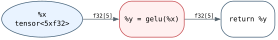
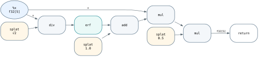

# Joggle: A Progressive IR for Malleable Compilation

## Abstract

Heterogeneous-compiler extensions are cross-cutting programs assembled from
semantics, analyses, transformations, conversions, and emitters. These parts
usually inhabit separate languages, registries, and ownership boundaries, so a
local feature becomes a nonlocal patch and a local edit triggers coarse
re-execution. Joggle represents the program and the compiler functions that
change it on one typed graph. Effect contracts distinguish inspection,
verified mutation, conversion, and artifact return. A graph-level *mod* owns a
feature's functions, native bindings, and dependencies independently of program
containment. During execution, Joggle records each call's observed state and
each stage's published effects. Entity generations and hierarchical revisions
validate those observations; read--write overlap selects affected work; and a
transaction publishes the graph and its dependency records together. We
evaluate this design with held-out extension tasks, matched cross-system
patches, controlled model edits, and executable artifacts. Repeated edits
reduce Joggle's update-to-ready time by $1.48$--$2.47\times$ relative to matched
complete rebuilds while preserving output digests. Joggle also passes 24/24
operators and 14/15 models; its optimization pack improves operator latency by
$1.78\times$, and its common-model geometric mean is $2.10\times$ faster than
default TVM.

## 1. Introduction

A compiler extension is rarely one edit. Adding a numeric format, a fused
operator, or a target mapping can require a semantic definition, legality
analysis, graph rewrite, representation conversion, artifact emitter, and
build registration. Modern infrastructures expose these tasks through
different languages, object models, and ownership boundaries. The program is
programmable; the path that changes its compiler remains fragmented.

This mismatch matters for both developers and code-generating agents. A local
feature is complete only when every cross-layer contract agrees. Its pieces
may be scattered across an IR hierarchy, pass registry, build target,
conversion library, and backend. A later edit must rediscover those pieces,
and a conventional staged driver may rebuild an entire suffix even when most
stages neither read nor affect the change. The resulting costs are not three
independent inconveniences: fragmented mechanisms diffuse ownership, diffuse
ownership obscures dependencies, and obscured dependencies force coarse
re-execution.

Joggle treats compiler behavior as a typed program over the same graph that it
transforms. A *compiler function* can define semantics, inspect a graph,
rewrite it, convert representations, or emit an artifact through one language,
call model, and value model. A graph-level *mod* owns the functions, native
bindings, and dependencies that constitute a feature. During execution, Joggle
records the graph state each call observes and the effects each stage publishes.
Revisions, dependency indices, and cached execution plans then select the
affected calls after an edit, while a transaction couples their records to the
verified graph they describe.

We call this a *progressive intermediate representation*. Compilation is not
required to traverse a fixed ladder of mutually isolated IRs. Instead, typed
compiler functions progressively refine a verified graph. Every published
state remains a normal, inspectable mod, and each feature keeps an explicit
owner across stages.

Figure 1 states the paper's argument. Its rows move from development problem to
Joggle mechanism to observable outcome. The evaluation follows the columns:
extension completion, matched patch footprint, and model update cost. Separate
operator and model experiments test the artifacts emitted through the common
extension surface.

<!-- FIGURE 1 PROMPT — A dense two-column 3×3 systems-paper argument map. The
columns are PROGRAMMABILITY, ORGANIZATION, and UPDATE; the rows are CHALLENGE,
JOGGLE DESIGN, and OUTCOME. Each column reads top to bottom with no cross-column
arrows. Programmability: fragmented Semantics/Analysis/Transform/Convert/Emit
mechanisms → Unified metaprogramming using typed compiler functions, one language,
one call model, one value model, and `Ty Attr Mod Fn Op Val` → CONVENIENT with
`task success` and `tokens · tool calls`. Organization: one feature scattered across hierarchical
IR, pass registry, build target, conversion, and backend → Graph-level mod
boundary with `mod quant`, `use tensor`, own/publish/version/change tabs, and an
app→quant→tensor use graph → CONTROLLABLE with `files · lines` and `ownership
zones`; depict a feature patch as filename bars without invented source code.
Update: local edit at B causing suffix B→C→D rerun → Reactive re-execution over an
affected subgraph using revisions, dependency index `D/W`, and cached execution
plan → EFFICIENT with `p50 · p95`, `visited work`, and `edit-to-artifact`.
Use a changed→execute / unchanged→reuse ledger instead of synthetic curves.
The outcome row names measured endpoints without displaying invented results.
Use compact technical
glyphs, thin dark connectors, white background, restrained blue/teal/lavender,
and coral only for changed state. Use only the named Joggle constructs; omit
source snippets, line numbers, numbered circles, red numeric labels, gradients, shadows, and
decorative people. -->

*Figure 1: Joggle maps three extension challenges to system mechanisms and
measurable outcomes.*

The paper contributes three technical elements: (1) a typed representation in
which program entities and compiler functions share a handle and value model,
with separate semantics for inspection, verified mutation, conversion, and
artifact return; (2) a mod graph that specifies function visibility, native
bindings, dependencies, and publication independently of program containment;
and (3) an update algorithm in which entity generations and revisions validate
recorded reads, write overlap propagates affected work, and a transaction
publishes the graph and dependency records together.

We evaluate these elements with held-out extension tasks, matched patches
across Joggle, MLIR, and xDSL, controlled model edits across Joggle, TVM, and
ONNX-MLIR, and executable artifacts against ONNX Runtime. Repeated model edits
turn complete Joggle rebuilds into $1.48$--$2.47\times$ faster updates with
identical output digests. Joggle passes 24/24 operators and 14/15 models. Its
optimization pack improves operator latency by $1.78\times$; on the eight
models supported by every system, Joggle is $2.10\times$ faster than default
TVM.

## 2. Why Compiler Extensions Resist Local Change

### 2.1 One Feature, Several Mechanisms

Figure 2 follows a model from structure to device. Extension work enters at
every level: an operator defines semantics, a graph pass changes connectivity,
a system pass chooses order and storage, and a backend realizes the result for
a platform. The interfaces at these levels evolved for different purposes. A
feature that crosses them inherits every registration, calling, and
invalidation convention.

<!-- FIGURE 2 PLAN — Single-column figure. Preserve the supplied overview
artwork and its existing layout. It shows model structure and formats above
offline operator-, graph-, and system-level compilation; an online runtime and
target devices below; model, pass, operator/type, and hardware customization on
the left; and design, optimization, and deployment roles on the right. Do not
regenerate or alter the figure. -->

*Figure 2: A compiler extension can span semantic definition, optimization,
runtime support, and target deployment.*

Consider a fused convolution, bias addition, and activation. The feature must
state the fused operation's types and semantics, recognize a legal source
subgraph, replace it without losing users, select a target form, and emit or
bind its implementation. A layout or numeric-format change must update the
same contract in every role. None of these tasks is exceptional; their
composition is the problem.

LLVM supplies a shared typed representation for analysis and transformation
[@lattner2004llvm];
MLIR extends that model across abstraction levels [@lattner2021mlir]; Halide
separates algorithms from schedules [@ragankelley2012halide]; and TVM combines
graph and tensor optimization for heterogeneous targets [@chen2018tvm]. Joggle
makes the compiler capabilities acting on these structures explicit: typed
functions express them, mods own them, and recorded dependencies drive their
re-execution.

### 2.2 Three Sources of Friction

*Fragmented mechanisms.* Schemas define admissible programs. Analyses derive
facts, passes rewrite graphs, converters bridge representations, and emitters
produce artifacts. When each role has a separate declaration and invocation
model, a feature cannot be inspected, generated, or composed as one typed
program. Correctness depends on conventions outside the local definition.

*Scattered ownership.* Hierarchical IR assigns operations to regions, blocks,
and functions. Cross-stage capability ownership instead emerges from
directories, registries, build targets, pass pipelines, and backend tables. One
semantic change therefore crosses several review and release boundaries.

*Coarse re-execution.* An ordered pipeline responds to a local edit by rerunning
a suffix. The suffix is a coarse update unit: it includes stages that never
observed the edited entity and stages unreachable from the preceding effects.
Repeated decoding, traversal, conversion, and native compilation then dominate
turnaround.

These problems form a causal chain. Separate mechanisms scatter a feature;
scattered features hide the dependencies that matter; hidden dependencies
leave a stage or pipeline suffix as the smallest safe update unit. Joggle
therefore treats interface, ownership, and update granularity as one design
problem.

### 2.3 Design Requirements

The preceding workflow gives three requirements for a malleable compiler.

**R1 — One typed extension surface.** Semantics, analyses, transformations,
conversions, and artifact generation must share a language, call model, and
value model. Read-only and mutating calls remain distinguishable through
explicit effect contracts.

**R2 — An explicit feature boundary.** A cross-stage capability needs a named
owner, public and local functions, declared dependencies, native bindings, and
an independent lifecycle. This boundary must be orthogonal to program
containment so that feature ownership survives graph lowering.

**R3 — Change-proportional execution.** The runtime must identify what a call
actually observed, propagate only effects that can reach later observations,
and reuse decoded work across calls. Reuse becomes visible only when the graph
and its dependency records are published together.

Compiler functions realize R1; mods realize R2; the evaluator and graph runtime
realize R3. Section 3 presents them in the order a call encounters them:
resolution, ownership, dependency capture, and transactional execution.

## 3. Joggle Design

### 3.1 System Model

Joggle represents programs and compiler extensions with the same typed graph
substrate. A *subject mod* contains the program being inspected or changed,
whereas an *extension mod* contributes compiler functions. Both are ordinary
mods: they use the same graph representation, type system, dependency rules,
and loader. The distinction describes their role in one invocation, not two
different runtime objects.

The graph owned by a mod is

$$
G = (F, B, O, V, A),
$$

where $F$, $B$, $O$, and $V$ are functions, blocks, operations, and values, and
$A$ denotes attributes attached to these entities. Blocks order operations,
operations consume and produce values, and maintained def-use edges connect
each value to its users. Operator sets, input formats, and artifacts enter
through extension mods.

An environment $E$ loads the mods named by a program, resolves typed calls,
binds source or native implementations, and owns evaluator state. One
compiler-function call has the form

$$
E \vdash f(M, a) \Downarrow (r, D, W).
$$

Here, $M$ is the subject mod and $a$ contains explicit arguments. The call
returns $r$, records the observed graph state $D$, and publishes graph effects
$W$. Read-only calls have $W=\varnothing$. Mutating calls produce $W$ only
after the resulting graph passes verification.

Joggle calls this representation progressive because each successful compiler
function publishes another verified mod over the same entity model. A stage may
retain semantic operations while introducing lower-level helpers, and a later
stage may replace definitions it owns. Typed refinements express progress
within one graph model, and every published state remains inspectable.

Figure 3 separates the two graphs that organize compilation. The mod graph
determines which compiler functions are available; the subject graph contains
the program those functions inspect and refine. Typed handles connect the
shared evaluator to the subject store. Execution plans cache function decoding,
whereas dependency records track the graph state observed by a call. These
caches serve different purposes and share a transactional publication boundary.

<!-- FIGURE 3 PROMPT — system-architecture.png. Original compact single-column
square compiler architecture, white background, fine charcoal rules, pale blue
and amber nodes, small serif mathematics and monospace field annotations.
Top left: tensor/fusion/target mod boundaries, use edges from dependents to
tensor; legal/fuse/lower/emit function nodes. Top right: nested M/f/b0 subject
graph x,w→Conv→Add→ReLU→y, b→Add, value circles and users(v) links.
Middle: f:(H,A)→R and parallel query(R), run(RW), emit(R) entrances to one
resolve/evaluate interface; a compact body/intrinsic/native bracket identifies
implementation forms. Bottom: evaluator plan table, register slots and
K/D/W records beside separate F/B/O/V entity-slot arrays, h=(S,i,g), revision
scopes and a separate o0→v0→o1 def-use relation. Plan key includes store,
function, generation and revision. Tiny annotations distinguish query (K,r,D)
from stage (K,D,W) records and decode the store/slot/generation handle fields.
Transaction: G→G′→verify ownership/types/uses, success publishes
graph and dependency records; failure restores G. No invented timing numbers,
large title bands, decorative icons, paragraphs, or sequential query/run/emit.
Use thin dependency arrows and tiny local annotations, not word-heavy cards. -->

*Figure 3: Joggle's two graph structures. Mods delimit compiler capabilities;
typed calls operate on the subject graph. Decoded plans, dependency records,
and versioned entity stores support transactional publication. Entries are schematic.*

The rest of the design follows the three requirements from Section 2. Section
3.2 realizes R1 with typed compiler functions. Section 3.3 realizes R2 with
mod-scoped composition. Sections 3.4 and 3.5 realize R3 through observed
dependencies and the graph runtime that validates them.

### 3.2 Compiler Functions

Joggle's metaprogramming interface is the typed compiler function. Operator
semantics, analyses, transformations, representation conversion, and artifact
generation use this single programmable surface for definition and invocation.

A compiler function accepts graph handles and ordinary values:

$$
f : (H_1, \ldots, H_n, A_1, \ldots, A_m) \rightarrow R.
$$

Each $H_i$ is a `Mod`, `Fn`, `Blk`, `Op`, or `Val` handle. Each $A_i$ is a
configuration or structural value, such as an integer, type, list, dictionary,
or `Attr`. The result $R$ may itself be a handle, an ordinary value, structured
data, text, or bytes. Handles retain graph ownership and lifetime; ordinary
values remain independent of graph storage.

Figure 4 follows the operator extension introduced in Section 2. The graph
computes $y=\max(\operatorname{Conv}(x,w)+b,0)$. A legality function checks
types, shapes, and intermediate uses; fusion replaces the matched operations
with one semantic operation; conversion selects its target form. These graph
states, $G_0$, $G_1$, and $G_2$, retain the same input/output contract. An
emitter reads $G_2$ and returns the artifact. The extension's mod owns all five
roles, which exchange graph handles and owned values through the same call
interface.

<!-- FIGURE 4 PROMPT — Original compact single-column scientific diagram,
3.35 inches wide and approximately 2.6 inches high. Top: one conv_ext mod
containing Semantics/Analysis/Transform/Convert/Emit columns, with
define/legal/fuse/lower/emit and contract/read/write/write/read beneath them;
use tensor and a common typed-functions/graph-handles/owned-values rail.
Bottom: three aligned graph states. G0: x,w→Conv; b→BiasAdd; Conv→BiasAdd→ReLU→y,
with a single-use match boundary. G1: x,w,b→ConvBiasReLU→y. G2:
x,w,b→target.conv_relu→y. Left arrows: fuse·verify and lower·verify.
An emit(read) arrow connects the G2 graph to an artifact glyph. Semantic
contract: y=max(Conv(x,w)+b,0). These are schematic operator and role names.
Thin charcoal connectors, white background, pale teal/blue/lavender;
coral only for the match boundary. Compact readable labels, no numeric callouts,
fake source code, cache-hit counts, or isolated output-type edits. -->

*Figure 4: A schematic fused-operator extension. One mod owns five compiler
roles. Fusion and conversion publish verified graphs; emission reads the
prepared graph and returns an artifact without changing it.*

Joggle resolves a call from its qualified name, visible mods, explicit generic
arguments, parameter types, and result context. The selected implementation
may be a source body, an intrinsic, or a native binding. Caller syntax and the
evaluator's result boundary remain identical across these implementations.

Uniform calls retain distinct effect contracts. A query evaluates against a
read-only mod and returns an `Attr`. A run applies one or more mutating
functions within a transaction. An artifact call evaluates read-only over a
prepared graph and returns text or bytes. Thus, `query`, `run`, and `emit`
share resolution and evaluation while preserving different publication rules.
Read-only execution rejects mutation, and a run publishes only a verified
graph.

Compiler functions also compose through ordinary calls. A fusion function can
invoke the legality analysis in Figure 4, and a conversion can query the fused
operator's semantic contract. These calls remain visible to type checking,
diagnostics, and dependency capture. The typed call graph therefore defines
composition directly.

This function model unifies how compiler behavior is declared, resolved, and
invoked. Mods then supply the namespace, visibility, and dependency boundaries
that organize these functions.

### 3.3 Mods

A mod is Joggle's unit of ownership and composition. We model it as

$$
\mathcal{M} = (n, U, F_{pub}, F_{local}, G, N).
$$

Here, $n$ is the mod name and $U$ is its declared `use` set. $F_{pub}$ and
$F_{local}$ are its public and local functions, $G$ is its graph, and $N$
contains optional native bindings. The loaded object is the semantic boundary;
its on-disk package is the distribution form.

The `use` declarations form a directed mod graph. Search roots determine where
a named mod can be found, while `use` edges select the dependencies that
participate in loading and resolution. Separating location from dependency
keeps neighboring installations outside the visible function set.

Loading validates the declared dependency closure before evaluation. The
loader rejects missing mods, cycles, declaration-name mismatches, duplicate
public signatures, unreadable fragments, and unresolved native bindings. It
then loads source fragments in deterministic order. For a fixed mod graph and
search-root order, this process yields a stable public function set.

Visibility keeps this public set small. A public function can be resolved by a
dependent mod, whereas a `local fn` remains inside its owner. Source fragments
may split a large implementation without creating new dependency or lifecycle
boundaries. A separate mod is appropriate when a capability needs an
independent public surface, dependency set, owner, or installation lifecycle.

Native code follows the same boundary. A body-less declaration names the typed
contract, and a native library owned by that mod supplies its implementation.
The binding is scoped to the owning mod and becomes available through the
declared dependency graph.

Lifecycle operations preserve the same closure. Installation stages a
candidate, loads and verifies its dependencies, and publishes it only after
validation succeeds. Upgrade additionally checks affected reverse
dependencies. A failed operation leaves the installed graph unchanged. These
rules make the mod the unit that evolves across installation and upgrade.

The mod graph is orthogonal to the containment structure inside a subject
program. Blocks and operations describe program structure; `use` edges
describe compiler capability. The former may change during transformation
without rewriting the latter. This separation lets one project compose
analysis, transformation, and artifact mods without embedding those ownership
decisions into its program IR.

Static mod dependencies state what a compiler extension may call. During
execution, the evaluator records which
functions and graph entities a call actually observes. Section 3.4 uses this
second, dynamic dependency graph to avoid re-executing unaffected work.

### 3.4 Incremental Evaluation

A local graph edit need not invalidate every compiler result. Joggle bases
reuse on observed state rather than on the subject mod's whole revision alone.
For a cached read-only call $c$, the evaluator stores

$$
C_c = (K_c, r_c, D_c),
$$

where $K_c$ identifies the environment, store, function, and arguments;
$r_c$ is the returned value; and $D_c$ contains the observations made while
computing it.

Observations follow the graph API used by the function. Reading one operation
records its identity, generation, and payload state. Reading one value also
records type, metadata, and def-use state. Traversing a function records the
relevant function revision or collection membership. Reading all operations,
the mod structure, or the `use` set records progressively broader state. The
evaluator therefore captures the narrowest observation that preserves the
semantics of each graph operation.

Range access records the structural revision together with only the returned
operations. A content edit outside the range therefore preserves the record,
whereas insertion, removal, or reordering invalidates its structural premise.

A cached query is reusable when its call key and every recorded observation
remain current:

$$
Reusable(c) = Same(K_c) \land
              \bigwedge_{d \in D_c} Current(d).
$$

On a hit, the evaluator returns $r_c$. On a miss, it evaluates the function in
read-only mode, captures a fresh $D_c$, and replaces the entry. The execution
report names the first invalid contract, such as an environment, structure,
function, operation, or value change. Generation checks distinguish an edited
entity from a new entity that later reuses the same slot.

Mutating pipelines require one further step. After a successful run, a reactive
schedule stores for each stage $s_i$ its call key $K_i$, observed inputs $D_i$,
and output scope $W_i$. The schedule is bound to the subject store; its key
names the environment and its epoch, the stage function, and the arguments.
The output scope contains changed function identities and flags for structural
or mod-dependency changes. On the next run, a stage is selected when its key or
inputs are stale, or when an earlier selected stage may change something it
observed:

$$
\begin{aligned}
Selected_i ={}& \neg Current(K_i,D_i) \\
              & \lor \exists j<i:\ Selected_j \land Overlap(W_j,D_i).
\end{aligned}
$$

The second term is an *upstream* miss. The inputs recorded for $s_i$ may still
match at the start of a run, yet an earlier stage selected in the same run can
change them. Propagating recorded output scopes restricts downstream selection
to stages with overlapping observations instead of forcing all later stages
to execute. A selected stage executes its complete function body. Thus, the
observations determine which stages run, while the compiler's stage boundaries
determine how much work each selection performs. Replacing the subject store
starts a cold schedule.

```text
Algorithm 1: Reactive stage selection and execution

dirty_outputs <- empty
selected      <- empty

for each stage s[i] in schedule order:
    miss <- validate(s[i].key, s[i].inputs)
    if miss is none and overlaps(dirty_outputs, s[i].inputs):
        miss <- upstream
    if miss is not none:
        selected.add(s[i])
        dirty_outputs.add(s[i].outputs)

begin transaction
for each stage s[i] in selected:
    execute s[i]
    capture fresh inputs D[i] and outputs W[i]
verify graph
commit transaction
replace records for selected stages
rebase retained observations to the committed graph
publish all records for the next run
```

Dependency records are published only after all selected stages execute and
the final graph verifies. Failure rolls back graph mutations and revision
state; it also discards the tentative records. Consequently, the next run
cannot reuse dependencies derived from an unpublished graph.

Figure 5 illustrates the distinction between a direct and an upstream miss.
An external edit changes the convolution's layout metadata. Stage $s_1$ read
that property, so its observation is stale. Stage $s_2$ read the ReLU operation:
that observation remains current at selection time, but $s_1$ previously wrote
to the containing function $f$. This output scope overlaps $s_2$'s input, so
$s_2$ is selected as an upstream miss. Stage $s_3$ observed a reduction in a
disjoint function $g$ and retains its result. Thus, stage selection follows
recorded reads and write scopes, not merely reachability from the edited node.

<!-- FIGURE 5 PROMPT — reactive-update.png. Dense square single-column
mechanism diagram, fine black rules, small math annotations, pale blue graph
nodes, amber selected stages and hatched retained records. Three tight bands:
(a) f contains x,w→Conv→Add→ReLU→y and b→Add; disjoint g contains u→Reduce→v.
External edit layout a→b at Conv; cached D1 records layout=a, D2 observes ReLU,
D3 observes Reduce. (b) Record table s1/Conv.layout/f/stale,
s2/ReLU/f/upstream, s3/Reduce/empty/reuse; selected_i=stale(Ki,Di) OR
overlap(dirty,Di). Scope intersections explain selection. (c) s1→s2 within a
transaction captures fresh D′/W′; verify G′ precedes joint publication;
failure restores G, including the already committed external edit layout=b.
Retained s3 records are rebased. No timings, large headings or prose boxes. -->

*Figure 5: Reactive stage selection. A stale observation selects $s_1$;
overlapping effects select $s_2$; disjoint observations retain $s_3$.
Verification gates joint publication; rollback preserves the committed external edit.*

Fine-grained observations reduce re-execution but add capture and validation
work. For $K$ stages, scheduled graph-evaluation latency is approximately

$$
\begin{aligned}
T_{select} &= \sum_{i=1}^{K} T_{validate}(K_i,D_i) + T_{propagate}, \\
T_{inc} &= T_{select}
        + \sum_{s_i \in Selected} T_{eval}(s_i) \\
        &\quad + T_{verify}(G') + T_{commit}.
\end{aligned}
$$

Reuse is beneficial when this cost is lower than executing the omitted stages.
Broad graph APIs remain correct but record broad dependencies; narrow APIs can
preserve results across unrelated edits. External mutable state must enter
through typed arguments or an environment change before reuse. Native bindings
exchange scalar or byte attributes and do not receive graph entities, so
graph-dependent work remains in tracked compiler functions. These rules define
the state over which Joggle can validate reuse.

Incremental evaluation therefore depends on more than a result cache. It
requires stable entity identity, revisions that reflect every published edit,
and transactions that align graph state with dependency state. The graph
runtime provides these mechanisms.

### 3.5 Graph Runtime

Each mod owns a store with separate slot arrays for functions, blocks,
operations, and values. Public graph entities are small handles

$$
h = (S, i, g),
$$

where $S$ identifies the store, $i$ selects a slot, and $g$ is that slot's
generation. A lookup succeeds only when the store matches and the slot is live
at generation $g$. Erasing an entity advances its generation, so a stale handle
cannot refer to a later entity that reuses the same slot.

The store maintains whole-mod, structural, and function revisions. Any
observable edit advances the whole revision. Membership, order, and topology
changes also advance the structural revision, while function-local changes
advance the owning function's revision. These counters serve as freshness
tokens. Their granularity lets a function-level
observation survive an unrelated edit elsewhere in the mod.

Graph relations are updated with the store. In particular, each value records
its users. Replacing a value can therefore walk the affected uses, update both
def-use lists, and touch the owning functions without scanning every operation.
Repeated affected-cone walks use epoch marks, avoiding a graph-sized bitmap
clear before each sparse traversal.

Mutations execute inside a transaction. Metadata edits journal the previous
leaf value. Structural edits acquire a store snapshot lazily, when the first
such edit occurs. After evaluation, the verifier checks ownership, liveness,
dominance, calls, block arguments, return types, and structured control flow.
The publication rule is

$$
Publish(f,G) =
\begin{cases}
(G', \mathrm{ok}) & \text{if } f:G \Downarrow G' \land Verify(G'),\\
(G, \mathrm{fail}) & \text{otherwise.}
\end{cases}
$$

Verification therefore prevents a locally valid edit from exposing a globally
invalid graph. Success commits the graph and its revisions; failure restores
both.

The evaluator uses predecoded plans for checked compiler functions. A plan maps
parameters, block arguments, and operation results to dense slots;
it also records block targets, operation kinds, operand indices, and call-site
information. Its cache key is

$$
PlanKey = (S, id(fn), generation(fn), revision(fn)).
$$

Changing a function body invalidates its plan, while calls to the same version
reuse decoding and slot layout. Stable call sites additionally cache overload
resolution under the current environment epoch and argument types. Reusable
register windows reduce per-call allocation.

These plans are an internal interpreted execution form. They remove repeated
decoding and slot-allocation setup while preserving the language's control
flow, failure propagation, and dynamic calls. A native implementation may
accelerate a specific typed function through the same mod-scoped binding and
graph API.

At the extension boundary, typed handles represent live graph identity and
`Attr` represents owned, serializable values. Dependency records, execution
plans, transaction journals, and counters remain private. This boundary keeps
runtime machinery out of the extension API while allowing reports and profiles
to evolve as structured data.

Together, stable handles, hierarchical revisions, transactional mutation, and
versioned execution plans make the higher-level design operational. Compiler
functions can manipulate live graph entities, mods can evolve independently,
and the evaluator can reuse work while preserving graph and dependency
publication boundaries.

## 4. Evaluation

### 4.1 Methodology

The evaluation maps each mechanism in Figure 1 to an independently observable
effect. Table 1 summarizes the subjects, controls, and primary measurements.
Only outputs that pass the relevant correctness oracle enter an aggregate.

| Property | Comparison | Primary evidence |
| --- | --- | --- |
| Convenient | 3 systems; 12 eval tasks | completion, tokens |
| Controllable | 3 systems; 36 patches | files, lines, zones |
| Efficient | 3 systems; 13 models | update time, reuse |
| End-to-end | 4 systems | correctness, latency |

*Table 1: Evaluation matrix. Every comparison fixes revisions, inputs, and its
correctness oracle before measurement.*

**Subjects and controls.** Extension and ownership comparisons use Joggle,
MLIR, and xDSL. Each extension follows its system's native API at a pinned
revision. The production update protocol targets Joggle, TVM, and ONNX-MLIR
and measures the time to produce a bound executable for the edited model. It
draws 13 editable subjects from the 15-model end-to-end corpus and
uses the same fixed inputs. End-to-end execution also includes ONNX Runtime.

**Correctness and measurement.** Compiler-extension tasks use build-and-test
oracles; transformations use verification and canonical graph digests;
executable artifacts use reference tensors with dtype-specific tolerances.
Failed cases remain in coverage but do not enter latency ratios. The update
experiment has two populations: one complete sweep over 13 models and 37 edit
sites, and ten paired repetitions of three edit sites on each of DenseNet-121,
SqueezeNet-1.1, and TinyYOLOv3. The execution experiment uses ten warm-ups and
100 timed samples per artifact. We form ratios within an edit, model, or
operator before aggregation. Every CSV row records correctness, subject and
input digests, compiler identity, seed, and timing boundary; run records
additionally pin build flags, host policy, and cache configuration.

Figure 6 summarizes the common comparison structure. Extension and ownership
studies share feature specifications; update paths start from the same edited
graph; execution paths consume identical tensors. The oracle precedes metric
aggregation in each branch. Successful cases provide paired measurements,
while unsuccessful cases remain in the coverage denominator.

<!-- FIGURE 6 PROMPT — evaluation-workflow.png. Original dense square
single-column protocol schematic, fine black rules, white background, small
serif math labels and monospace annotations. Independent source glyphs for
specification, graph G, tensor X and revision/hash. Four compact rows:
(a) native function/type specification → Joggle/MLIR/xDSL → budgeted code/oracle
repair loop → pass/tokens; (b) feature patch hunks and package dependency
boundaries → (F,L,Z,R); (c) same edited G forks into update/full compilation,
replacement executables and output-tensor check → Tu and Tu/Tf;
(d) same X forks into Joggle/ORT/TVM/ONNX-MLIR, numerical comparison →
median/p95 and correct/total. Label extension and ownership rows
Joggle/MLIR/xDSL; label update row Joggle/TVM/ONNX-MLIR. Success/failure branches
both retain CSV records. This is a protocol, not numerical results. No
fabricated bar charts, percentages, prose boxes, large headers or gradients. -->

*Figure 6: Four paired comparisons. Shared specifications, edited graphs,
and tensors align inputs; correctness gates measurements while failures
remain in coverage. Update shading denotes executed work.*

### 4.2 Agent Extension Completion

The extension suite specifies 24 tasks, four in each of six families: type or
operation definition, analysis, rewrite, conversion, artifact generation, and
a vertical feature combining these roles. Each task has one semantic
specification and fixed positive and negative fixtures. Before collecting
agent outcomes, we select the same two tasks per family used by the footprint
study for a 12-task execution set.
Admission requires a system-specific harness and an idiomatic reference patch
that passes the shared oracle.

The agent protocol uses two frozen small instruction models with the same
deterministic coding-agent harness. For each system, the input contains the
task's semantic contract, positive and
negative examples, and a compact native API card. The agent works in an
isolated source tree with the same inspect, edit, build, and test tools. Its
output is the final source patch and complete tool trajectory. It may take at
most 30 actions and emit at most 32k tokens. Each model--system--task condition
runs once with deterministic decoding and no demonstrations. The paired design
contains 72 trajectories: 12 tasks, three systems, and two models.

The primary endpoint is executable success within budget: the final workspace
must parse, type-check, build, and pass the semantic oracle without manual
repair. We macro-average success over tasks and resample tasks within each
family. For successful trajectories, secondary measures are completion tokens,
tool calls, edit attempts, and wall time. Failed trajectories retain their
first terminal phase---parse, type, build, semantic oracle, or budget. As a
supplementary interface-predictability diagnostic, we score all 24
oracle-passing reference patches and report paired conditional bits per UTF-8
byte under each model. The prefix is the corresponding initial task and API
prompt, and the continuation is a canonical edit action containing the native
reference. Bits per byte is the reported measure; source records also retain
token count and negative log likelihood.

<!-- AGENT-RESULTS FIGURE PLAN — Compact 2×3 grouped vertical bars. Rows are the
two frozen models; columns show task-macro executable success, completion
tokens for successful tasks, and successful tool calls. Each panel uses the
same six family positions and fixed Joggle/MLIR/xDSL colors. Failure phase and
reference-solution bits per byte belong in the supplement. CSV:
figure-04-extension.csv. Raw columns: model,
model_revision,system,system_revision,task,family,run,seed,
budget_actions,budget_tokens,wall_ms,prompt_tokens,completion_tokens,tool_calls,
edit_attempts,files_touched,parsed,typed,built,passed,stop_reason,
task_spec_sha256,api_card_sha256,trajectory_sha256,patch_sha256,reference_nll,
reference_tokens,reference_bytes,reference_bpb. -->

### 4.3 Change Footprint and Ownership

The footprint study reuses the 12-task execution set, two tasks from each
family. Selection is fixed before patch metrics are collected. Each of the 36
implementations begins from a clean pinned snapshot, passes the common oracle,
and is reduced to a hunk-level fixed point.

For patch $p$, the footprint is

$$
Footprint(p)=(F_p,L_p,Z_p,R_p),
$$

where $F_p$ counts touched implementation files, $L_p$ counts added plus
deleted implementation lines, $Z_p$ counts ownership zones, and $R_p$ counts
changed build, registry, or pipeline declaration lines under a frozen policy.
Test changes are reported in parallel. A zone is a source package or build
target with one public responsibility.

Every task reports all four coordinates, build and oracle status, dependency
fan-out, and crossed ownership edges; in Joggle, these are declared `use`
edges. Because a baseline may require zero registry or
build edits, absolute paired counts are primary. We summarize the paired
difference with a task-level bootstrap interval and report a ratio only when
both counts are nonzero. Small rewrites and vertical features remain separate.

<!-- FOOTPRINT-RESULTS FIGURE PLAN — One-column dense 2×2 grouped vertical-bar
figure. The four panels show touched source files, changed source lines,
ownership zones, and registry/build edits for the same 12 tasks. Fixed
Joggle/MLIR/xDSL colors and family separators make paired task comparisons
visible; symmetric-log axes retain true zero while labeling raw counts. CSV:
figure-05-footprint.csv. Raw columns:
system,system_revision,task,family,patch_hash,source_files,source_added,
source_deleted,test_files,test_added,test_deleted,zones,registrations,fanout,
cross_zone_edges,oracle_passed. -->

### 4.4 Reactive Update Cost

The production endpoint is a bound executable for the edited model.
Update-to-ready time starts immediately before applying the edit and includes
import, specialization, lowering, emission, native compilation, and binding.
Numerical validation follows the interval and gates the result. We retain both
intervals:

$$
T_{validated}=T_{ready}+T_{validation}.
$$

Reference outputs are generated outside both intervals. We record environment
setup and the validated initial build separately from the update.

For system $s$ and edit $e$, the paired update ratio is

$$
UpdateRatio_{s,e}=\frac{T_{ready,update,s,e}}{T_{ready,full,s,e}}.
$$

The denominator is a complete rebuild of the same edited model under the same
optimization policy. Absolute update latency compares turnaround across
systems, while the ratio isolates reuse within each system.

Each case applies the same hash-bound node replacement, input tensors, and
tolerance. The update path first compiles and validates the original model; the
matched rebuild starts in a fresh worker. Both apply the edit inside the timed
interval. Native caches remain enabled: TVM retains its runtime and process
caches, while ONNX-MLIR invokes a fresh compiler process from a resident host.

Joggle retains its environment, evaluator plans, and prepared function bodies.
It matches specialization signatures after importing the edited graph and
materializes only referenced cached bodies. The timed endpoint also charges
scalarization, model-wide storage planning, emission, native compilation, and
binding for the replacement executable. The matched rebuild uses the identical
pipeline with an empty body cache.

<!-- UPDATE-RESULTS FIGURE — Compact 3×2 vertical-bar small multiples using the
same visual grammar as the operator and model execution figures. Models are
grouped into classic CNNs, mobile CNNs, quantized/transformer, detection, YOLO,
and small/common panels. Within each model, Joggle/TVM/ONNX-MLIR use fixed
colors; hatched bars show rebuild and solid bars show update. Use logarithmic
y axes, four-sided inward ticks, × for failed correctness, and a tiny
rebuild/update label above each valid pair. The final panel includes the
common-set geometric mean. Source: audited production update CSV only. -->

### 4.5 End-to-End Performance

The final experiment quantifies the performance and coverage of code emitted
through the programmable infrastructure. One matrix contains 24 fixed operator graphs---four each for
elementwise chains, reductions, matrix multiplication, convolution,
quantization, and fusion---and the same 15 model subjects. We compare Joggle's
optimized lowering path with a pinned single-thread ONNX Runtime CPU reference,
TVM Relax's default LLVM CPU pipeline without tuning, and ONNX-MLIR's
LLVM pipeline at `-O3`, with parallelism and fast math disabled. The operator
study additionally measures Joggle's required lowering path without the
optimization pack to isolate its effect.
Each case uses byte-identical inputs; dtype-specific numerical oracles gate its timing results. Joggle fixes
each entry signature from those inputs before either lowering pipeline begins.

We report median steady-state execution latency from 100 measurements after
ten warm-ups. The performance figure groups all 24 operators into six panels
with shared logarithmic axes. Each latency is divided by the same-case ORT
median: a ratio below one means faster execution, and a ratio above one means
slower execution. Bars extend from parity to the median ratio; whiskers reach
p95 using the same denominator. Thus, whiskers show timing spread, not
confidence intervals. The model figure uses the same encoding. Cases that
fail compilation or numerical validation remain in the coverage denominator
but contribute no latency ratio.

<!-- PERFORMANCE FIGURE PROMPT — Render from measured CSV using
artifact/figures/figure_07_performance.py. Compact single-column figure with
six panels, two rows by three columns: elementwise, reduction, matmul,
convolution, quantization, fusion.
Every panel contains four operators and grouped base/optimized/TVM bars. Shared
logarithmic y axis, one legend, ORT=1 dashed line, median-to-p95 whiskers,
hatched base bars, solid optimized bars, and dotted amber TVM bars. Mark unsupported
TVM cases with ×, not zero-height bars. Report correct coverage in the
caption. Bars start at parity; use compact wrapped labels and shared axes at
the final column width. Enclose every panel in four thin spines with inward
ticks on all sides; share colors, hatching, and the compact legend with Figure 8.
Source CSV: paper/data/figure-07-operators.csv.
Model measurements have a separate companion display. Preserve every case and failed outcome.
No generated pixels or illustrative numbers for data. -->

*Figure 7: Operator latency relative to ORT (log scale; lower is faster).
Bars run from parity to the median; whiskers reach p95 over 100 samples.
Joggle and ORT pass 24/24 cases; TVM passes 22/24. × marks unsupported
QLinearConv and QLinearMatMul imports.*

| Operator-suite measure | Base | Optimized | TVM | ONNX-MLIR |
| --- | ---: | ---: | ---: | ---: |
| Correct operators | 24/24 | 24/24 | 22/24 | 22/24 |
| Faster than ORT | 4/24 | 4/24 | 7/22 | 7/22 |
| Latency / ORT, all 24 | 9.27× | 5.21× | — | — |
| Latency / ORT, common 22 | 8.95× | 5.23× | 6.66× | 3.18× |

*Table: Operator summary. Geometric means use all 24 or the common 22 operators,
as indicated. Per-operator values appear in the supplementary material.*

Across the 22 jointly correct operators, Joggle's optimized path was 1.27×
faster than default TVM; ONNX-MLIR was 1.64× faster than Joggle.
Joggle had lower median latency on ten operators against TVM and eight against
ONNX-MLIR. Its rectangular and square matrix products outperformed TVM, whereas TVM favored several
elementwise and reduction workloads. All three compiler configurations remained
slower than ORT in aggregate.

Joggle and ORT passed all 24 operators, while each external compiler passed 22.
TVM could not import QLinearConv or QLinearMatMul; ONNX-MLIR could not lower
QLinearConv, and its QLinearMatMul output failed the integer oracle.
The common-set aggregate therefore used the same 22 operators across all
configurations, with complete per-operator measurements in the supplementary material.

Within Joggle, the optimization pack reduced geometric mean latency by 1.78×
over all 24 operators, with gains concentrated in matrix multiplication.
Rectangular and 256×256 products improved by 21.67× and 12.90×, respectively.
Strided convolution slowed by 1.11× relative to the base path. These results
separate optimization gains, cross-system kernel performance, and the compiler
update costs in Section 4.4.

Figure 8 extends the external comparison to all 15 models. Joggle passes the
numerical oracle on 14 models, ORT on 13, and TVM and ONNX-MLIR on 11 each.
Joggle executes both EfficientNet quantization variants and both TinyYOLO
models; SSD-MobileNet stops during preparation. Correctness is checked against
the unoptimized ONNX graph. ORT's optimized executions of MobileNetV2 and
EfficientNet QDQ exceed the tolerance, so these two models have no ORT-normalized
ratio even where another system produces a correct executable.

Eight models pass in all four systems. On this common set, geometric mean
latency relative to ORT is 24.83× for Joggle, 52.11× for TVM, and 23.84× for
ONNX-MLIR. Thus Joggle runs 2.10× faster than default TVM, while ONNX-MLIR runs
1.04× faster than Joggle; ORT has the lowest aggregate latency. The per-family
panels separate this execution comparison from coverage: a failed candidate
is marked ×, and a correct candidate without a valid ORT reference is marked
with a dash. Absolute medians and p95 values for every correct candidate remain
in the accompanying CSV.

<!-- FIGURE 8 DATA — Single-column 3.35-inch paired bar plot, two rows by
three columns. Five panels contain all 15 models grouped as dense CNNs,
mobile CNNs, detectors, quantized models, and other models; the sixth gives
the four-system common-set geometric means. Shared logarithmic latency/ORT
axis, parity at one; teal Joggle, dotted amber TVM, and hatched blue ONNX-MLIR
bars start at parity. ORT is the dashed reference line.
Whiskers extend from median to p95; the aggregate has no timing whisker.
Four thin spines, inward major/minor ticks, compact labels, and one legend.
Explicit × for failed candidates and a dash for correct candidates without a
valid ORT denominator, never zero-valued bars. Aggregate only the eight models
correct in all four systems. All panels share Figure 7's width and height.
CSV: paper/data/figure-07-models.csv; per-model summaries:
paper/data/figure-07-models-summary.csv; script:
artifact/figures/figure_07_models.py. -->

*Figure 8: Model execution by family. Bars show median latency / ORT;
whiskers reach p95 over 100 samples. × marks failed candidates; a dash marks
correct candidates without a valid ORT reference. Panel (f) aggregates the
eight models correct in all four systems. Correct coverage is 14/15 for Joggle,
13/15 for ORT, and 11/15 each for TVM and ONNX-MLIR.*

<!-- PERFORMANCE DATA — Separate operator and model displays form one
end-to-end experiment. Each display has a source CSV and plotting script.
Model CSV: paper/data/figure-07-models.csv. Columns:
subject_kind,subject,subject_hash,family,system,system_revision,variant,
supported,reason,iteration,calls_per_sample,latency_ns,max_abs_error,
max_rel_error,input_digest,output_digest,correct,seed. -->

Together, generation characterizes the extension surface, patch footprint its
ownership boundary, the cross-system update study its responsiveness, and the
combined operator/model matrix its generated performance.

## 5. Related Work

The related-work table aligns mechanisms with Joggle's three design axes. **Roles**
covers the five compiler roles through one programmable surface. **Owner** and
**Deps** capture capability organization.

The final four columns cover reactive updates.

Symbols: ✓ first-class; △ role-specific or coarser; × absent.

| System | Roles | Calls | Owner | Deps | Reads | Effects | Reactive | Atomic |
| --- | :---: | :---: | :---: | :---: | :---: | :---: | :---: | :---: |
| LLVM [@lattner2004llvm] | × | △ | △ | △ | △ | △ | × | × |
| Nanopass [@keep2013nanopass] | × | ✓ | △ | × | × | △ | × | × |
| MLIR [@lattner2021mlir; @mlirpass] | △ | △ | ✓ | △ | △ | △ | × | × |
| MLIR Transform [@lucke2025transform] | × | ✓ | ✓ | △ | △ | ✓ | × | × |
| xDSL [@fehr2025xdsl] | △ | △ | ✓ | △ | × | × | × | × |
| Halide [@ragankelley2012halide] | × | ✓ | ✓ | △ | × | × | × | × |
| TVM [@chen2018tvm] | △ | △ | △ | △ | × | × | × | × |
| egg [@willsey2021egg] | × | ✓ | △ | × | △ | ✓ | △ | × |
| Adapton [@hammer2014adapton] | × | ✓ | △ | ✓ | ✓ | ✓ | ✓ | △ |
| Build systems [@mokhov2018build] | × | △ | ✓ | ✓ | △ | ✓ | ✓ | △ |
| **Joggle** | ✓ | ✓ | ✓ | ✓ | ✓ | ✓ | ✓ | ✓ |

*Table 2: Coverage of unified extension, ownership, and reactive-update
mechanisms. Columns follow the three design axes in Figure 1.*

### 5.1 Extensible Compiler Infrastructures

LLVM established a reusable typed SSA infrastructure with shared analyses and
passes [@lattner2004llvm]. MLIR extends this model with dialects, nested
operations, declarative operation definitions, conversions, and pass pipelines
across abstraction levels [@lattner2021mlir]. Its pass manager caches analyses
at operation anchors and uses explicitly preserved analyses to control
invalidation [@mlirpass]. xDSL retains compatibility with MLIR's SSA structure
while moving compiler construction and rapid prototyping into Python
[@fehr2025xdsl]. These systems demonstrate the value of common IR
infrastructure and extensible operation sets.

Joggle centers the typed compiler function together with the graph-level mod
that owns and publishes it. Semantics, analysis,
mutation, conversion, and artifact generation retain their distinct effects
but share one declaration, resolution, and invocation model. The mod graph is
orthogonal to blocks and operations, so capability ownership follows declared
dependencies independently of program containment.

### 5.2 Tensor Compilers

Halide separates an image-processing algorithm from its schedule, allowing
target-specific choices without changing functional meaning
[@ragankelley2012halide]. TVM combines graph-level optimization, tensor
programs, schedule search, and target code generation
[@chen2018tvm]. Multi-level tensor compilers similarly use progressively lower
representations to expose decisions at the operator, loop, memory, and target
levels. Joggle supplies the programmable and organizational substrate for
declaring, composing, converting, and executing these algorithms.

This distinction separates two performance dimensions. Tensor compilers
primarily optimize generated code. Joggle also reduces the compiler
work repeated after a transformation, policy, or input changes. Section 4
measures generated artifacts and edit-to-result latency independently.

### 5.3 Programmable Transformations

The Nanopass framework derives representation checks and traversal support from
explicit source and target languages, encouraging many small passes
[@keep2013nanopass]. MLIR's Transform dialect represents fine-grained
transformation schedules as IR, maps handles into a separate payload IR, and
uses effect interfaces to constrain transform execution
[@lucke2025transform]. Rewrite systems make local rules concise and composable;
`egg` combines equality saturation, rebuilding, and e-class analyses to manage
many equivalent programs efficiently [@willsey2021egg]. These systems make
transformation intent programmable at complementary granularities.

Joggle extends the programmable unit beyond transformation control. A compiler
function may define semantics, query types, traverse control flow, invoke a
native solver, rewrite a graph, convert a representation, or return an
artifact. Typed calls compose these roles; mods own and publish them; observed
reads and effects connect them to reactive execution. This boundary organizes
the semantic definitions, conversions, and artifact generation surrounding
specialized transformation languages and rewrite engines.

### 5.4 Incremental Computation

Self-adjusting systems record dependencies and repair demanded computation
after an input changes. Adapton formalizes this model with a demanded
computation graph [@hammer2014adapton]. Build
systems apply related ideas to tasks and artifacts; Build Systems à la Carte
separates dependency discovery, scheduling, and rebuilding policies
[@mokhov2018build]. Compiler pass managers also cache analyses and preserve
them across transformations when their contracts allow it [@mlirpass].

Joggle specializes dependency tracking to mutable compiler graphs. A cached
call records typed graph observations, while a mutating stage also records the
scope it changed. Revisions and generations validate identity and state;
upstream effect overlap selects later stages; and a transaction publishes the
graph and fresh dependency records together. This combination connects
fine-grained graph invalidation with an ordered, effectful compiler pipeline.

## 6. Discussion

**Composition follows capabilities.** Joggle retains functions, blocks,
operations, values, and def-use relations for local compiler reasoning. A mod
adds the cross-stage boundary: it binds a typed public surface to dependencies,
source fragments, native bindings, and publication. This division lets a
feature span semantic definitions, rewrites, conversions, and emitters while
keeping one owner and one dependency closure. High-level operations and lowered
helpers can coexist in the same graph as compiler functions progressively
refine it.

**Precise observations bound updates.** Every cached call carries
the observations that produced its result. A whole-graph traversal records a
broad dependency; range and entity access record progressively narrower
dependencies. After an edit, effect overlap selects the affected suffix and
observation validation recovers reusable calls inside it. Miss reasons,
observation counts, and executed-stage counts make this precision visible,
while the update measurements quantify its payoff.

**Publication unifies safety and reuse.** Queries execute under read effects,
transformations publish a verified graph, and artifact calls return owned
values through the same typed call boundary. A transaction publishes graph
mutations, revisions, and dependency records as one state transition. External
state enters through typed arguments or an environment revision, so every
reusable observation names a published graph and environment. Predecoded
execution plans remove repeated interpreter setup, and native mod bindings
accelerate selected functions without changing their signatures or ownership
rules.

## 7. Conclusion

Joggle makes compiler behavior part of the typed program. Compiler functions
express semantics, analysis, transformation, conversion, and emission over one
graph model. Mods give each cross-stage capability an explicit owner and
dependency closure. Recorded reads, published effects, revisions, and stable
entity generations turn a subsequent edit into a dependency-selected update,
with transactions coupling reusable records to the verified graph.

The implementation carries these abstractions through native artifact
publication. Across repeated model edits, Joggle updates reach a replacement
executable 1.48--2.47× faster than matched complete rebuilds and produce
identical output digests. The generated artifacts pass 24/24 operator oracles
and 14/15 model oracles; the optimization pack improves aggregate operator
latency by 1.78×, and Joggle outperforms default TVM by 2.10× on the common
model set. Joggle therefore connects extension semantics, feature ownership,
and update execution in one compiler substrate.

## Appendix A. Operator Measurements

The table reports individual operator latencies and matched baseline ratios.
The main evaluation presents aggregate comparisons and their performance implications.

| Operator | ORT (µs) | Base / ORT | Opt / ORT | TVM / ORT | ONNX-MLIR / ORT |
| --- | ---: | ---: | ---: | ---: | ---: |
| conv-depthwise | 41.92 | 3.64 | 4.57 | 0.82 | 3.74 |
| conv-pointwise | 63.83 | 146.92 | 32.66 | 144.27 | 12.65 |
| conv-stem | 178.12 | 4.44 | 9.35 | 2.50 | 5.96 |
| conv-strided | 39.06 | 171.00 | 190.42 | 186.00 | 180.75 |
| ew-affine-1k | 2.80 | 0.08 | 0.08 | 0.33 | 0.21 |
| ew-broadcast-relu | 3.58 | 0.81 | 0.79 | 0.32 | 0.21 |
| ew-chain-64k | 21.55 | 3.40 | 3.92 | 1.32 | 0.55 |
| ew-select-16k | 8.08 | 0.98 | 0.87 | 0.59 | 0.96 |
| fuse-add-relu | 14.11 | 4.89 | 4.53 | 0.85 | 0.52 |
| fuse-conv-bias-relu | 294.42 | 101.45 | 43.96 | 84.67 | 75.86 |
| fuse-matmul-bias-relu | 14.26 | 170.18 | 13.35 | 166.48 | 6.56 |
| fuse-mul-add | 20.34 | 2.32 | 2.44 | 0.83 | 0.47 |
| mm-batched | 10.64 | 71.02 | 71.00 | 69.89 | 6.41 |
| mm-rectangular | 13.23 | 214.80 | 9.91 | 225.47 | 10.36 |
| mm-square-256 | 31.51 | 327.35 | 25.37 | 330.90 | 16.21 |
| mm-square-64 | 4.55 | 20.57 | 1.66 | 20.40 | 1.57 |
| quant-conv | 26.51 | 9.06 | 10.25 | — | — |
| quant-dynamic | 4.82 | 1.48 | 1.52 | 3.15 | 5.24 |
| quant-matmul | 6.15 | 20.78 | 2.40 | — | × |
| quant-qdq-tensor | 3.40 | 0.54 | 0.56 | 0.44 | 0.65 |
| red-l2-last | 15.46 | 1.10 | 1.07 | 1.23 | 1.21 |
| red-max-channel | 59.16 | 10.66 | 10.40 | 3.72 | 2.22 |
| red-mean-spatial | 12.25 | 9.54 | 9.57 | 6.75 | 8.36 |
| red-sum-row | 9.49 | 5.78 | 6.28 | 6.36 | 6.39 |
| Geometric mean, all 24 | — | 9.27 | 5.21 | — | — |
| Geometric mean, common 22 | — | 8.95 | 5.23 | 6.66 | 3.18 |
| Correct operators | 24/24 | 24/24 | 24/24 | 22/24 | 22/24 |

*Table A1: Operator execution measurements. Joggle revision `5a71fe55a3be`,
Apple Clang 17.0.0 (`-O3 -DNDEBUG`), ONNX Runtime 1.26.0 CPU with full graph
optimization, TVM revision `c7b458e946bc` (default LLVM), and ONNX-MLIR revision
`4a13c34aa695` (`-O3`, no parallelism or fast math). All use one CPU thread.
Each passing entry uses ten warm-ups and 100 measured samples. Ratios divide
unrounded per-operator medians; values below one indicate lower latency than
ORT. — denotes an unsupported operation; × denotes a failed numerical oracle.
Geometric means use the indicated common population.*

## Appendix B. Extension Task Inputs and Outputs

Table A2 records the natural-language contracts and representative observable
inputs and outputs for the 12 tasks used by the Agent and footprint studies.
The operative semantic constraints are preserved; only system-specific
entry-point boilerplate is omitted. Every candidate is additionally checked on
disjoint hidden cases.

| Family | Task | Natural-language request | Positive input → output | Boundary / negative input → observation |
| --- | --- | --- | --- | --- |
| Definition | `def-parametric-type` | Define signed `fx<W,F>`; require `2≤W≤32`, `0≤F<W`, and preserve both parameters through construction, printing, and reparsing. | `W=8,F=3` → `fx<8,3>`, 8 logical bits | `W=8,F=8` → `invalid-type-parameter`; no output IR |
| Definition | `def-quantized-op` | Define `qadd` for equal-shape i8 tensors with finite positive scales and signed-i32 zero points. | two `4xi8` tensors → `4xi8` | `2x3xi8 + 3x2xi8` → `shape-mismatch` |
| Analysis | `ana-broadcast-shape` | Analyze NumPy trailing-dimension broadcasting for nonnegative extents. | `[2,3,1]`, `[4]` → legal `[2,3,4]` | `[2,3]`, `[4,3]` → conflict axis 1 from end |
| Analysis | `ana-numeric-range` | Propagate closed finite intervals through add, multiply, ReLU, and clamp. | `mul([-2,3],[-4,5])` → `[-12,15]` | `relu([2,-1])` → `invalid-interval` |
| Rewrite | `rew-add-zero` | Remove typed add-by-zero; floating positive zero requires `no_signed_zeros`; retain negative zero and used constants. | f32 `x+0`, `[4]`, NSZ → `x` | f32 `x+0.001` → unchanged |
| Rewrite | `rew-redundant-cast` | Remove identity casts and only lossless signed-widening or finite f32/f64 round trips. | `f32[4]→f32[4]` → eliminated | `i16→i8→i16` → retained |
| Conversion | `con-gelu-expand` | Replace `gelu` with `0.5*x*(1+erf(x/sqrt(2)))`; preserve shape, floating type, and users. |  |  integer → `unsupported-element-type` |
| Conversion | `con-quant-expand` | Lower i8 `qadd` through f32 dequantize, add, and ties-even saturating quantize. | fixed vector → `[-1,1,-3,127]` | negative scale → `invalid-scale` |
| Emission | `emit-graph-manifest` | Emit deterministic schema-v1 JSON with stable node/value numbering, types, users, and sorted attributes. | `splat→add→relu` → `n0..n2`, `v0..v3` | repeated emission → byte-identical JSON |
| Emission | `emit-kernel-wrapper` | Emit complete C99 `task_kernel` for ReLU or `2*x+1`, supporting in-place and zero-count calls. | ReLU `[-2,-0,1.5,4]` → `[+0,+0,1.5,4]` | zero count + null pointers → no access |
| Vertical | `vert-int4` | Add signed qint4, saturate, and pack low nibble first; reject invalid literals before packing. | five values → `[-7,0,-2,7,7]`, bytes `09 7e 07` | literal 8 → `literal-out-of-range` |
| Vertical | `vert-fused-op` | Add NHWC/HWIO i8 fused qconv+bias+requantize+ReLU; fuse only a single-use chain. | unit kernel → `[4]`, one fused node | shared convolution → original chain preserved |

*Table A2: Natural-language task inputs, observable outputs, and oracle-facing
edge cases. The GELU row embeds the actual before/after SSA structures rendered
from Graphviz DOT with DejaVu Sans Mono labels.*

Tables A3–A5 specify construction, verification, and print/parse round trips.
Rejected inputs produce no output IR. Tensor types omit the `tensor<…>` wrapper;
bare i8 or f32 denotes a rank-zero tensor. Axis indices are zero-based.

### B.1. Parametric type definition

| Case | Width | Fraction bits | Expected type | Logical bits | Expected diagnostic |
| --- | ---: | ---: | --- | ---: | --- |
| fx8-3 | 8 | 3 | `fx<8,3>` | 8 | — |
| fx16-7 | 16 | 7 | `fx<16,7>` | 16 | — |
| minimum-integer | 2 | 0 | `fx<2,0>` | 2 | — |
| minimum-fraction | 2 | 1 | `fx<2,1>` | 2 | — |
| maximum-integer | 32 | 0 | `fx<32,0>` | 32 | — |
| maximum-fraction | 32 | 31 | `fx<32,31>` | 32 | — |
| fraction-overflow | 8 | 8 | — | — | invalid-type-parameter |
| width-too-small | 1 | 0 | — | — | invalid-type-parameter |
| width-too-large | 33 | 0 | — | — | invalid-type-parameter |
| negative-width | -2 | 0 | — | — | invalid-type-parameter |
| negative-fraction | 8 | -1 | — | — | invalid-type-parameter |

*Table A3: `def-parametric-type`: complete inputs and expected outputs.
Width denotes logical bits, not ABI allocation size.*

### B.2. Quantized operation definition

| Case | LHS type | RHS type | Scales (L, R, out) | Zero points (L, R, out) | Expected result / diagnostic |
| --- | --- | --- | --- | --- | --- |
| vector | 4×i8 | 4×i8 | 0.5, 0.25, 0.5 | 0, -3, 0 | 4×i8 |
| matrix | 2×3×i8 | 2×3×i8 | 0.125, 0.125, 0.25 | 2, 2, 1 | 2×3×i8 |
| scalar | i8 | i8 | 1, 1, 0.25 | 0, 0, 0 | i8 |
| empty-axis | 0×3×i8 | 0×3×i8 | 1, 1, 0.5 | 0, 0, 0 | 0×3×i8 |
| signed-zero-point-bounds | 1×2×3×i8 | 1×2×3×i8 | 0.0625, 2, 1 | −2³¹, 2³¹−1, −2³¹ | 1×2×3×i8 |
| shape-mismatch | 2×3×i8 | 3×2×i8 | 1, 1, 0.5 | 0, 0, 0 | shape-mismatch |
| zero-scale | 4×i8 | 4×i8 | 1, 1, 0 | 0, 0, 0 | invalid-scale |
| lhs-zero-scale | 4×i8 | 4×i8 | 0, 1, 1 | 0, 0, 0 | invalid-scale |
| rhs-negative-scale | 4×i8 | 4×i8 | 1, -0.25, 1 | 0, 0, 0 | invalid-scale |
| negative-output-scale | 4×i8 | 4×i8 | 1, 1, -0.5 | 0, 0, 0 | invalid-scale |
| lhs-element | 4×i16 | 4×i8 | 1, 1, 1 | 0, 0, 0 | operand-type-mismatch |
| rhs-element | 4×i8 | 4×i16 | 1, 1, 1 | 0, 0, 0 | operand-type-mismatch |
| rank-mismatch | i8 | 1×i8 | 1, 1, 1 | 0, 0, 0 | shape-mismatch |

*Table A4: `def-quantized-op`: complete inputs and expected outputs, with defaults
expanded. Scales are finite positive f64 values; zero points are signed i32 values.
This task defines the operation; arithmetic lowering is evaluated separately.*

### B.3. Layout-carrying operation definition

| Case | Input type | Source | Destination | Permutation | Expected result / diagnostic |
| --- | --- | --- | --- | --- | --- |
| to-nhwc | 1×3×8×16×f32 | NCHW | NHWC | 0, 2, 3, 1 | 1×8×16×3×f32 |
| to-nchw | 2×7×9×4×f16 | NHWC | NCHW | 0, 3, 1, 2 | 2×4×7×9×f16 |
| identity-nchw | 2×3×4×5×f32 | NCHW | NCHW | 0, 1, 2, 3 | 2×3×4×5×f32 |
| identity-nhwc | 2×4×5×3×f16 | NHWC | NHWC | 0, 1, 2, 3 | 2×4×5×3×f16 |
| empty-axis | 1×3×0×16×f32 | NCHW | NHWC | 0, 2, 3, 1 | 1×0×16×3×f32 |
| integer-element | 1×8×16×3×i8 | NHWC | NCHW | 0, 3, 1, 2 | 1×3×8×16×i8 |
| wrong-rank | 3×8×16×f32 | NCHW | NHWC | — | rank-mismatch |
| scalar-rank | f32 | NCHW | NHWC | — | rank-mismatch |
| invalid-source | 1×3×8×16×f32 | CHWN | NHWC | — | invalid-layout |
| invalid-destination | 1×3×8×16×f32 | NCHW | HWCN | — | invalid-layout |

*Table A5: `def-layout-attribute`: complete inputs and expected outputs.
The constructor infers the result shape and preserves the element type and both layout attributes.*
