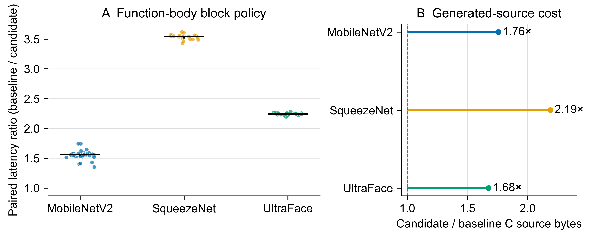

# Joggle: Malleable Inference Compilation with a Progressive Function IR

Working manuscript for the EuroSys 2027 fall cycle. The current file is
an argument draft, not a submission-ready paper. Pilot values are labeled and
must be replaced by frozen experiment results.

## Abstract

Custom inference research often crosses several compiler boundaries at once: a
researcher imports a conventional model, exposes an operator's real function
body, changes its loop or storage structure, and emits an executable for a new
device or data representation. Production stacks support such work, but
distinct graph, tensor, loop, and target abstractions make a small experiment
depend on native compiler infrastructure. Joggle explores malleable inference
compilation: one typed function IR progressively exposes imported calls as
reusable bodies, structured loops, and storage decisions.
Malleability has an operational meaning here: a separately distributed module
can discover a represented decision, replace it through the public IR API, and
carry the edit to executable output without adding a native IR kind or central
dispatch case.
Decoders, analyses, transformations, memory policies, and emitters are
distributable typed module functions rather than privileged pipeline stages.
Structural legality queries and transactional edits let user policy rewrite
actual model bodies while preserving explicit failure. We evaluate the design
through matched extension tasks, compiler cost, staged compatibility on
conventional models, numerical correctness, workspace, code size, and latency.
Current pilots execute ten ONNX models; one operator-independent block policy
selects 31 MobileNetV2, 18 SqueezeNet, and 37 UltraFace bodies and improves
same-process paired latency while preserving outputs, although code growth and
uncontrolled measurements still preclude a final speed claim. The completed
study will test whether a progressive function IR provides a practical,
inspectable substrate for cross-layer AI co-design, not whether it replaces a
production runtime.

## 1. Introduction

The unit of change in neural-network hardware/software co-design is rarely an
isolated graph operator. A new numeric format changes types and constants; a
new accelerator primitive changes the implementation chosen for a family of
calls; a storage experiment changes lifetimes and interfaces; and a scheduling
study must observe and rewrite loops before an artifact target accepts the
program. These changes cross boundaries that production compilers introduce
for good reasons, including stable frontend semantics, target-independent
optimization, scheduling, code generation, and runtime deployment.

MLIR makes such multi-level systems reusable through extensible dialects and
passes [Lattner et al. 2021](https://doi.org/10.1109/CGO51591.2021.9370308).
TVM combines graph optimization, tensor programs, schedules, and target-aware
search [Chen et al. 2018](https://www.usenix.org/conference/osdi18/presentation/chen).
ONNX-MLIR represents ONNX and loop-level computation in distinct dialects
[Jin et al. 2020](https://arxiv.org/abs/2008.08272), while IREE extends an MLIR
stack through deployment artifacts and runtimes that scale to embedded systems
[Liu et al. 2022](https://doi.org/10.1109/MM.2022.3178068). These systems target
capabilities and deployment breadth beyond the scope of a small research
workbench.

This paper asks a different question: what is the smallest compiler substrate
that remains useful when a co-design researcher must change several of these
boundaries at once? “Small” alone is not a contribution. Removing distinct IRs
can merely move complexity into special cases, weaken verification, or produce
poor code. A useful answer must preserve typed structure, permit independent
extensions, compose deterministically, expose unsupported programs, and
produce executable artifacts whose limitations can be measured.

Joggle tests one answer. Its program state consists of functions, blocks,
operations, values, structural types, and open attributes. An operation may
initially call a source-schema function such as an ONNX operation, later call
an inspectable neural-network function, and finally contain explicit loops and
scalar operations after function expansion. It does not migrate between graph,
tensor, loop, and target IR object models. Module functions inspect or mutate
this state through the same public API; reading a model, inferring types,
selecting an implementation, planning storage, and emitting C are explicit
invocations rather than privileged pipeline stages.

This design is influenced by the function and rewrite orientation of Lift
[Steuwer et al. 2017](https://doi.org/10.1109/CGO.2017.7863730) and RISE & Shine
[Steuwer et al. 2022](https://arxiv.org/abs/2201.03611), but it does not impose
a closed data-parallel pattern vocabulary. It also differs from tile-level
languages such as TileLang, which expose GPU memory, layout, thread binding,
and scheduling concepts to kernel authors
[Wang et al. 2025](https://arxiv.org/abs/2504.17577). Joggle leaves such
concepts to user modules and asks whether the core function representation is
sufficient to host them. The evaluation must determine where that choice
succeeds and where a dedicated representation is necessary.

The paper makes three candidate contributions:

1. A function-oriented compiler design that progressively exposes conventional
   neural-network models from schema calls to structured loop bodies without a
   mandatory representation boundary.
2. A source module mechanism in which frontend bridges, semantic
   implementations, analyses, transformations, capability checks, and artifact
   generation use ordinary typed functions and a transactional editing API.
3. An empirical evaluation of extension surface, composition failure,
   conventional-model coverage, numerical correctness, and generated-artifact
   quality, including negative compatibility and performance results.

The first two items are implemented design candidates. The third remains the
submission-critical study; no contribution claim is final until its protocol
and results are frozen.

## 2. Research questions

- **RQ1, progressive representation:** Can imported model calls, reusable
  semantics, explicit loops, storage decisions, and target preparation remain
  understandable and verifiable in one function representation?
- **RQ2, extension surface:** Across an end-to-end ONNX-MLIR baseline and
  task-specific mechanism controls, which files, native registrations,
  generated definitions, core changes, and build dependencies are required?
- **RQ3, composition:** Do independently defined modules compose with stable
  output, transactional failure, and useful unsupported-frontier diagnostics?
- **RQ4, artifact quality:** What correctness, code size, workspace,
  compilation, and latency costs result, and how much can user-defined
  structural policies improve them without modifying the core or C emitter?

## 3. Design

### 3.1 One progressive function representation

Malleability is not used as a synonym for configurability. For one installed
module and one input program, we require three observable properties. First,
the module discovers candidates through typed structure rather than frontend or
operator-name cases. Second, it can replace the selected decision through the
same public `Fn`/`Blk`/`Op`/`Val` API used by other modules. Third, the edited
program either reaches an executable artifact with the change intact or fails
at an explicit capability boundary. The extension study measures native
registrations and core changes, the composition study exercises transactional
failure, and the model study checks the artifact boundary. These are the paper's
tests of malleability; source brevity alone is not one.

The representation has seven public concepts: `Mod`, `Fn`, `Blk`, `Op`, `Val`,
`Ty`, and `Attr`. Calls and structured control flow are operations; tensor
shapes and numeric formats are structural types; source-schema fields and
target facts are open attributes. This is not a claim that every compiler
should use one IR. It is a testable constraint intended to keep a co-design
experiment readable while it moves from model-scale dataflow toward explicit
computation.

### 3.2 Semantics are executable functions

A frontend decoder preserves source operators and metadata. A separate bridge
can retarget a source call to a shared function once its schema conditions are
met. The shared function has a typed body, so a later pass can inspect the call,
replace it with another compatible implementation, or expand its body into the
caller. The artifact target handles only scalar, memory, call, and control-flow
forms. For example, variadic ONNX Min and Max are first converted into binary
chains of ordinary broadcast-capable `nn.minimum` and `nn.maximum` functions;
the C emitter has no Min, Max, or ONNX case.

### 3.3 Extensions are module functions

A module is a source package with typed functions, dependencies, visibility,
and optional native bindings. Metadata selects functions for conventions such
as inference or conversion, but it does not create a second pass language.
Read-only queries, mutating transforms, decoders, and artifact functions share
the invocation model. The study will test whether this uniformity reduces the
surface and coupling of matched extensions or merely shifts complexity into
module code.
For structural transforms, an edit of one operation returns its replacement
`Op`, while a whole-module traversal returns only whether it changed the
module. This lets a source policy compose checked edits directly without a
second result abstraction, metadata marker, or module rescan.
Helpers may separately promise snapshot-relative referential transparency with
a `memo` attribute. Scalar values, types, IR capabilities, and recursive lists
participate in cache keys. Capability identity includes handle generation and
the owning store revision; result capabilities retain the same revision
dependencies, and an invocation that changes an input store is not cached.
The cache remains local to one top-level invocation, avoiding process-global
analysis state while permitting repeated structural queries within an
unchanged snapshot. Deterministic reports count both source-function
invocations and memoized returns; this makes repeated module-level analysis
visible without adding timings to the reproducible report.

Structural transformations also expose policy-facing queries before mutation.
For scalar promotion, `tile.scalar_cost` returns zero for an illegal candidate
and otherwise reports lane count times recursive source-body operation count.
The example blocking policy can enforce a whole-invocation duplication limit
before applying split, reorder, or scalarize. This metric is deliberately a
target-neutral proxy rather than a claim to predict emitted bytes or latency;
the evaluation must determine whether it is informative enough for useful
selection.

Storage and artifact policy remain separate module functions. `mem.separate`
proves a deliberately narrow call-site relation from planned slots and
immutable payloads. The C module can consume that fact across every call to a
private function before strengthening its definition; one unclassified or
repeated pointer rejects the contract, and exported entries are never inferred.
The proof neither introduces a memory IR nor gives C semantics to the planner.

### 3.4 Capability-driven exposure and failure

Targets publish an ordinary predicate over operations. Exposure repeatedly
expands or selects implementations until the target accepts the program or a
fixed point leaves an explicit frontier. Mutating invocations are transactional:
failure must not expose a half-rewritten program. Partial ONNX models are
therefore reported by stage and remaining source calls rather than counted as
supported end to end.

Alternative implementations are ordinary overloaded functions. A read-only
module policy can inspect one compatible candidate or the complete compatible
set and can receive an ordinary configuration dictionary. The compiler checks
that a selector returns at most one member of that set. Thus a resource budget
can alter choices at individual call sites without adding a target class or an
operator-specific compiler branch; whether this interface is sufficient for a
useful co-design study remains an evaluation question.

### 3.5 Artifact interfaces are derived, not duplicated

The C target derives public symbols from qualified source functions, preserves
valid parameter and value names, and reserves compiler-generated stems for
anonymous temporaries and storage slots. Its source, header, and structured API
descriptor use the same naming and signature functions. The descriptor records
the C representation class, shape, byte count, pointer passing, and optional
weight payload for every exported entry. The application test generates its
allocation, call, comparison, and timing harness from that descriptor, including
multiple tensor inputs and outputs; it does not maintain a second model ABI in
handwritten C.

## 4. Implementation

Joggle's host implementation is a C++20 library with a public embedding API
and a small command-line driver. The host owns parsing, immutable type and
attribute values, IR storage, verification, overload resolution, module
loading, and transactional invocation. It does not contain a neural-network
operator enumeration or target-specific lowering table. Handles carry store
identity, numeric identity, and generation; edits reject foreign, stale, or
non-dominating values before changing the module. Successful changes advance a
store revision, which also bounds snapshot-relative analysis memoization.

Most compiler behavior is written in the same `.jog` language presented to an
extension author. Bundled modules supply scalar and tensor semantics, ONNX and
TFLite bridges, conservative bounds, structural loop transforms, storage
planning, a deterministic virtual machine, and C artifact generation. A module
is a directory containing one public source file, optional source fragments,
and at most one optional native library. Dependency closure and visibility are
derived from `use` declarations; a generated header, dialect table, or pass
registry is not part of the module contract.

External formats are deliberately split at the transport boundary. Optional
native codecs decode protobuf or FlatBuffer bytes while preserving source
symbols and attributes. Source bridge modules perform type refinement and
semantic conversion explicitly. Consequently, adding another frontend does
not require adding its operation names to `nn`, `tile`, or the C emitter. The
same rule applies at the other end: the C and VM modules publish ordinary
capability predicates, preparation functions, and artifact functions.

The test suite exercises the command-line and embedding paths, module
installation, native-module loading, malformed input, transaction rollback,
stale handles, structural edits, generated C execution, VM execution, and
optional ONNX/TFLite paths. Linux and macOS clean builds and a Linux
AddressSanitizer/UndefinedBehaviorSanitizer configuration run in continuous
integration. Large model artifacts remain checksum-pinned external inputs and
are excluded from the default CI path; the evaluation scripts must therefore
record explicitly which optional gates were available.

## 5. Evaluation status

The repository currently records pilots, not publication measurements. Ten
ONNX models execute against stored reference outputs. TinyYOLOv3 retains a
type frontier and SSD-MobileNetV1 retains 710 source calls after conversion.
Across executed models, the stored maximum absolute differences range from
approximately `1.34e-7` to `2.10e-5`. These checks establish numerical paths,
not task-level accuracy.

The structural compatibility table is now generated directly from twelve
pinned Zoo tests rather than transcribed from test output. Ten models complete
semantic conversion and canonical round trip. TinyYOLOv3 retains 219 unknown
results after inference; SSD-MobileNetV1 infers all result types but retains
710 source calls after conversion. Models absent from the configured cache are
omitted, not counted as passes. Structural completion is kept separate from
the ten-model numerical execution claim above.

DenseNet exposes both progress and a compiler-scaling boundary. After
conversion and selection of the then-current out-of-tree spatial
implementation used by smaller models, its 65,429,147-byte IR did not complete
`c.prepare` within a 600-second pilot cutoff at revision `741b972`. Replacing
repeated block scans
with block-local indexing and batching exposure edits reduced the same
single-run pilot to 271.92 seconds at revision `d09571a`. The resulting strict
C agrees with the official stored output within `7.6293945e-6`, making
DenseNet the tenth executed ONNX model. Its unisolated median remains 574.763
ms versus 19.673 ms for one-thread ONNX Runtime, an approximately 29.2x gap.
Neither the single compiler timing nor the latency rows are publication-grade;
preparation scaling and generated-code quality remain open problems.

The compiled application gate now checks that generated model source, public
header, structured API, and generated harness agree under strict C11 warnings.
The harness mechanism has compiled for both the official MNIST application and
a two-input/two-output interface. This establishes interface consistency, not
broader model execution or performance.

Compiler-side scaling has a concrete mechanism pilot but not yet a formal
result. Snapshot-relative memoization binds IR handles to their generation and
owning-store revision, rejects insertion when a call edits an input store, and
revalidates result-store dependencies at each hit. On the exact-split
MobileNetV2 `spatial.block` path, a mechanically stripped control and the
checked-in candidate emitted byte-identical IR in four alternating processes.
Deterministic source calls fell from 2,939,981 to 1,272,463; two-run wall-time
medians were 42.099 and 28.341 seconds. The host was not isolated and the sample
is too small for a performance claim. The result currently establishes a safe
ablation path and identifies repeated structural analysis as measurable work.
The later UltraFace block experiment exposed a separate quadratic CSE lookup:
each candidate scanned the complete preceding module prefix before testing
block ownership. Indexing the unchanged equivalence fields per `Blk` reduces a
single `opt.basic` diagnostic from 244.26 to 11.28 seconds while producing
byte-identical IR and the same 597 edits. This is a mechanism check from one
unisolated run, not a compiler-throughput result; it also demonstrates why
end-to-end model bodies, rather than only small extension fixtures, belong in
the evaluation.
The same path exposed a path-sensitive affine-analysis key: including the
complete DFS history prevented shared SSA address expressions from reusing a
result. Keying by the verified acyclic SSA value instead, together with
revision-aware loop-local access caches, reduces recursive affine calls from
254,955 to 145,171 and one `spatial.block` diagnostic from 40.30 to 28.71
seconds. Both variants perform 15,877 edits and emit byte-identical IR. This is
also a one-run mechanism diagnostic; controlled repetitions remain required.

Source emission exposed a third repeated-work boundary on the placed UltraFace
IR. The original external-payload path rescanned the full operation sequence
for each of 240 constants, while ABI, type, and naming queries were repeatedly
interpreted despite an unchanged snapshot. Building one value-keyed payload
layout and applying the existing revision-aware memo contract to pure queries
reduces a report-enabled run from 191.51 to 38.65 seconds. The number of
interpreted source-function bodies falls from 2,099,082 to 237,342 after memo
hits, and both variants emit byte-identical 329,117-byte C. This is a
single-host mechanism diagnostic, not a controlled compiler-throughput claim.

Generated C is presently the main negative result. Depending on the model, the
recorded unisolated pilots are about 7--101 times slower than one-thread ONNX
Runtime. A retired out-of-tree spatial convolution body improved five matched
C variants by 1.36--6.29 times without frontend or emitter changes, but does not
provide evidence for the replacement pass. A fresh single-model pilot instead
applies the generic `tile.reorder` pass to 64 instantiated canonical Conv
bodies without retargeting any call. Its pooled 20-call MobileNetV2 median falls
from 351.060 to 194.463 ms (1.81x), with identical output hash and unchanged
`2.0981e-5` reference error. This run remains unisolated and does not close the
production-runtime gap. A later same-process diagnostic selects factors four
and seven from affine state extents and composes `split`, `reorder`, and
`scalarize` without inspecting operator names. It changes 31 bodies; all 40
paired calls favor the candidate, with a 1.559 median pair ratio and
bit-identical candidate/baseline outputs. Candidate C is 75.7% larger, and the
machine slows materially during the unisolated run, so this is a mechanism and
protocol pilot rather than a performance claim. The same source policy now
uses a generic state-axis peel for SqueezeNet's non-divisible widths; 20 paired
calls have 253.762/71.524 ms medians and a 3.544 median pair ratio, with
bit-identical variant outputs and unchanged `5.2452e-6` reference error.
Candidate C is 118.9% larger. This second run broadens the mechanism evidence,
but its unisolated single-machine protocol still precludes a performance
claim. A third paired UltraFace diagnostic changes 37 bodies, including 11
peeled non-divisible extents. Its 20 baseline/candidate medians are
40.632/18.125 ms with a 2.244 median pair ratio. Both result tensors are
bit-identical between variants and retain their reference errors, while C grows
67.5%. Together the three runs make cross-model structural selection
plausible; they still do not establish controlled performance or an automatic
scheduling policy (Figure 1).

**Figure 1: Descriptive block-policy pilot.** Each point in panel A is one
adjacent baseline/candidate timed pair; bars show medians and vertical lines
show interquartile ranges. These are repeated technical calls within one
unisolated process (`n = 40`, `20`, and `20`), not independent experimental
units, so no inferential test is reported. Every candidate output is
bit-identical to its paired baseline. Panel B reports exact generated C source
byte ratios from the corresponding preserved artifacts. The figure does not
compare Joggle with a production runtime.

A follow-up UltraFace diagnostic tests whether the policy can bound this
growth before mutation. Limits 0, 500, 1,500, and 1,000,000 produce 0, 4, 16,
and 148 accumulators and C sizes of 197,266, 200,740, 208,137, and 326,858
bytes. Ten alternating paired calls give median within-pair ratios of 1.039,
1.052, and 2.260 for the three nonzero limits, with both result tensors
bit-identical to the common baseline. The small limits therefore control size
but capture little of the unrestricted speed direction. This is an unisolated
mechanism pilot, not a Pareto result; it shows that a replaceable policy needs
a benefit signal or candidate ordering in addition to structural cost.

A deliberately temporary source policy then ordered candidates by statically
derived reduction reuse per structural-cost unit. At limits 500 and 1,500 it
produced 2.7% and 10.4% larger C than baseline and median paired ratios of
1.002 and 1.060, versus 1.039 and 1.052 for first-fit. All outputs remained
bit-identical. The small difference at 1,500 is not distinguishable from this
pilot's uncontrolled variation, and the 500 direction is worse. We therefore
retired the heuristic rather than adding it to the workbench: static reduction
reuse is not a sufficient latency benefit model.

A separate UltraFace diagnostic tests whether the artifact
module can consume storage facts without an operator case. A single call index
proves private non-aliasing contracts for 72 of 139 functions; all 40 paired
calls favor the proved variant, with 20.570/17.680 ms medians and a 1.162
median pair ratio. The two result errors are at most `1.1921e-7` relative to
the unqualified variant. The host was not isolated, so this is a mechanism
pilot rather than a final speedup. A second ordinary
implementation reduces GoogLeNet's static workspace elements by 58.4% and
slots from 55 to 6, while
increasing its unisolated median latency by 27.5%. This is a resource tradeoff,
not a Pareto or speedup claim. Final experiments require isolated repeated
runs, dispersion, fixed revisions and flags, task-level accuracy where
applicable, and at least one second machine.

The extension-surface study and controlled performance study are not complete.
One of four system-baseline tasks now passes, but that result does not support
a general claim that Joggle is easier to extend, more compatible, or faster
than another compiler.

The first reproducible extension-footprint pilot freezes four tasks and runs
their named tests. Its three out-of-tree tasks contain 20, 69, and 138 source
lines; the bundled numeric-format task contains 284 source lines across a
source semantic module, a native binding, and two target companions. These are
descriptive implementation footprints, not usability or productivity results.
The implementation contract now also has a generated, digest-pinned opset-13
ONNX fixture with its exact `2x3` and `3x2` inputs. Joggle imports that model,
expands the ordinary `ikj` function, and reproduces the same TensorProto oracle
through both its deterministic VM and strictly compiled C. The same model now
passes a native ONNX-MLIR `0.4.2` extension at pinned revision `4a13c34a` and
its documented LLVM revision. The preserved lowered IR contains explicit
`i-k-j` affine loops, and its shared library returns `[58, 64, 139, 154]` with
zero maximum absolute error.

The first three frozen contracts now also pass on a pinned TVM `v0.26.0`
baseline: one generic explicit i-k-j matrix body, one structural schedule
policy, and one generic external-call implementation exercised by the unchanged
C harness. Their exact experiment sources and build recipe are preserved, but
the numeric-format contract remains incomplete. These are mechanism-level
controls, not a substitute for an end-to-end neural-network compiler. The
ONNX-MLIR implementation task uses its documented accelerator path and adds
six files containing 167 nonblank, non-comment lines: the conversion and
accelerator class, three build files, and a runtime compatibility symbol. It
also requires one generated native registration and five global macro
definitions, but changes no existing framework-core file and adds no external
dependency. Joggle's matching body contains 20 source lines and TVM's control
contains 62. These are separately reported surface observations, not measures
of difficulty, comprehension, or developer time. The remaining ONNX-MLIR
contracts and a clean-build repetition are incomplete, so there is still no
full matched RQ2 result or comparative extensibility claim. Standalone MLIR
type/dialect experiments may
decompose registration and conversion work, but cannot be reported as the
system comparison because they omit ONNX ingestion and artifact generation.

## 6. Related work

MLIR addresses compiler extensibility by making multiple domain-specific IRs,
operation interfaces, conversions, and pass infrastructure reusable
[Lattner et al. 2021](https://doi.org/10.1109/CGO51591.2021.9370308).
ONNX-MLIR applies that approach to ONNX semantics and loop-oriented lowering
[Jin et al. 2020](https://arxiv.org/abs/2008.08272), exposes documented
operation-generation and accelerator integration paths, and produces native
artifacts ([official documentation](https://onnx.ai/onnx-mlir/)). It is
therefore the system-level comparator. IREE extends an MLIR stack through
host/device partitioning, deployment artifacts, and embedded runtime
configurations
[Liu et al. 2022](https://doi.org/10.1109/MM.2022.3178068). Joggle does not
argue that one representation replaces these abstractions. It tests whether a
smaller source-level module boundary is sufficient for bounded experiments
whose changes would otherwise cross several of them.

TVM combines graph optimization, tensor programs, schedules, cost models, and
target code generation
[Chen et al. 2018](https://www.usenix.org/conference/osdi18/presentation/chen).
TileLang gives kernel authors explicit control over tiled dataflow, memory,
layout, and thread binding while building on TVM IR
[Wang et al. 2025](https://arxiv.org/abs/2504.17577). These systems are the
appropriate baselines for production code quality or kernel-control tasks.
Joggle instead exposes loops and storage through ordinary functions and leaves
hardware concepts in user modules. A matched study must determine whether that
choice reduces extension coupling; current generated-C pilots establish that
it does not by itself deliver competitive performance.

Lift and RISE & Shine make typed functional patterns and explicit rewrite
strategies central to optimization
[Steuwer et al. 2017](https://doi.org/10.1109/CGO.2017.7863730);
[Steuwer et al. 2022](https://arxiv.org/abs/2201.03611). Joggle shares their
emphasis on inspectable functions and transformations but keeps imported calls,
explicit structured loops, and external declarations in one open function
representation instead of requiring a closed data-parallel pattern vocabulary.
This is a design tradeoff to evaluate, not an assertion that either form is
universally simpler.

TensorFlow Lite Micro targets inference on fragmented, memory-constrained
microcontrollers through an interpreter and explicitly registered operator
implementations
[David et al. 2021](https://proceedings.mlsys.org/paper_files/paper/2021/file/6c44dc73014d66ba49b28d483a8f8b0d-Paper.pdf).
ncnn is a dependency-light C++ inference framework with optimized CPU and
Vulkan paths and a registered custom-layer interface
([project](https://github.com/Tencent/ncnn),
[extension guide](https://github.com/Tencent/ncnn/wiki/how-to-implement-custom-layer-step-by-step)).
They define the deployment context Joggle must respect: transparent compiler
artifacts are useful for research, but cannot be presented as substitutes for
mature optimized runtimes. A custom-operation comparison is valid only under a
matched model, target, and oracle.

## 7. Limitations and threats to validity

The present implementation favors visibility and extension over automatic
optimization. Dependence proofs cover conservative affine cases, scheduling
policies are manually selected, dynamic shapes remain partial, and generated C
lacks the packed kernels, vectorization strategy, and broad target tuning of a
production runtime. The single progressive IR may reduce conversion code for
some experiments while making abstraction boundaries less explicit for others.
The evaluation must report both outcomes.

The current authors built both the system and its examples, creating familiarity
and experimenter bias. Source volume is objective but not a measure of
comprehension, difficulty, or productivity. The RQ2 protocol therefore freezes
inputs, observable behavior, and forbidden shortcuts; preserves exact patches,
registrations, dependencies, build records, and diagnostics; and reports each
dimension separately. It does not combine them into an ease-of-use score.

Model coverage currently overrepresents static vision networks. Numerical
agreement with one stored input does not establish task accuracy, robustness,
or general operator support. Performance pilots were run on one unisolated host
and cannot support cross-system speed claims. Final results require pinned
artifacts and revisions, isolated repeated trials with dispersion, task-level
metrics, at least one non-vision workload, and a second-machine artifact
reproduction. Unsupported models and transformations that lose performance
remain part of the reported frontier.

## 8. Conclusion

Joggle explores a deliberately narrow compiler design point for neural-network
co-design research: one typed function representation and one distributable
module-function mechanism from imported calls to explicit computation and
artifacts. The implementation now demonstrates that frontends, semantic
bodies, structural analyses, loop and storage edits, implementation selection,
and two artifact paths can share this boundary. It also exposes the boundary's
costs: model support is incomplete, automatic profitability is absent, and
generated C remains far behind a production runtime. Whether the design
meaningfully lowers extension coupling is therefore an empirical question, not
an implemented feature. The controlled extension and artifact studies must
answer it before this conclusion can make a stronger claim.

## 9. Submission work remaining

- Motivating extension task and trace through the representation
- Frozen study design and baseline versions
- Results generated from committed raw data
- Data Availability
- Research-use AI disclosure in Methods
- Author contributions, funding, conflicts, and ethics declarations for the
  camera-ready package
