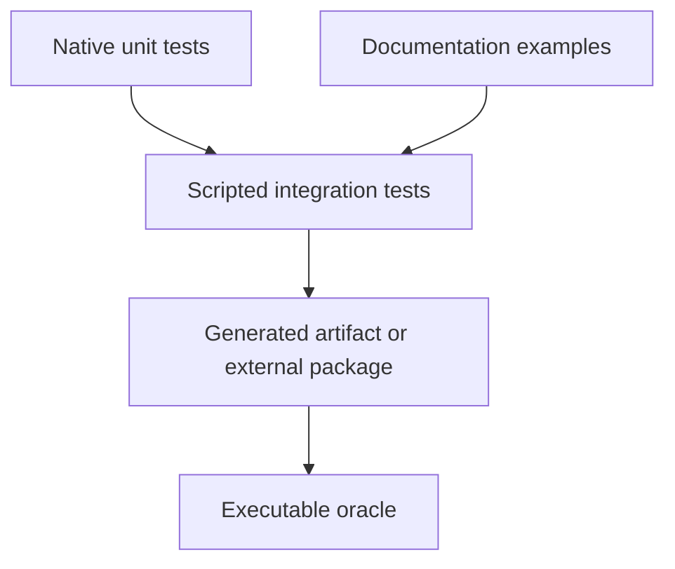

# Test organization

The suite is organized by behavior, not by the implementation file that happens
to provide it. CTest labels are the stable entry points; individual test names
are useful when diagnosing one failure.

## Fast paths

| Goal | Command | Covers |
| --- | --- | --- |
| everyday check | `ctest --test-dir build -LE model` | everything except pinned model corpora |
| core library | `ctest --test-dir build -L unit` | language, IR, evaluator, VM, codecs |
| command line | `ctest --test-dir build -L cli` | parsing, streams, diagnostics, reports, modules |
| analysis | `ctest --test-dir build -L analysis` | statistics, bounds, optimization policies |
| external mod examples | `ctest --test-dir build -L example-mod` | packages loaded from `examples/mods/` |
| generated C | `ctest --test-dir build -L c` | prepare, emit, compile, and execute |
| documented path | `ctest --test-dir build -L tutorial` | exact tutorial inputs, commands, outputs, and C oracle |
| repository checks | `ctest --test-dir build -L lint` | documentation graph and layout |
| pinned models | `ctest --test-dir build -L model` | configured ONNX/TFLite corpora |

Each maintained test has one primary kind label. Feature labels such as
`onnx`, `onnx-zoo`, `execution`, and `heavy` are orthogonal filters for optional
corpora.

## CI lanes

| Lane | Labels or configuration | Responsibility |
| --- | --- | --- |
| Ubuntu and macOS | default suite | complete core, CLI, documentation, example-mod, and generated-artifact behavior |
| optional mods | ONNX, TFLite, and SAT enabled | codecs, semantic conversion, pinned model contracts, and optional executors |
| ASan/UBSan | `unit`, `cli`, `analysis` | instrumented language, graph, evaluator, loader, VM, query, transform, and emitter paths |

The sanitizer lane includes `cli-emit`, so artifact construction crosses the
instrumented compiler boundary. Generated C harnesses are compiled and checked
by the Ubuntu lane; repeating every harness inside an instrumented Joggle CLI
does not instrument the generated C program and duplicates the same compiler
startup work.

## Layers

- Native C++ tests exercise public library contracts directly.
- Scripted CMake tests drive the installed CLI and compare deterministic text,
  attributes, diagnostics, or files.
- C backend tests emit strict C, compile it with warnings as errors, and execute
  a small oracle harness.
- Optional model tests use pinned hashes and never silently substitute a
  different external artifact.

## Shared test infrastructure

- `joggle_test.cmake` owns command execution, failure formatting, workspace
  creation, and text assertions.
- `c_pipeline.cmake` owns the common prepare → plan → frontier → emit → compile
  → execute path for operation-level C tests.
- `tools/make_harness.py` generates deterministic harness data where a checked
  generator is clearer than copied literals.
- `tools/fetch_*.cmake` contains opt-in fixture downloaders. Downloads are not
  part of the default test run.
- `models.cmake` is the pinned ONNX model manifest.

New tests should extend these helpers instead of copying their process and
diagnostic handling.

## Tutorial mapping

| Documentation path | Executable gates |
| --- | --- |
| Getting started | `cli-check`, `cli-run`, `cli-query` |
| Transform a model | `workflow`, `cli-run`, `cli-report` |
| Write a mod | `cli-module`, `example-*`, `install-consumer` |
| Import ONNX | `onnx-codec`, configured `model` tests |
| Emit C | label `c`, especially `c-execution` and `mem-safety` |

`tutorial-smoke` additionally runs the exact public path across these rows. It
does not replace the deeper gates; it prevents a documented command, fixture,
or expected output from drifting away from them.

Tutorials may simplify an input, but they must use the same public commands and
module functions as their corresponding gates.

## Adding a test

1. Choose the narrowest existing label.
2. Reuse an existing fixture unless the new behavior needs a distinct oracle.
3. Keep input IR in `test/data/` and expected behavior in the test, not in an
   unexplained generated file.
4. Make failures identify the rejected stage and preserve compiler output.
5. If the behavior is public, update the matching tutorial or reference page.

> [!IMPORTANT]
> A test that only checks that a command exits successfully is insufficient for
> transformation or artifact behavior. Check the resulting structure, API, or
> executable output as well.
